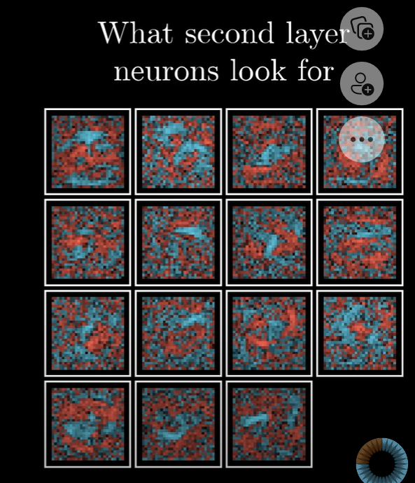
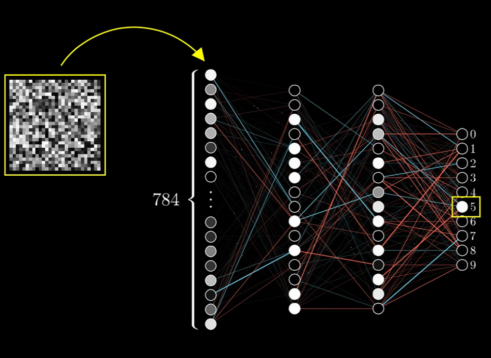
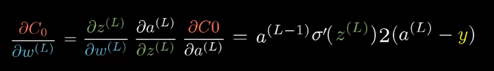
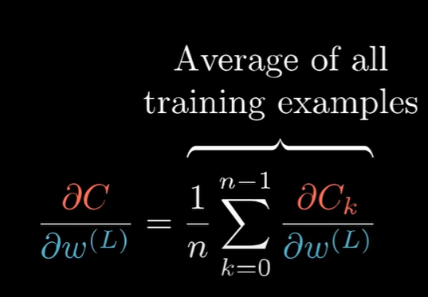
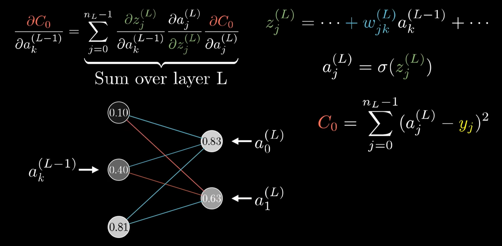

# 神经网络简介

## 神经网络概述

- 多层神经网络
  - 每一层间的节点间都有边，边带有一个“权值”，每个点带有一个 bias
  - 下一层的每个点的的 value，就是上一层的每个点分别乘以边权，再加上 下一层该点的 bias
    - 每个点最终的值为 $\sigma(value)$ (sigmoid function)
    - 其中 $\sigma(x) = \frac 1 {1 + e^{-x}}$
  - 最后，每一层的点可以由矩阵形式表示

## 神经网络训练

### 梯度下降法

对于每个特定的训练数据，input 是图片点向量，expected output 是标注数据为 1，其他均为 0 的向量。
- cost 定义为 real output 与 expected output 之差的 2-norm（自然模长）
- cost 在这里认为和所有 weight 和 bias 有关

利用梯度下降法，我们每一轮改变 weight 和 bias，使得 cost 减小

### 对普通神经网络的分析

1. 神经网络的不同层并没有去“模式识别”，边权只是一团乱麻
   
2. 神经网络虽然大部分情况下，会对某个正确图片进行正确输出。但是，对于也是一团乱麻的图片，网络有时并不会给出“不确定”的信息，而是也（很有把握的）把它当成了某个数字
   
3. 神经网络只能识别数字，不能重新把数字描绘出来

### 反向传播计算梯度

#### 数学基础

以多层单个神经元和 $\frac{\partial C_0}{\partial w^{(L)}}$ 为例：

- 其中：
  - $C_0 = (\lVert a^{(L)} - y \rVert _2)^2$，也就是误差的平方和
- $\frac{\partial C_0}{\partial b^{(L)}}, \frac{\partial C_0}{\partial a^{(L-1)}}$ 同理
- 高维（多层多个神经元）情况类似

当然，实际情况下，我们会使用所有样本（or 因性能起见，使用部分随机样本）：

#### 反向递归求偏导

以多层单个神经元和 $\frac{\partial C_0}{\partial w^{(n)}}$ 为例。由链式法则：

$$
\frac{\partial C_0}{\partial w^{(n)}} = \frac{\partial C_0}{\partial a^{(L)}}(\frac{\partial a^{(L)}}{\partial z^{(L)}}\frac{\partial z^{(L)}}{\partial a^{(L-1)}})(\frac{\partial a^{(L-1)}}{\partial z^{(L-1)}}\frac{\partial z^{(L-1)}}{\partial a^{(L-2)}})\dots(\frac{\partial a^{(n+1)}}{\partial z^{(n+1)}}\frac{\partial z^{(n+1)}}{\partial a^{(n)}})\frac{\partial a^{(n)}}{\partial z^{(n)}}\frac{\partial z^{(n)}}{\partial w^{(n)}}
$$

从而，我们对每一层**由后到前**地递归计算，就可以计算出 cost 关于所有边权和 bias 的偏导数，并进行梯度下降法。

#### 补充

对于多层多神经元的网络，计算如下：

