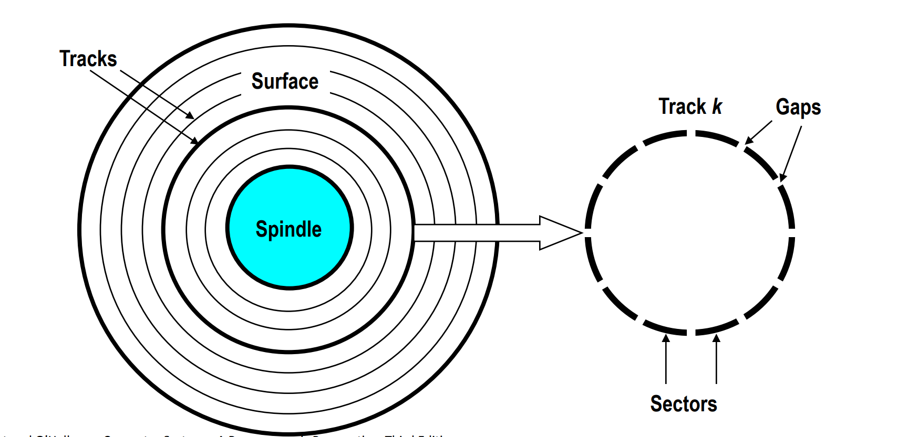
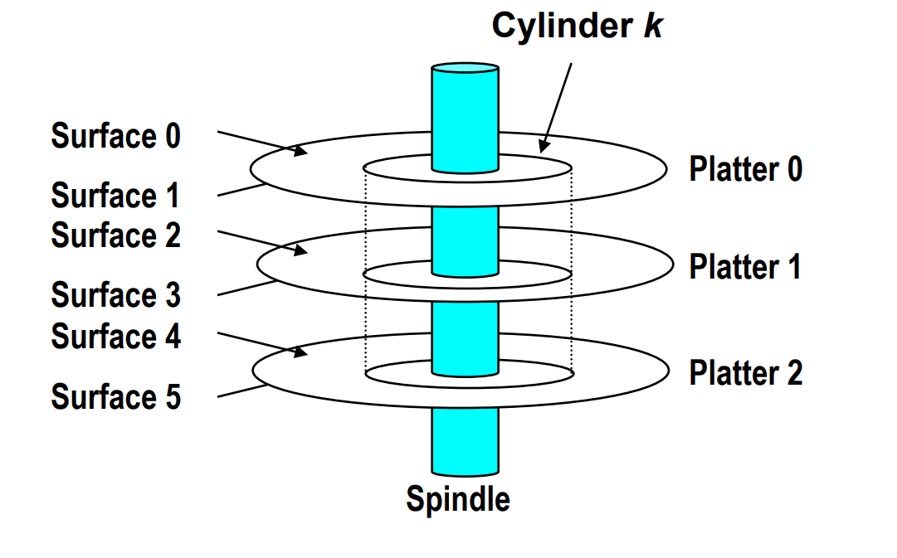
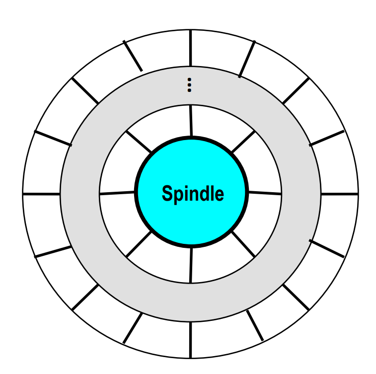
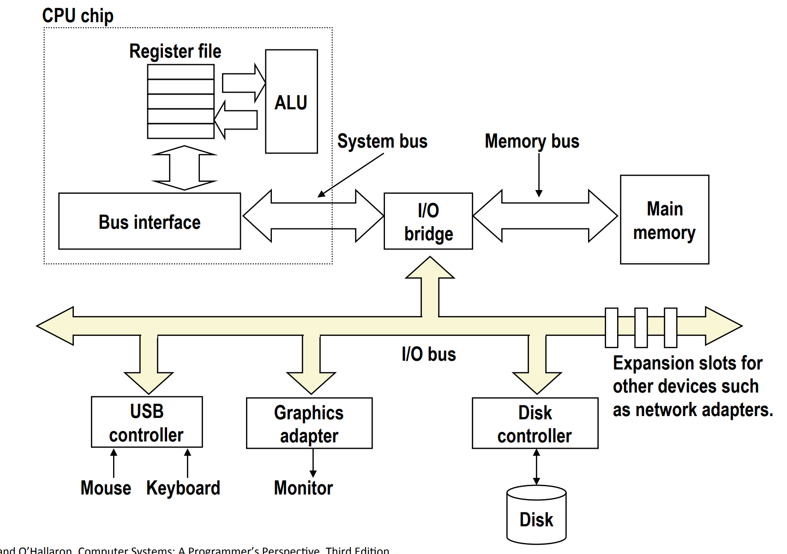
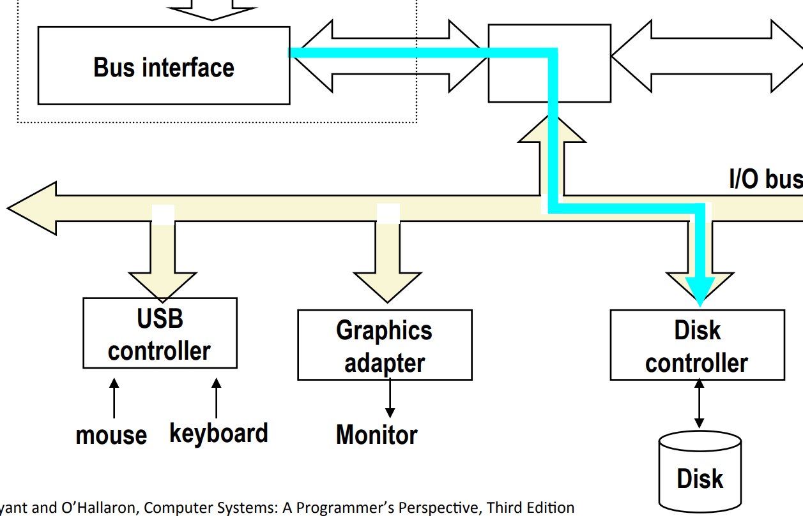
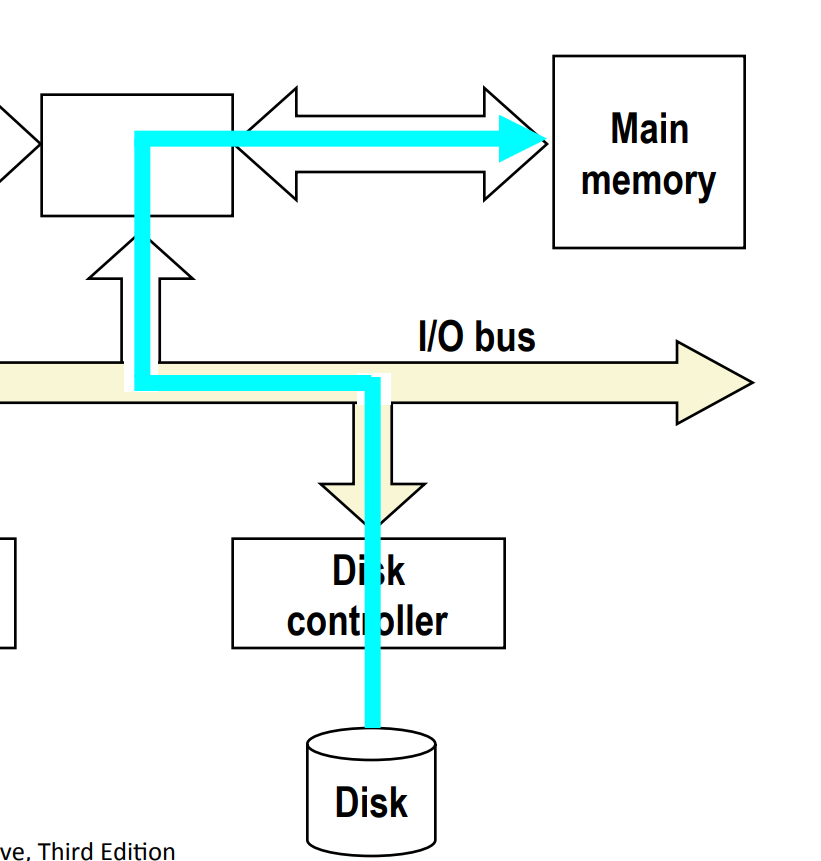
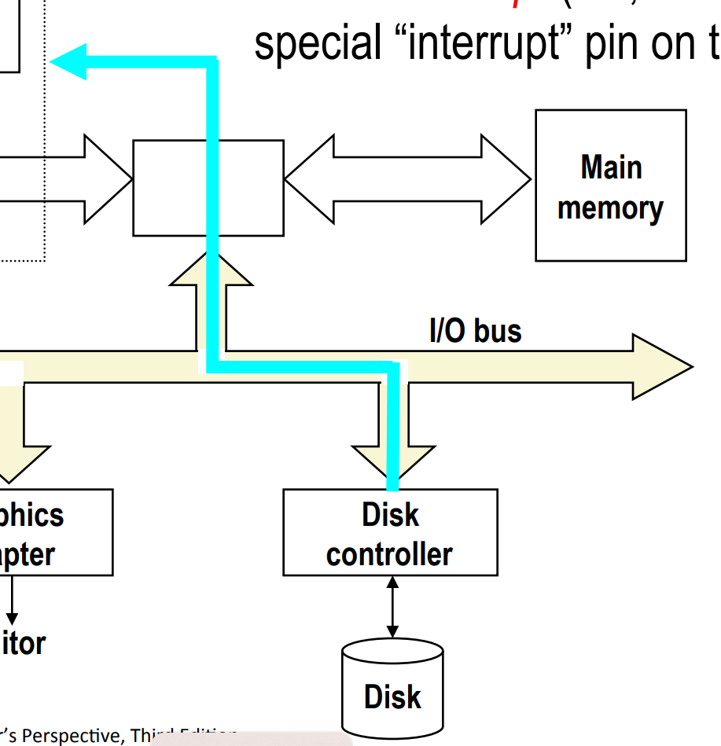
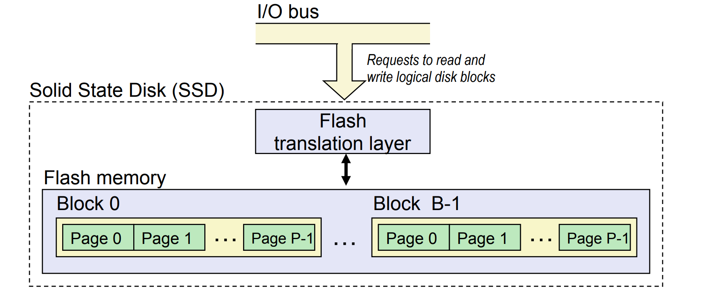
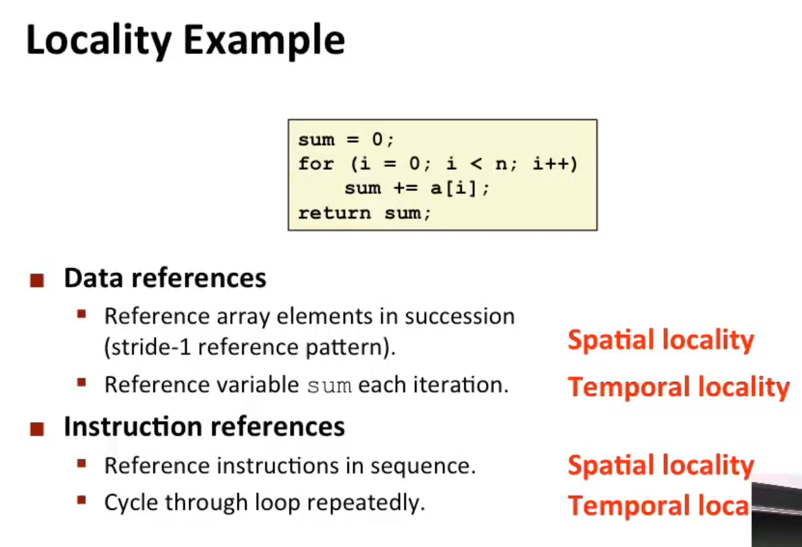

# Lec 11: The Memory Hierarchy

## Random Access Register (RAM)

SRAM vs DRAM

|      | Transistors per bit | Access time | Needs refresh? | Needs EDC? | Cost | Applications                 |
| ---- | ------------------- | ----------- | -------------- | ---------- | ---- | ---------------------------- |
| SRAM | 4 or 6              | 1X          | No             | Maybe      | 100x | Cache memories               |
| DRAM | 1                   | 10X         | Yes            | Yes        | 1x   | Main memories, frame buffers |

## I/O with memory


Since reading from memory is slow, and memory is far away from CPU, you have to use 50~100 ns to retrieve data from main memory, whereas typical operations between registers can be sub-nanosecond.

## HDD

### Geometry of a Disk



- Disk consists of **platters**, each with 2 **surfaces**
- Each surface consists of concentric rings called **tracks**
- Each track consists of **sectors** separated by **gaps**
  - each **sector** typically contains 512 bytes

Also, aligned tracks form a cylinder



### Disk Capacity

**Capacity**: Maximum number of bits that can be stored.

Vendors express capacity in units of gigabytes (GB), where 1 GB = $10^9$ Bytes.

Capacity is determined by these technology factors:

- **Recording density (bits/in)**: Number of bits that can be squeezed into a 1 inch segment of a track.

- **Track density (tracks/in)**: Number of tracks that can be squeezed into a 1 inch radial segment.

- **Areal density (bits/in^2)**: Product of recording and track density.

### Recording Zone

In order not to waste space, modern hard disk uses recording zones to partition the disk into disjoint units.



Modern disks partition tracks into disjoint subsets called **recording zones**.

- **Each track in a zone has the same number of sectors**, determined by *the circumference of the innermost track*.
  - for the sake of easy I/O
- **Each zone has a different number of sectors per track**, with outer zones having more sectors per track than inner zones.
  - in order not to waste space
- Therefore, we use the **average** number of sectors per track when computing capacity.

### Compute Disk Capacity

Capacity = (#bytes/sector) x (avg. #sectors/track) x
(#tracks/surface) x (#surfaces/platter) x
(#platters/disk)

Example:
- 512 bytes/sector
- 300 sectors/track (on average)
- 20,000 tracks/surface
- 2 surfaces/platter
- 5 platters/disk

$$
\begin{aligned}
\text{Capacity} &= 512 \times 300 \times 20000 \times 2 \times 5 \\
&= 30,720,000,000 \\
&= 30.72 \text{ GB}
\end{aligned}
$$

### Disk Access Time

Average time to access some target sector approximated by:

- **Seek time (Tavg seek)** 
  - Time to position heads over cylinder containing target sector. 

  - **Typical Tavg seek is 3-9 ms.**

- **Rotational latency (Tavg rotation)**
  - Time waiting for the first bit of the target sector to pass under r/w head. 

  - Tavg rotation = 1/2 x 1/RPMs x 60 sec/1 min. 

  - Typical Tavg rotation is 7200 RPMs.

- **Transfer time (Tavg transfer)** 
  - Time to read the bits in the target sector. 

  - Tavg transfer = 1/RPM x 1/(avg sectors/track) x 60 secs/1 min.


**Rule of thumb:** est. time of avg time is twice of seek time.

### I/O with HDD



#### Step 1

CPU initiates a disk read by writing a 

- **command**, 
- ***logical* block number**, 
- and **destination memory address** 

to a port (address) associated with disk controller.



#### Step 2

Disk controller then reads the sector and performs a direct memory access (DMA) transfer into main memory. 



#### Step 3

When the DMA transfer completes, the disk controller **notifies the CPU with an interrupt** (i.e., asserts a special “interrupt” pin on the CPU).



## SSD



- Pages: 512KB to 4KB, Blocks: 32 to 128 pages
  - note: the "blocks" stated here is different from logical blocks

- **Data read/written in units of pages.**
- **A page can be written only after its block has been erased.**
- A block wears out after about 100,000 repeated writes.
  - there are algorithms to minimize the number of writes

---

- Advantages
  - No moving parts: faster, less power, more rugged

- Disadvantages
  - Have the potential to wear out
    - Mitigated by "wear leveling logic" in flash translation layer
    - E.g. Intel SSD 730 guarantees 128 petabyte (128 x 10^15 bytes) of writes before they wear out
  - In 2015, about 30 times more expensive per byte

- Applications
  - MP3 players, smart phones, laptops
  - Beginning to appear in desktops and servers

## Locality of Programs

**Principle of Locality:** Programs tend to use data and instructions with *addresses near or equal to* those *they have used recently*

- **Temporal Locality:** Recently referenced items are **likely to be referenced again** in the near future
  - e.g. in a loop, we will be visiting the same address several times
- **Spatial Locality:** Items with **nearby addresses** tend to **be referenced close together in time** 

Example:



### Good vs Bad Locality

```c
#include <stdio.h>
#include <time.h>

#define ROWS 10
#define COLS 100000
#define TOT_TIME 1000

int main() {
    int arr[ROWS][COLS];

    // Good locality code
    int good_sum = 0;
    clock_t good_local_start, good_local_end;
    good_local_start = clock();
    for (int times = 0; times < TOT_TIME; ++times)
        for (int i = 0; i < ROWS; i++) {
            for (int j = 0; j < COLS; j++) {
                good_sum += arr[i][j];
            }
        }
    good_local_end = clock();

    // Bad locality code
    int bad_sum = 0;
    clock_t bad_local_start, bad_local_end;
    bad_local_start = clock();
    for (int times = 0; times < TOT_TIME; ++times)
        for (int j = 0; j < COLS; j++) {
            for (int i = 0; i < ROWS; i++) { // bad spatial locality!
                bad_sum += arr[i][j];
            }
        }
    bad_local_end = clock();

    // print the times
    printf("Good locality code time: %f seconds\n", (double)(good_local_end - good_local_start) / CLOCKS_PER_SEC);
    printf("Bad locality code time: %f seconds\n", (double)(bad_local_end - bad_local_start) / CLOCKS_PER_SEC);

    return 0;
}
```

Without any optimization, the result is:

```
Good locality code time: 1.134834 seconds
Bad locality code time: 1.991599 seconds
```

## Memory Hierarchy

Some fundamental and enduring properties of hardware and software:

- Fast storage technologies cost more per byte, have less capacity, and require more power (heat!).
  - i.e. the faster, the more expensive and power-consuming.

- The gap between CPU and main memory speed is widening.
  - i.e. memory retrieval is more and more expensive relatively

- Well-written programs tend to exhibit good locality.

These fundamental properties complement each other beautifully. They suggest an approach for organizing memory and storage systems known as a **memory hierarchy**.

To **take advantage of locality**, we copy a chunk of data from $k+1$-th hierarchy to $k$-th hierarchy, so that it will probably be used some time in the future, and the value of its nearby addresses are also tend to be used in the near future. Thus, we can continue to use data from $k$-th hierarchy for a period of time, and thus saves much access time.

### General Caching Concepts: Types of Cache Misses

- Cold (compulsory) miss
  - Cold misses occur because the cache is empty
- Capacity miss
  - Occurs when the set of active cache blocks (**working set**) is larger than the cache.
  - e.g. when the cache is of size 192KiB (i.e. 196,608 bytes), and you have an array of 100,000 `long`s
- Conflict miss
  - For simplicity, we assume the cache is of size 4 bytes, and the mapping algorithm is simple `mod n` (i.e. `mod 4` in this case).
    Suppose we visit `a[0], a[4], a[8]` alternatively, then since `0%4 = 4%4 = 8%4 = 0`, these memory addresses conflict each other, and result in conflict misses.
  - (More details in tomorrow's course)

### Examples of Caching in the Mem. Hierarchy

| Cache  Type          | What is Cached?      | Where is it Cached? | Latency (cycles) | Managed By       |
| -------------------- | -------------------- | ------------------- | ---------------- | ---------------- |
| Registers            | 4-8 bytes words      | CPU core            | 0                | Compiler         |
| TLB                  | Address translations | On-Chip TLB         | 0                | Hardware MMU     |
| L1 cache             | 64-byte blocks       | On-Chip L1          | 4                | Hardware         |
| L2 cache             | 64-byte blocks       | On-Chip L2          | 10               | Hardware         |
| Virtual Memory       | 4-KB pages           | Main memory         | 100              | Hardware+OS      |
| Buffer cache         | Parts of files       | Main memory         | 100              | OS               |
| Disk cache           | Disk sectors         | Disk controller     | 100,000          | Disk firmware    |
| Network buffer cache | Parts of files       | Local disk          | 10,000,000       | NFS client       |
| Browser cache        | Web pages            | Local disk          | 10,000,000       | Web browser      |
| Web cache            | Web pages            | Remote server disks | 1,000,000,000    | Web proxy server |
