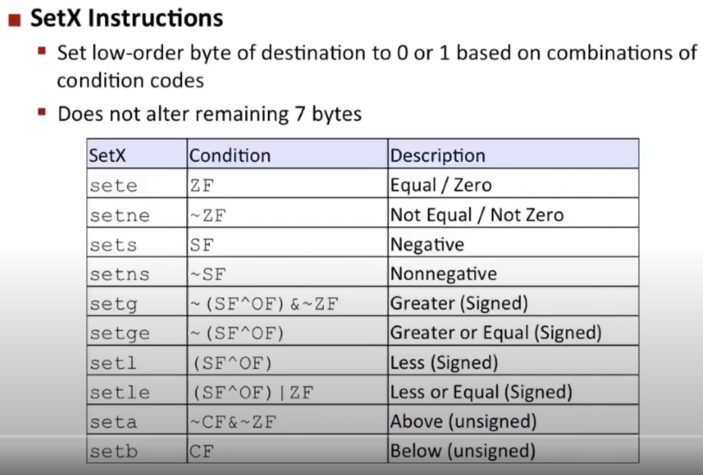
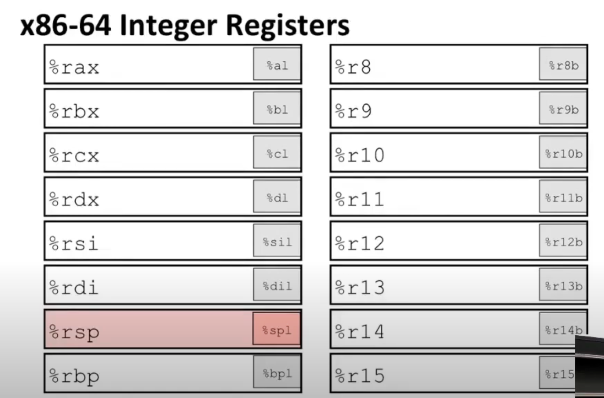
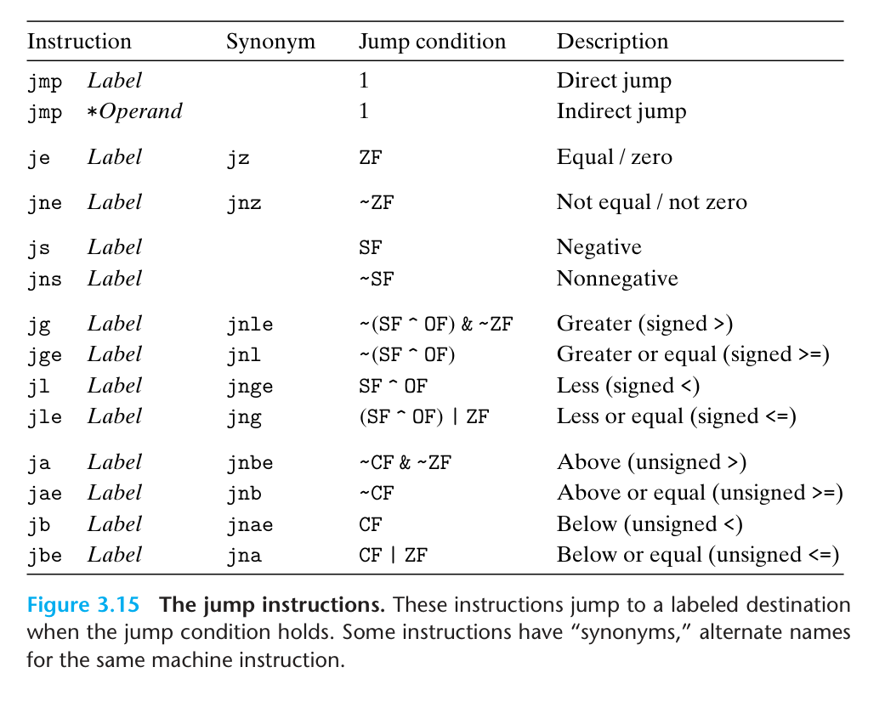
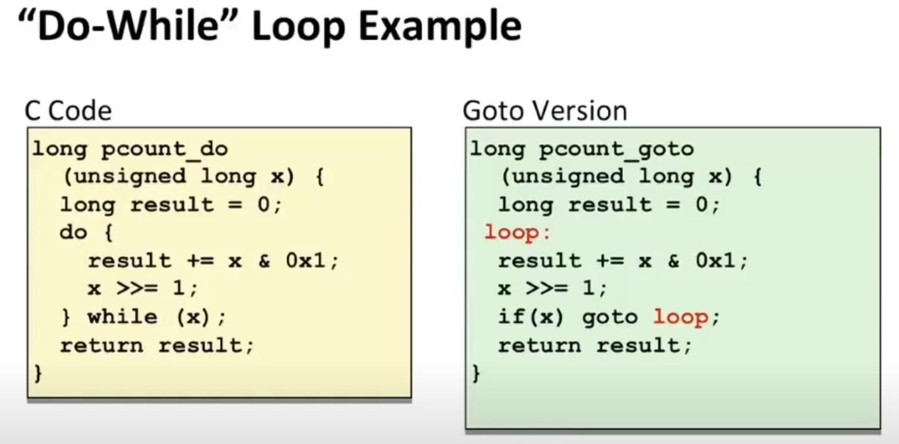
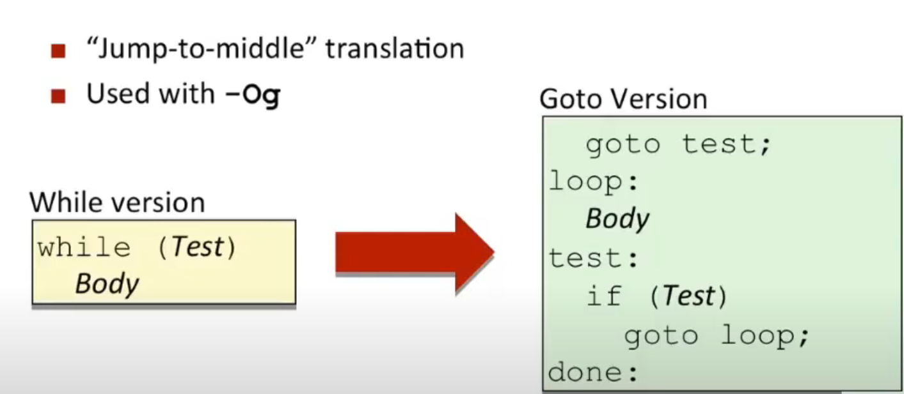
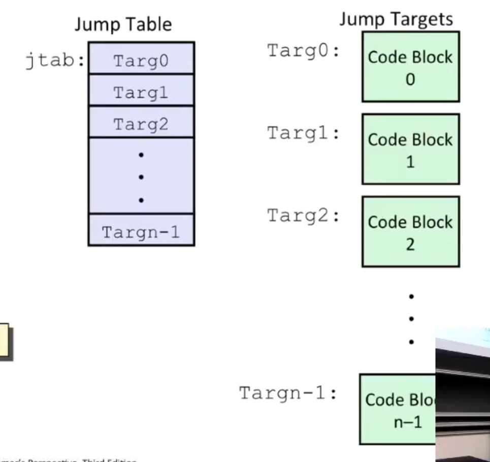
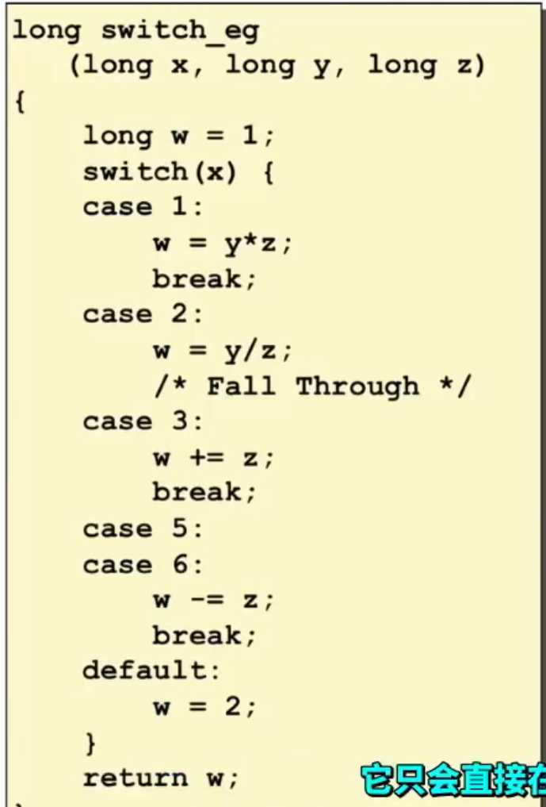
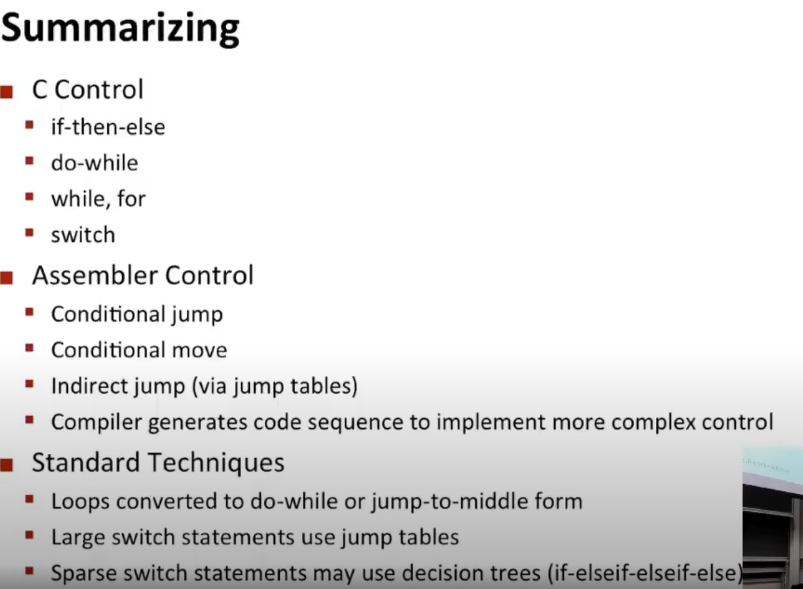

# Lec 6: Machine Level Programming: Control

> This course uses Intel 64-bit version of the instruction set.

## Outline

- Control: Condition codes
- Conditional branches
- Loops
- Switch Statements

## Processor State (x86-64)

- Information about the current executing program
  - Temp Data
    - `(%rax, ...)`
  - Location of runtime stack
    - `(%rsp)`
  - Location of current code control point
    - `(%rip,...)`
  - Status of recent tests
    - `(CF, ZF, SF, OF)`

### Conditional Codes

Actually, there are 8 in total. But today we only discuss 4 of them.

- CF: **carry out** from the most significant bit (unsigned overflow)
- ZF: `t==0`
- SF: `t<0` (as signed)
- OF: two's complement (signed) overflow
  - i.e. `(a > 0 && b > 0 && t < 0) || (a < 0 && b < 0 && t > 0)`

They will be set by many instructions, but not including `lea`.

Usually, we use `cmpq Src2, Src1` (src1 - src2) to compare two bins, `testq Src2 Src1` (src1 & src2) to `and` one bin with another (usually when one src is a mask). These two instructions will not store data in anywhere, but set the corresponding control bits.

### Read Condition Codes



We can use `set???`  to set the *lowest bit* of a register according to some combination of condition code.

How to specify it? We won't use the normal register name anymore. Instead, we will use 



Example:

```c
int greater_than (int x, int y) {
    return x > y;
}
```

with

| Register | Use(s)       |
| -------- | ------------ |
| `%rdi`   | Argument `x` |
| `%rsi`   | Argument `y` |
| `%rax`   | Return value |

```assembly
greater_than:
	cmpq %rsi, %rdi   # compare x(dest) y(src)
	setg %al          # set %al if (x-y)>0, i.e. x > y
	movabl %al, %rax  # copy %al to the lowest byte of %rax, and set the rest bits of %rax to 0
	rtn
```

## Conditional Branches

### Jumping



These are the instructions of all `jmp`'s. And `jmp` really resembles `goto` in C/C++.

The following two pieces of code are of the same functionality, but the latter is more "assembly"-like.

```c
long absdiff
    (long x, long y)
{
    long result;
    if (x > y) 
        result = x - y;
    else
        result = y - x;
    return result;
}
```

```c
long absdiff
    (long x, long y)
{
    long result;
    int ntest = x - y;
    if (ntest < 0) goto Else;
    goto Done; 
    
Else:
    result = y - x;
    return result;
Done:
    result = x - y;
    return result;
}
/*

*/
```

```assembly
absdiff:
	cmpq %rsi, %rdi
	jg .L1          # jump if %rdi is greater than %rsi
	movq %rsi, %rax
	subq %rdi, %rax
	rtn
.L1:
	movq %rdi, %rax
	subq %rsi, %rax 
	# the first-move-then-arithmetic pattern is common in assembly
	rtn
```

### Conditional Move

Since modern CPU use **pipelining** technology, it's like a heavy tanker on a ocean - when going on a straight line, it will be really fast; but when doing side turns, it needs loads of time. So, we often don't like too much branching.

Thus, we can calculate two branches (and store them in two registers), and use "conditional move" to choose which one to take.

**Note:**

**DON'T USE** conditional move if

- computation is **hard**
  - say `val = Test(x) ? Hard1(x) : Hard2(x)`
- computation is **risky**
  - say `val = p ? *p : 0`
    - i.e. if `p == 0`, `*p` will be invalid and thus unpredictable
- computation has **side effects**
  - say `val = x > 0 ? x *= 7 : x += 3`

## Loops

#### `do-while` loop

The most straight-forward way to implement loops in assembly is `do-while`-like loop:



It's easy to see that replacing `do-while` with `goto` is straight-forward.

#### `while` loop

Also, you can implement `while` loop:



That is, if the initial condition is not satisfied, you will go directly to `done`.


Example (Modern Approach):

The C code below 

```c
long pcount_while
    (unsigned long x) {
    long result = 0;
    while (x) {
        result += x & 0x1;
        x >>= 1;
    }
    return result;
}
```

is equivalent to the assembly-ish C code

```c
long pcount_while
    (unsigned long x) {
    long result = 0;
    goto test;
loop:
    result += x & 0x1;
    x >>= 1;
test:
    if (x) goto loop;
// done:
    return result;
}
```


And actually, there's another way of implementation (more traditional).

Example (Traditional Approach):

The C code below:

```c
long pcount_while
    (unsigned long x) {
    long result = 0;
    while (x) {
        result += x & 0x1;
        x >>= 1;
    }
    return result;
}
```

is equivalent to 

```c
long pcount_while
    (unsigned long x) {
    long result = 0;
    if (!x) goto done;
    do {
        result += x & 0x1;
        x >>= 1;
    } while (x);
done:
    return result;
}
```

Thus,

```c
long pcount_while
    (unsigned long x) {
    long result = 0;
    if (!x) goto done;
loop:
    result += x & 0x1;
    x >>= 1;
    if (x) goto loop;
done:
    return result;
}
```

#### `for` loop

The structure of `for`-loop:

```
for (Init; Test; Update)
	Body
```

We can convert it into `while`-loop:

```
Init;
while (Test) {
	Body;
	Update;
}
```


```c
#define WSIZE 8*sizeof(int)
long pcount_for
    (unsigned long x) {
    long result = 0;
    for (i = 0; i != WSIZE; ++i) {
        unsigned bit = 
            (x >> i) & 0x1;
        result += bit;
    }
    
    return result;
}
```

Here, 

- `init` is `i=0`

- `test` is `i != WSIZE`

- `update` is `++i`

- `body` is

  ```c
  {
      unsigned bit = 
          (x >> i) & 0x1;
      result += bit;
  }
  ```

Thus:

```c
#define WSIZE 8*sizeof(int)
long pcount_for
    (unsigned long x) {
    long result = 0;
    int i = 0;
    goto test;
loop:
    unsigned bit = 
        (x >> i) & 0x1;
    result += bit;
    // update
    ++i;
test:
    if (i != WSIZE) goto loop;
    return result;
}
```

## `switch` statements

`switch` statement is one of the most poorly designed statement in C (and this bad feature also passed down to Java, etc.). There is a rule of thumb that help you stay away from bugs:

- If you want a `case` to fall through, add comment - `/* fall through */ `

### Jump Table Structure




Example:



**Setup**

```assembly
switch_eg:
	movq %rdx, %rcx
	cmpq $6, %rdi        # whether x is in range [0,6]
	ja .L8               # if not, go straight to default branch
	jmp *.L4(, %rdi, 8)  # if so, go to jump table 
	# *.L4(, %rdi, 8) := *JTab[x], where `JTab` is of type `long []`
```

**Jump Table**

```assembly
.section   .rodata
  .align 8
.L4:
	.quad .L8 # x = 0 # 0 is not in `case`, so default
	.quad .L3 # x = 1
	.quad .L5 # x = 2
	.quad .L9 # x = 3
	.quad .L8 # x = 4 # 4 is not in `case`, so default
	.quad .L7 # x = 5 # 5 and 6 share the same piece of code
	.quad .L7 # x = 6
```


**Note:**

- if the cases are "dense" (and the range is large), the assembler will use jump table, which is $\mathcal O(1)$
  - and if there is negative number, the assembler will add *bias* to `w`, so that all are positive.
- if the cases are "sparse" (or the range is very small), say `case 0: //... case 114514: // ...`, the assembler will merely use `if-else`
  - but with binary-tree-like conditional jump! So the time complexity is $\mathcal O(\log(N))$.
  - Why can it do this? Well, the `case` operands are `constexpr`s, so gcc can sort them in advance and implement the bst.

- **So, in either case, the assembler does much better job than naive `if-else`.**

## Summary

The four major assembler controls are the basic primitives of almost all changes of flow execution, etc in a program.

