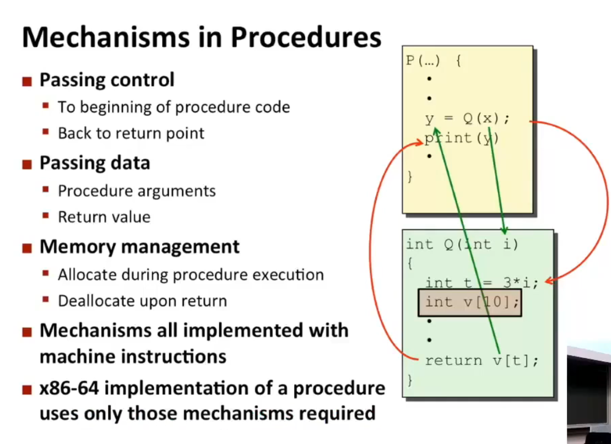
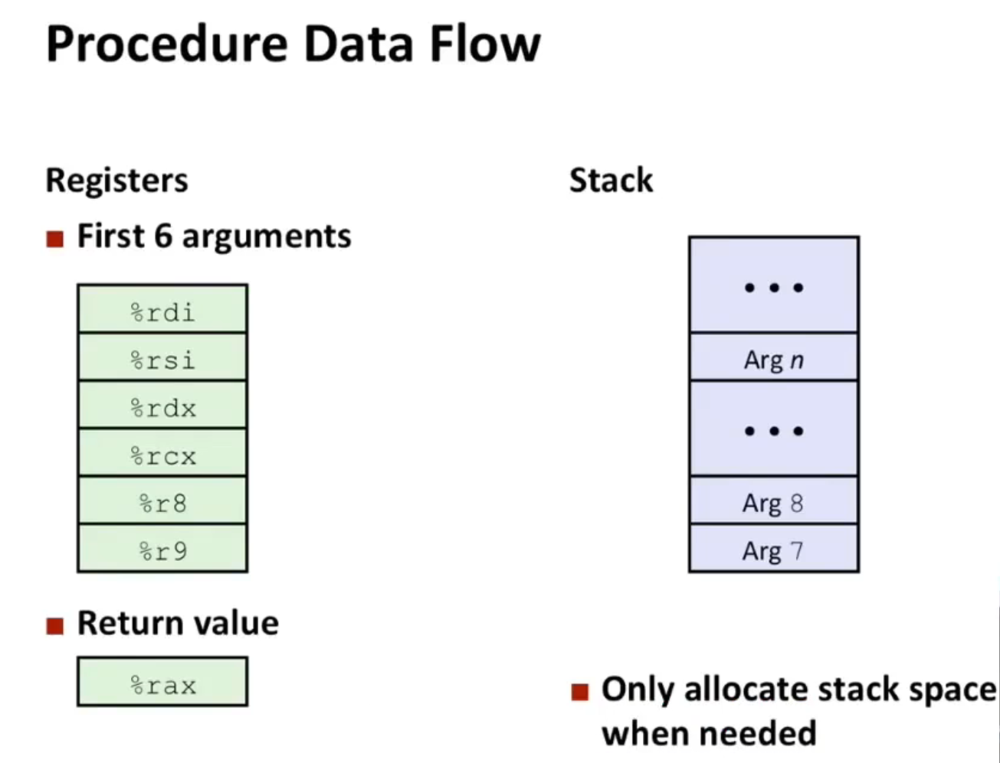
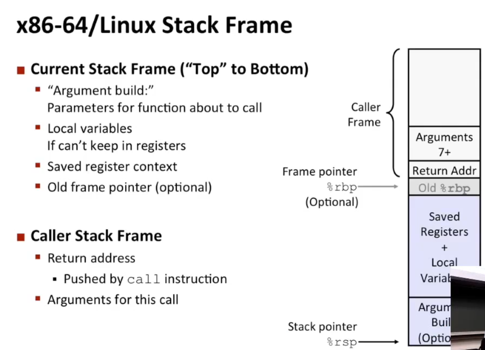
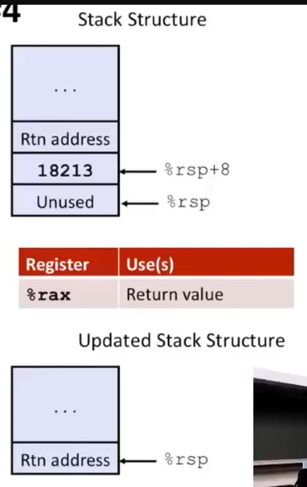
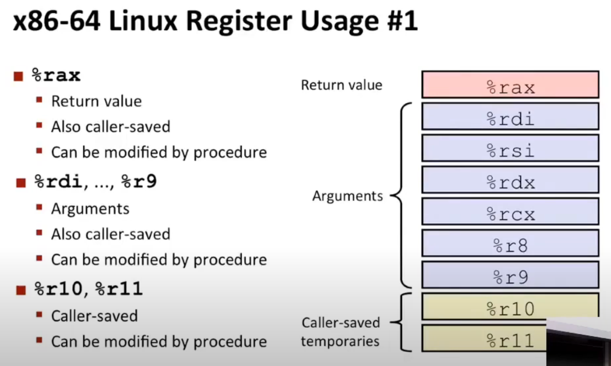
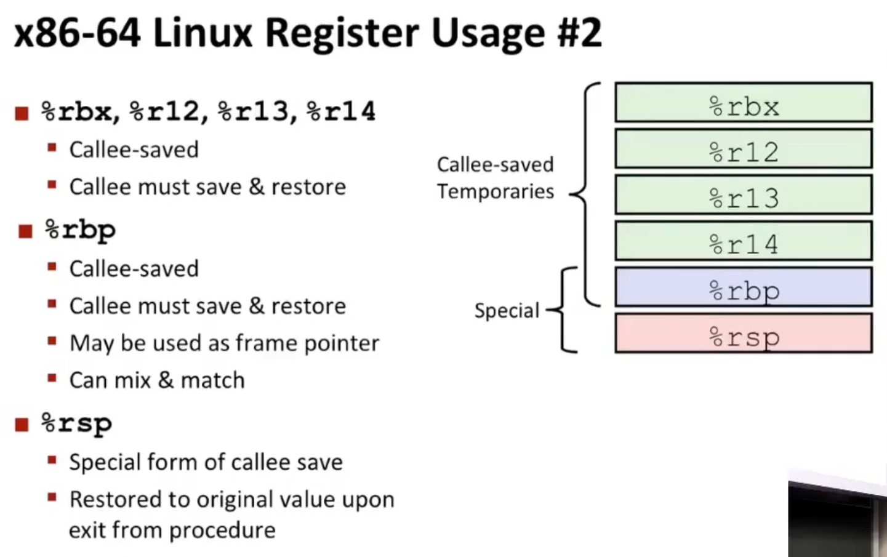
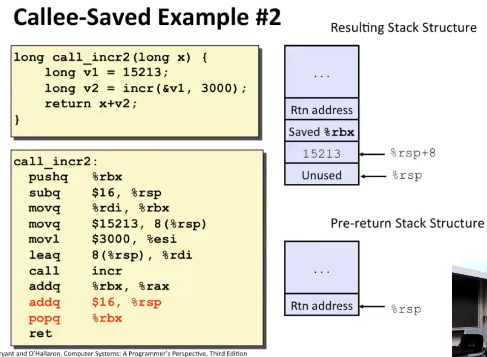

# Lec 7: Machine Level Programming: Control

## Outline

- Stack Structure
- Calling Conventions
  - Passing Control
  - Passing Data
  - Managing Local Data
- Illustrations of Recursions & Pointers

## Mechanism in Procedures



**Note:** reducing the overhead of procedure calls is very important (and it is well optimized in x86-64), esp. in OOP and FP, where each procedure only does a small amount of actual useful stuff.

## Stack Structure

The top address of x86-64 stack is very high, and when the stack grows, `%rsp` decrements.

```
                   Stack Bottom
          +---------------------------+
          |                           |  
          |                           |
          |                           |
          |                           |
          |                           |
          |                           |
          
          			 ........
          
          |                           |
          |                           |
          |                           |
          |                           |
          |                           |
          |                           |  <== Stack Pointer: %rsp
          |                           |
          +---------------------------+
                    Stack Top          
```


Operations:

- `pushq [Src]`
  - Fetch operand at `[Src]`
  - Decrement `%rsp` by **8**
  - Write operand at address given by `%rsp`
- `popq [Dest]`
  - Read value at address given by `%rsp`
  - Increment `%rsp` by **8**
  - Store value at `[Dest]` (must be register)

## Calling Conventions

### Passing Control

- `call [Address/Label]`
  - push `%rip` (i.e. instruction pointer) onto stack
  - set `%rip` to `[Address/Label]`
- `ret`
  - in some sense, equivalent to `popq %rip` (but notice `%rip` isn't allowed to be accessed directly, so in reality this won't work )

### Passing Data



Example:

```c
long my_function(long x, long y, long *dest) {
    long t = x * y;
    *dest = t;
    return t;
}
```

```assembly
my_function:
.LFB0:
	# x is %rdi, y is %rsi, dest is %rdx
	.cfi_startproc
	endbr64
	movq	%rdi, %rax    # let return_val = x
	imulq	%rsi, %rax    # return_val *= y
	movq	%rax, (%rdx)  # let *dest = return_val
	ret                   
	.cfi_endproc
```

### Managing Local Data: Stack Frame



Example:

```c
long call_incr() {
    long v1 = 18213;
    long v2 = incr(&v1, 3000);
    return v1 + v2;
}
```



```assembly
call_incr:
	subq	$16, %rsp        # allocate 16 byte of stack space
	movq	$18213, 8(%rsp)  # store 18213 at [7:15]
	movl    $3000, %esi      # store 3000 at $esi
	leaq    8(%rsp), %rdi    # let rdi (i.e. the first argument of the function `incr`) point to [7:15]
	call	incr
	# now, rax := rtn_val of `incr`
	addq	8(%rsp), %rax    # let rtn_val += [7:15]
	addq	$16, %rsp        # free the 16 byte of stack space
	ret
```

#### Caller-Saved vs. Callee-Saved

> When `yoo` calls `who`:
>
> - `yoo` is the **caller**
> - `who` is the **callee**

- caller-saved
  
- callee-saved
  

---

Example:



In this example, `call_incr2` want to use `%rbx`. Since `%rbx` is callee-saved register, `call_incr2` should save `%rbx` in its own stack frame.

## Recursive Function

Recursive function is not too different from non-recursive ones.

### Example: `pcount_r`

```c
long pcount_r (unsigned long x) {
    if (x == 0)
        return 0;
    else
        return (x & 1) 
            + pcount_r (x >> 1);
}
```

```assembly
pcount_r:
	movl	$0, %eax
	testq	%rdi, %rdi  # i.e. rdi&rdi
	je		.L6
	pushq	%rbx        # callee-saved
	movq	%rdi, %rbx  
	# Note: operations involving `%e..` will automatically set the higher 32 bits of `%r..` to 0
	andl	%1, %ebx
	shrq	%rdi
	call	pcount_r
	addq	%rbx, %rax  # %rax is pcount_r(...), 
	# %rbx is (x&1)
	popq	%rbx        # callee-saved
.L6:
	ret
```

