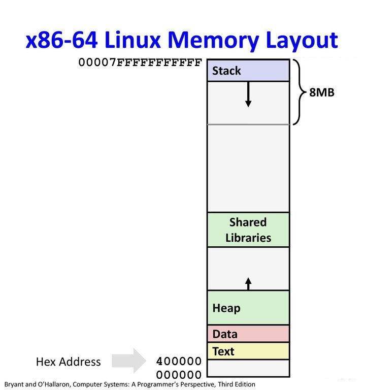
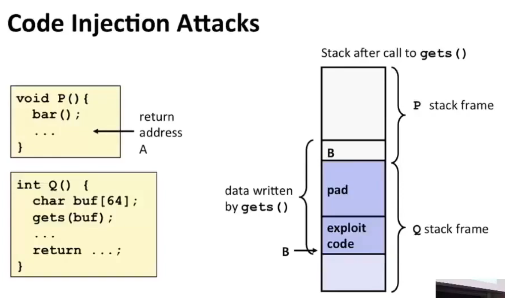
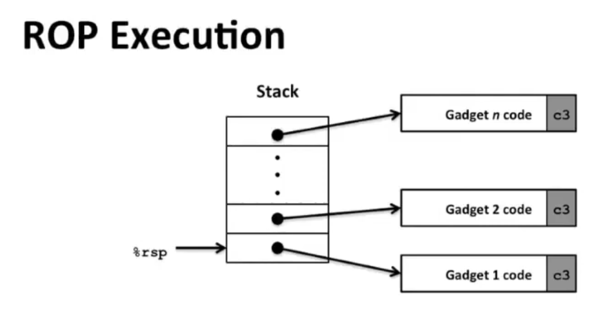
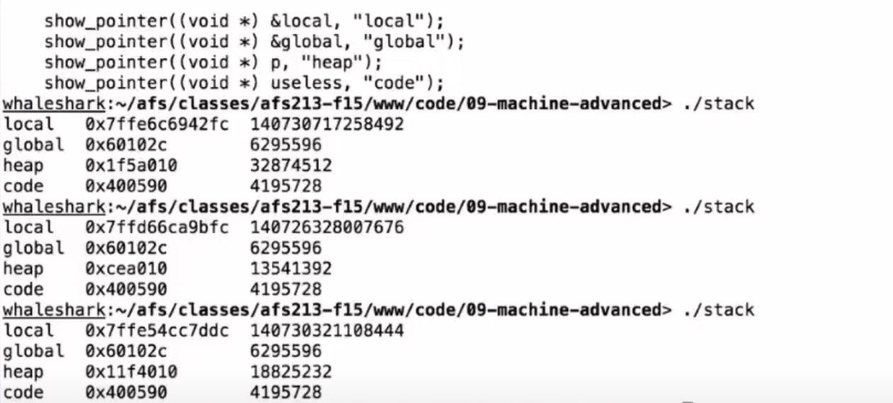
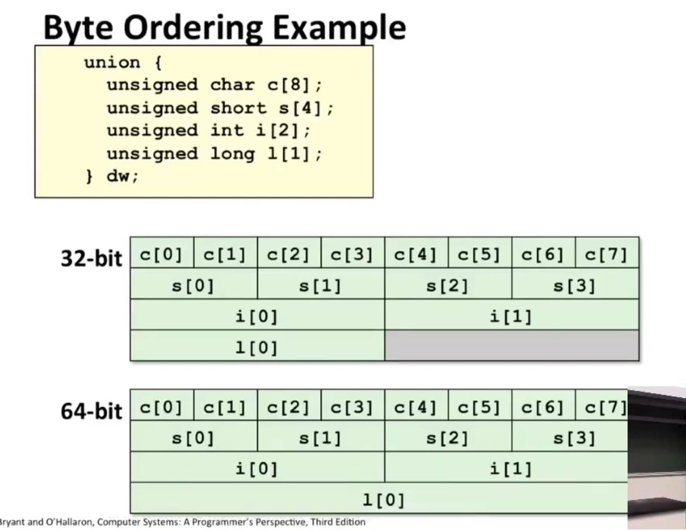

# Lec 9: Advanced Topics

Today we will talk about some miscellaneous but important topics.

## Outline

- Memory Layout
- Buffer Overflow
  - Vulnerability
  - Protection
- Unions

## Memory Layout



- Stack
  - Store **local variables**
  - Runtime Stack (8MB limit for Linux)
- Text/Shared Libraries
  - Store **executable machine instructions**
    - **Note:** library codes are stored on the disk (e.g. `malloc`, `printf`). They will be introduced to the program when it first starts executing, via *dynamic linking*.
  - **Read-only**
- Data
  - Store **static data**
  - e.g. global variables, `static` vars, string constants
- Heap
  - **Dynamically allocated** as needed
  - e.g. `malloc()`, `calloc()`, `new`, etc

## Buffer Overflow

### Example: `gets`

`gets` gets string from stdin, store it at `dest` and finally return `dest`.

```c
/* Get string from stdin */
char *gets(char *dest) {
    int c = getchar();
    char *p = dest;
    while (c != EOF && c != '\n') {
        *p++ = c;
        c = getchar();
    }
    *p = '\0';
    return dest;
}
```

Because `gets` will not check the boundary, and there's no way to specify limit on number of characters to read, `gets` is prone to have buffer overflow.

### Other vulnerable functions

- `strcpy, strcat`: Copy strings of **arbitrary length**.
- `scanf, fscanf, sscanf`: when given `%s` conversion specification.
  - the same as `gets`

### Code Injection Attack



> typo: `bar()` should be `Q()`

- Input string contains byte representation of 
  - executable code
  - padding
  - ret address
- When `Q()` gets returned, it will go to address `B` and start executing the exploited code.
  - Note the return address is stored in the caller's frame.

### Sidenote: Worm vs. Virus

| 特性     | 蠕虫                                                         | 病毒                                                         |
| -------- | ------------------------------------------------------------ | ------------------------------------------------------------ |
| 定义     | 蠕虫是一种自我复制的恶意软件，它可以在网络中自我传播，无需附着在宿主文件或者其他程序上。 | 病毒是一种恶意软件，它需要附着在宿主文件或者其他程序上才能传播。 |
| 传播方式 | 蠕虫可以自我复制并通过网络自我传播，无需用户交互。           | 病毒需要用户交互（如打开文件、运行程序）才能传播。           |
| 影响     | 蠕虫主要通过消耗系统资源（如网络带宽、内存）来影响系统性能。 | 病毒可以对系统文件进行修改、删除，甚至窃取用户数据。         |
| 自我复制 | 蠕虫可以自我复制，并在没有用户知情的情况下在网络中传播。     | 病毒需要附着在宿主文件上才能复制自身。                       |

### Return-Oriented Programming

Since stack can be randomized and inexecutable, we need to use the present code gadgets instead of our own codes.



- Trigger with ret instruction
  - Will start executing Gadget 1
- Final `ret` in each gadget will start next one

### Protection

#### Avoid Overflow Vulnerabilities in Code (!)

```c
void echo()
{
    char buf[4];
    fgets(buf, 4, stdin);
    puts(buf);
}
```

- Use `fgets` instead of `gets`
- Use `strncpy` instead of `strcpy`
- Don't use `scanf` with `%s`
  - use `fgets`!
  - or at least use `%ns` where `n` is a suitable integer
- ...

#### System-Level Protection

1. Address space layout randomization (ASLR) is an oft used technique to protect system from this sort of attack.

   **Main Idea:** apply a random address offset to the stack each time you run the program, so you can't predict where to return.

   

   As shown in the image, `global` is in data and `useless` is in text, so they won't vary. 
   But `local` is in stack and `p` is in `heap`, so they vary.

   - `p` varies as well, since `malloc` also has its own random implementation.

2. Nonexecutable code segments

   **Main Idea:** 

   - In traditional x86, you can mark a region of memory as either "read-only" or "writable". 
     - You can execute anything that is readable. 
   - **x86-64 added explicit "execute" permission.** 
   - The stack is marked as **non-executable.**

3. Stack Canaries

   ```
           High
           Address |                 |
                   +-----------------+
                   | args            |
                   +-----------------+
                   | return address  |
                   +-----------------+
           rbp =>  | old ebp         |
                   +-----------------+
         rbp-8 =>  | canary value    |
                   +-----------------+
                   | local variables |
           Low     |                 |
           Address
   ```

   ```assembly
   echo:
   	...
   	mov    -0x8(%rbp),%rax # $rbp stores the original %rsp value
   	xor    %fs:0x28,%rax
   	je     0x5555555551d1 <echo+72>
   	callq  0x555555555080 <__stack_chk_fail@plt>
   
   	leaveq 
   	retq
   ```

   

   In order to cause a buffer overflow and manipulate the return address, it is necessary to overflow the canary value, which is generated using a pseudo-random process. 
   By overflowing the canary value, the validity check for the canary fails.

## Union

