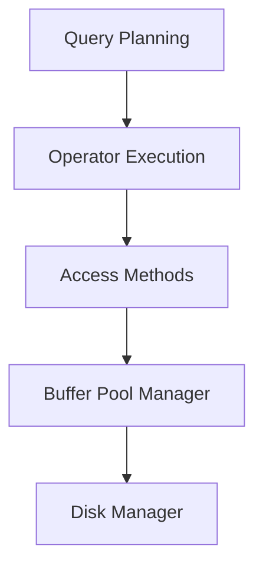

# Lec 3-4: Database Storage

## Looking Forward

### Course Outline

- Relational Databases
- Storage
- Execution
- Concurrency Control
- Recovery
- Distributed Databases
- Potpourri

### Hierarchical Database Model

This lecture is about the lowest level of abstraction, i.e. **disk manager**.

## Disk-Based Architecture

- The DBMS assumes that the primary storage location of the database is on **non-volatile** disk.
- The DBMS's components **manage the movement of data between non-volatile (e.g. disk) and volatile storage (e.g. memory)**.
  - The data sits at disk. Every time you want to do something about it, you load it into the memory, and the CPU will crunch it.

### Storage Hierarchy

However, there might be some game changers:

**If persistent memory is marketized, the current database design, algorithms, etc will ALL go away.**

## How to Access 

### Access Time for Different Storage

**Note:** The right column represents the current time multiplied by $10^9$, which has been done for our convenience in comprehending the data.

### Sequential VS Random Access

- Random access on non-volatile storage is almost always much slower than sequential access.
- DBMS will want to maximize sequential access.
  - Algorithms try to** **reduce number of writes to random**
    pages** so that data is stored in contiguous blocks.
  - Allocating multiple pages at the same time is **called an**
    **extent.**

## Disk-Oriented DBMS

The image below shows how to access data on the disk.

### Why Not Use the OS?

The DBMS can use memory mapping (mmap) to store the contents of a file into the address space of a program.
The OS is responsible for moving the pages of the file in and out of memory,so the DBMS doesn't need to worry about it.