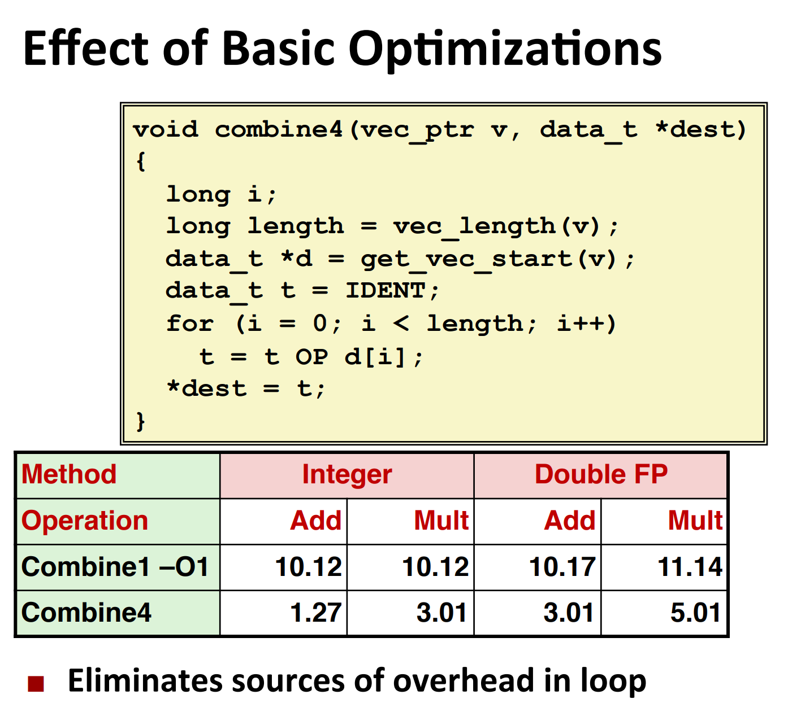
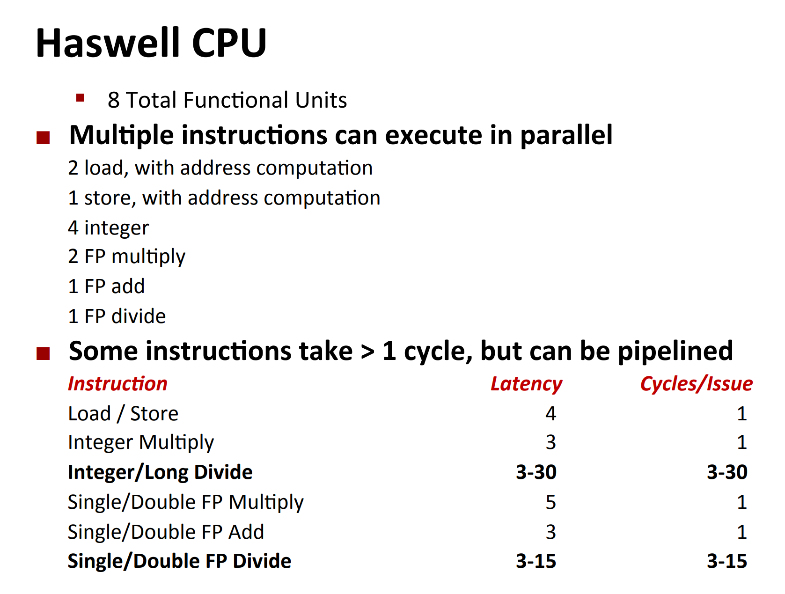
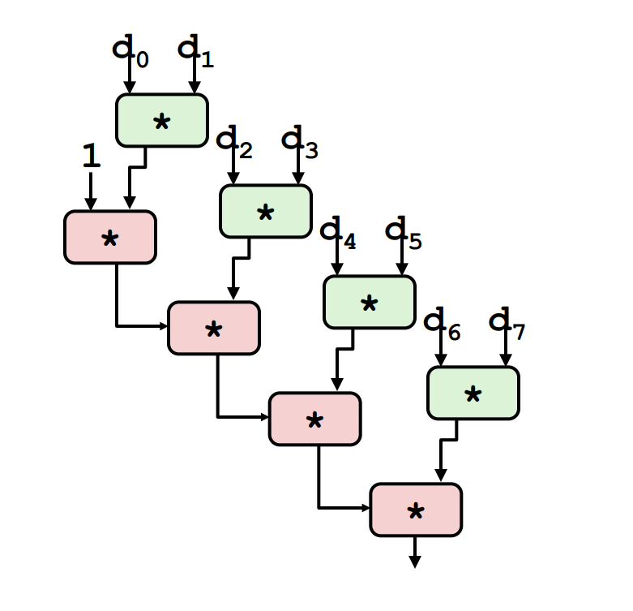
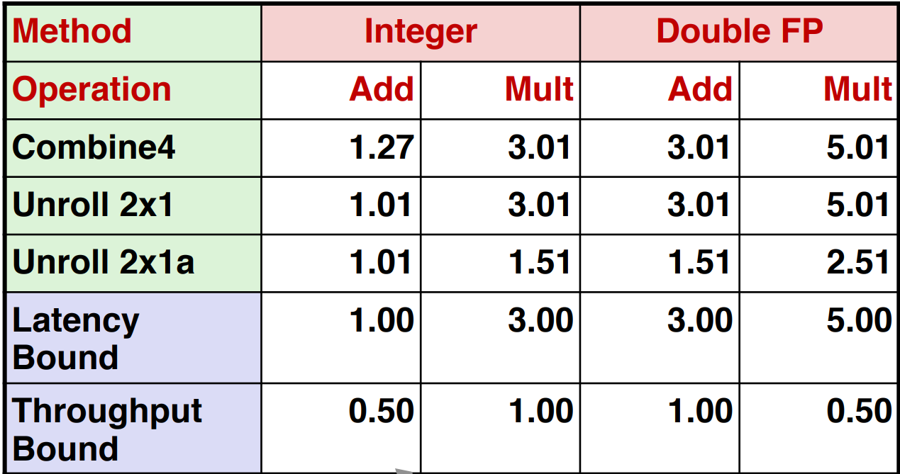
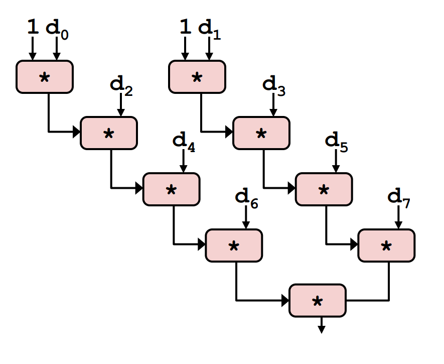
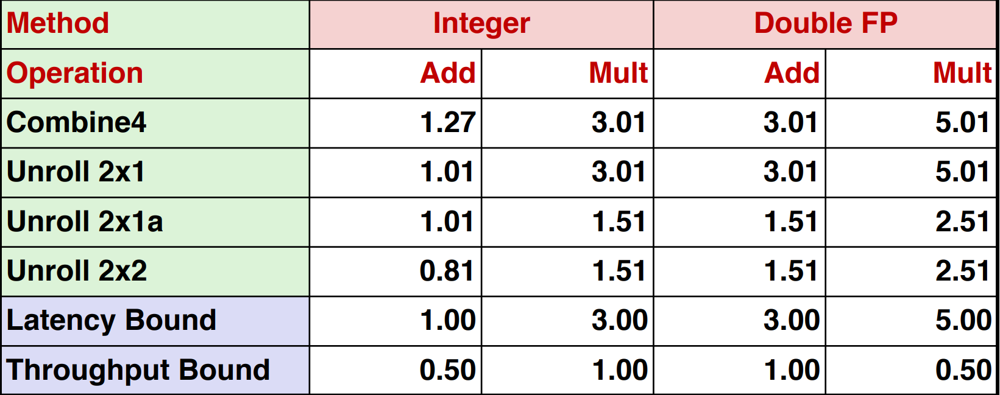
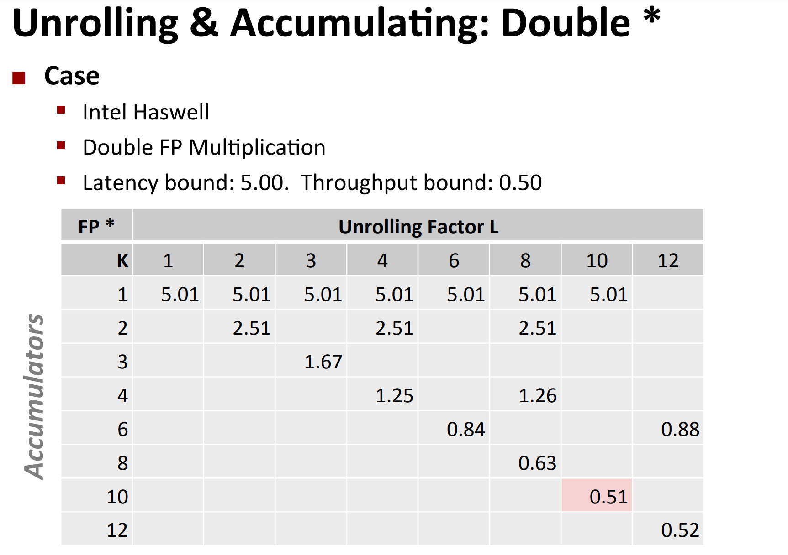
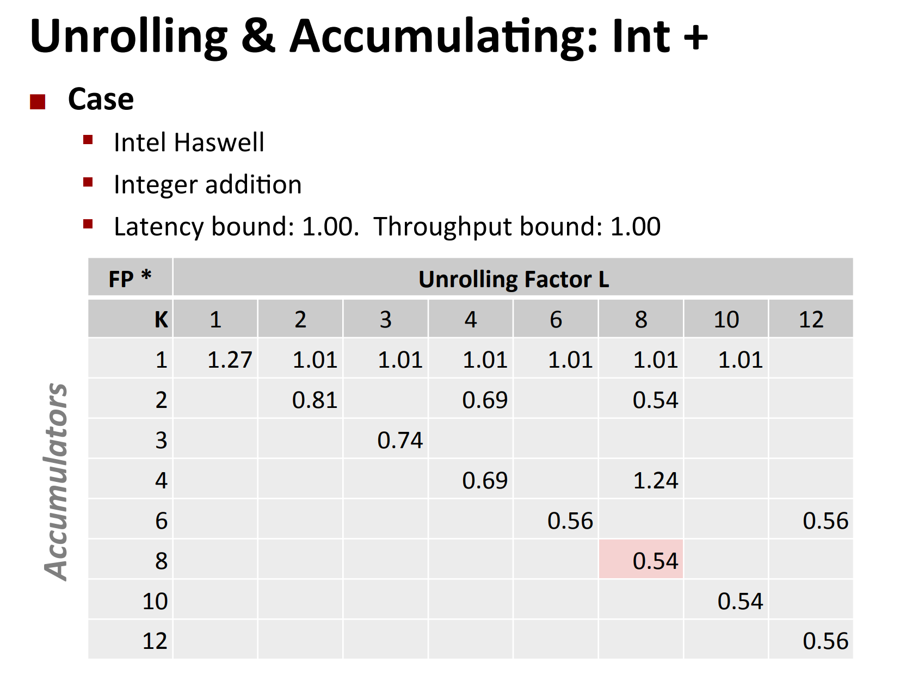
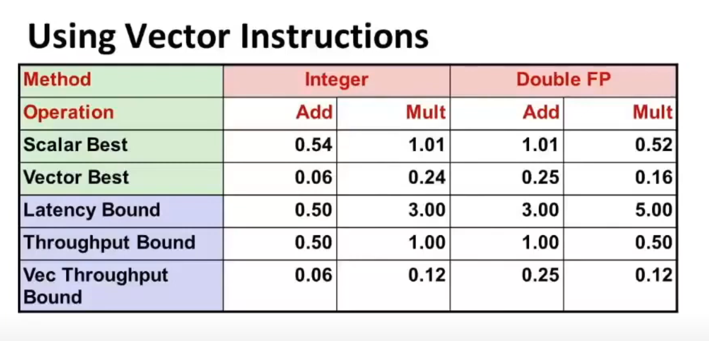

# Lec 10: Program Optimization

## General Useful Optimizations

Compiler should optimize 

```c
void set_row(double *a, double *b,
    long i, long n)
{
    long j;
    for (j = 0; j != n; ++j)
        a[n*i+j] = b[j];   
}
```

to 

```c
void set_row(double *a, double *b,
    long i, long n)
{
    long j;
    int ni = n * i;
    for (j = 0; j != n; ++j)
        a[ni+j] = b[j];   
}
```

so that the multiplication can be omitted.

---

Also, the compiler will replace costly operation with simpler ones:

Example 1:

```c
void set_row(double *a, double *b,
    long i, long n)
{
    for (i = 0; i != n ++i)
    {
        int ni = n * i;
        for (j = 0; j != n; ++j)
            a[ni+j] = b[j];   
    }

}
```

will be optimized to

```c
void set_row(double *a, double *b,
    long i, long n)
{	
    int ni = 0;
    for (i = 0; i != n ++i)
    {
        for (j = 0; j != n; ++j)
            a[ni+j] = b[j];
        ni += n;
    }

}
```

Example 2:

```c
x *= 12;
```

will be optimized to:

```c
x += x << 1;
x <<= 2;
```

Example 3:

```c
double test(long i, long j, long n, double *a, double *b, double *c) {
    return a[(i-1)*n + j] + b[(i+1)*n+j] + c[i*n+j-1];
}
```

will be optimized to:

```c
double test(long i, long j, long n, double *a, double *b, double *c) {
    long ni = (i-1) * n;
    return a[ni - n] + b[ni + n] + c[ni - 1];
}
```

## Optimization Blocker: Procedure Calls

During compilation, the compiler cannot determine which procedure will be used since procedure calls can be written in multiple source files and are only linked during the linking phase.

So, optimizations related to procedure calls are often weak.

Example:

```c
void toCapital (char *str) {
    for (int i = 0; i != strlen(str); ++i) {
        if (str[i] >= 'a' && str[i] <= 'z')
            str[i] += 'A' - 'a';
    }
}
```

As the `str`

- is always changing

and the compiler

- doesn't know whether the `strlen` used in this program is the `strlen` from the standard C library
  - doesn't know the implementation of the `strlen`
  - doesn't know whether there are side effects in `strlen`
- ...

it won't optimize `strlen(str)`.

- Also, this badly-implemented `toCapital` is actually quadratic time.

Therefore, it becomes our responsibility to optimize this situation ourselves.

```c
void toCapital (char *str) {
    int len = strlen(str);
    for (int i = 0; i != len; ++i) {
        if (str[i] >= 'a' && str[i] <= 'z')
            str[i] += 'A' - 'a';
    }
}
```

## Optimization Blocker: Memory Aliasing

The badly-implemented code:

```c
void sum_rows2(double *a, double *b, long n) {
    long i, j;
    for (i = 0; i < n; ++i) {
        for (j = 0; j < n; ++j)
            b[i] += a[i*n + j];
    }
}
```

```assembly
...
		movsd   (%rcx), %xmm0
        addsd   (%rax), %xmm0
        movsd   %xmm0, (%rcx)
...
```


The compiler faces uncertainty when it comes to determining if `b[i]` and `a[i*n+j]` overlap, meaning whether `b[i]` is the same as `a[i*n+k]`. Because of this uncertainty, **the compiler cannot guarantee that modifying `a[i*n+j]` will not impact `b[i]`**. As a result, the compiler follows the program's instructions explicitly: it moves the value from memory to a register and then adds the value in the register back to memory.

Therefore, it becomes our responsibility to optimize this situation ourselves.

```c
void sum_rows2(double *a, double *b, long n) {
    long i, j;
    for (i = 0; i < n; ++i) {
        double val = 0;
        for (j = 0; j < n; ++j)
            val += a[i*n + j];
        b[i] += val;
    }
}
```

And the assembly code is much better now:

```assembly
...
		addsd   (%rax), %xmm0
...
```

**Best Practice:bulb::** always get in habit of introducing local variables.

## Instruction Level Parallelism

### The bad old code

```c
void combine1(vec_ptr v, data_t *dest)
{
    long int i;
    *dest = IDENT;
    for (i = 0; i < vec_length(v); i++) {
        data_t val;
        get_vec_element(v, i, &val);
        *dest = *dest OP val;
    }
} 
```


### The code with basic optimization



### Instruction Level Parallelism 



Referring to the image provided, the term "latency" represents the number of clock cycles required for the completion of an instruction. 

On the other hand, "cycles/issue" denotes the number of clock cycles necessary for two **identical yet unrelated** instructions to be pipelined.

**Since all the OPs in the code are related, pipelining can't be apply to this code.** 

### More Optimization: Loop Unrolling, Separate Accumulation and Vectorization

Example 1: 2-Loop Unrolling with rearrangement (i.e. `(x OP d[i]) OP d[i+1]` is changed to `x OP (d[i] OP d[i+1])`)

```c
void unroll2aa_combine(vec_ptr v, data_t *dest)
{
    long length = vec_length(v);
    long limit = length - 1;
    data_t *d = get_vec_start(v);
    data_t x = IDENT;
    long i;

    /* Combine 2 elements at a time */
    for (i = 0; i < limit; i += 2) {
        x = x OP (d[i] OP d[i + 1]);
    }

    /* Finish any remaining elements */
    for (; i < length; i++) {
        x = x OP d[i];
    }

    *dest = x;
}
```



---

Example 2: 2-Loop Unrolling with Separate Accumulators

```c
void unroll2a_combine(vec_ptr v, data_t *dest)
{
    long length = vec_length(v);
    long limit = length - 1;
    data_t *d = get_vec_start(v);
    data_t x0 = IDENT;
    data_t x1 = IDENT;
    long i;

    /* Combine 2 elements at a time */
    for (i = 0; i < limit; i += 2) {
        x0 = x0 OP d[i];
        x1 = x1 OP d[i + 1];
    }

    /* Finish any remaining elements */
    for (; i < length; i++) {
        x0 = x0 OP d[i];
    }

    *dest = x0 OP x1;
}
```




---

Actually, you can do unrolling and accumulating together.

- Idea
  - Can unroll to any degree L
  - Can accumulate K results in parallel
  - L must be multiple of K

- Limitations
  - Diminishing returns
  - Cannot go beyond throughput limitations of execution units
  - Large overhead for short lengths
  - Finish off iterations sequentially





---

There's also a technique called vectorization, in the sense that you add/multiply several pairs of `int`s in parallel, if you regard the `int`s as a **vector**.



Since `int` is 4 bytes, and the maximum support for add/mult is 32 bytes, we can do 8 add/mult ops in the same time for `int`s.