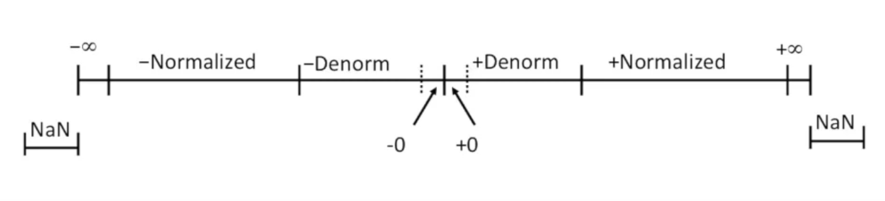
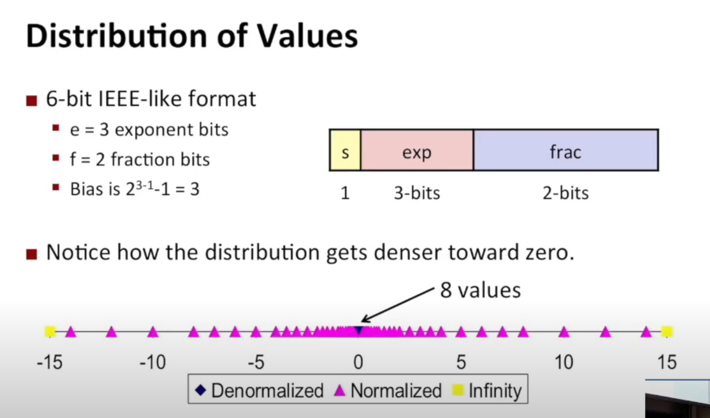
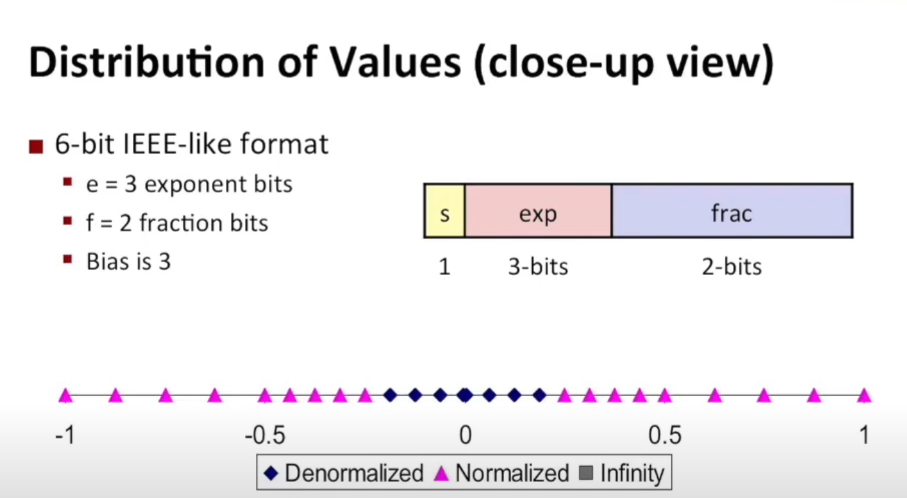
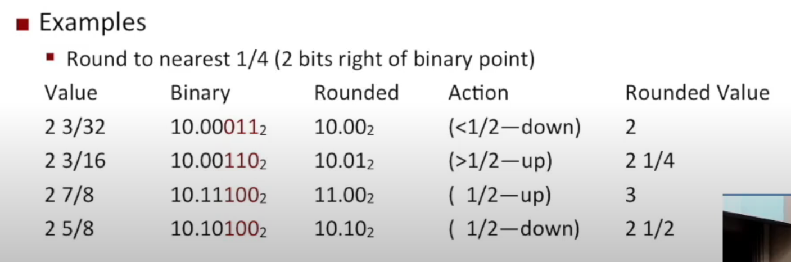
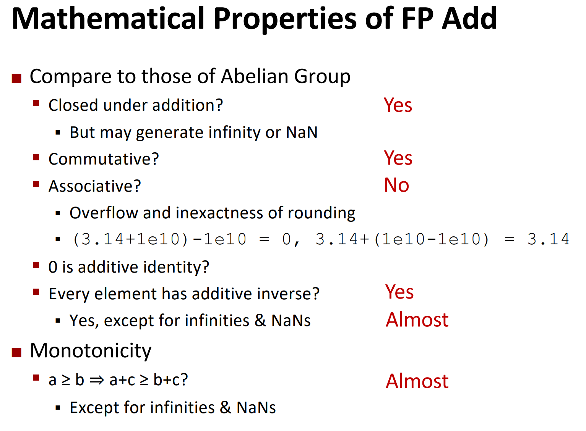
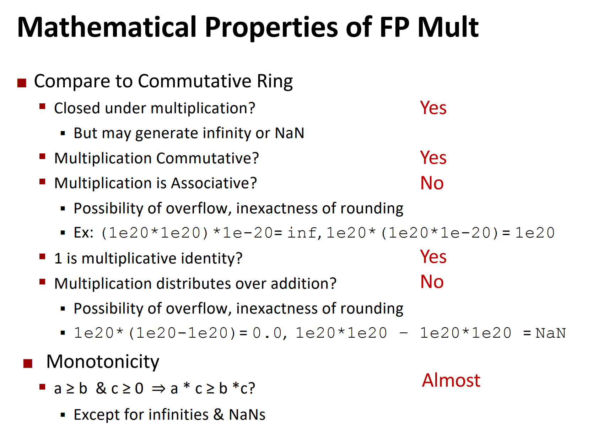

# Lec 4: Floating Points

Before 1985, there wasn't a universal representation of floating point numbers. So one program working on one machine might not be working on another.

## IEEE Standard 754

The IEEE 754 Floating Point Representation is shown below:

```
     1 bit            8 bits              23 bits
+--------------+------------------+-----------------------+
|     Sign     |     Exponent     |       Mantissa        |
+--------------+------------------+-----------------------+
```

Here, the number represented is 
$$
(-1)^{S}M2^{E}
$$
where **normally**, $M \in [1.0, 2.0)$.

And, in the representation

- $S$ = sign field
- exp field encodes E (but is not equal to E)
- frac field encodes M (but is not equal to M)

### Precise Implementation for IEEE 754

|       Form        | $Exponent$ | $Mantissa$ | Value                            |
| :---------------: | :--------: | :--------: | -------------------------------- |
|       Zero        |    $0$     |    $0$     | $0$                              |
| Denormalized Form |    $0$     |  non-$0$   | $(-1)^{Sgn}2^{-126}(0.Man)$      |
|  Normalized Form  | $1\sim254$ | arbitrary  | $(-1)^{Sgn}2^{Exp - 127}(1.Man)$ |
|     Infinity      |   $255$    |    $0$     | $\infty$                         |
|        NaN        |   $255$    |  non-$0$   | NaN                              |

**Visualization:**



### Some Variations of IEEE 754

- Single Precision: (1, 8, 23) ------------------------------> 32 bits
- Double Precision: (1, 11, 52) --------------------------> 64 bits
- Extended Precision (Intel only) : (1, 15, 63/64) --> 79/80 bits

#### ... and also a generic definition of the forms

|       Form        |    $Exponent$     | $Mantissa$ | Value                             |
| :---------------: | :---------------: | :--------: | --------------------------------- |
|       Zero        |        $0$        |    $0$     | $0$                               |
| Denormalized Form |        $0$        |  non-$0$   | $(-1)^{Sgn}2^{1-Bias}(0.Man)$     |
|  Normalized Form  | $1\sim 2^{\#E}-2$ | arbitrary  | $(-1)^{Sgn}2^{Exp - Bias}(1.Man)$ |
|     Infinity      |    $2^{\#E}-1$    |    $0$     | $\infty$                          |
|        NaN        |    $2^{\#E}-1$    |  non-$0$   | NaN                               |

where usually $Bias = 2^{\#E-1} - 1$.

- In the case of IEEE 754, $Bias = 2^{8 - 1} - 1 = 128 - 1 = 127$.

### Distribution of Floating Point Numbers

Take (1,3,2) as example.



One can observe the presence of **uniformly distributed values close to zero**.
Additionally, a **step-like pattern of uniformly distributed values** is apparent when examining **normalized values**.

### Properties of the IEEE encoding

- **FP Zero** is the same as **Integer Zero**
  - i.e. All bits = 0
- Can (Almost) Use Unsigned Integer Comparison
  - Must **first compare sign bits**
  - Must consider **-0 =0**
  - NaNs problematic
    - Will be greater than any other values
    - What should comparison yield?
  - Otherwise OK
    - e.g. 
      Denorm vs.normalized
      Normalized vs.infinity

### Operations on FP

#### Basic Idea

First, compute the **exact result**. 

- Assuming you have infinite amount of bits available

Next, 

- make it infinity if it's too large.
- **round** it if it's too long

#### Rounding

There are four major ways of rounding.

| Value  | Towards zero | Round down ($-\infty$) | Round up ($+\infty$) | Nearest Even (default) |
| ------ | ------------ | ---------------------- | -------------------- | ---------------------- |
| $1.40  | $1           | $1                     | $2                   | $1                     |
| $1.60  | $1           | $1                     | $2                   | $2                     |
| $1.50  | $1           | $1                     | $2                   | $2                     |
| $2.50  | $2           | $2                     | $3                   | $2                     |
| $-1.50 | -$1          | -$2                    | -$1                  | -$2                    |

"Nearest Even" is used in IEEE standard. But you can choose the way you round in assembly code.

#### How To Round?



If the digits to be truncated is 

- greater than 1/2: **Round UP!**
- smaller than 1/2: **Round DOWN!**
- equal to 1/2: **Round EVEN!**

```
ROUND_TO_EVEN (x_x0.x1_x2_..._xn)
	IF (x1 & (!x2_..._xn)) BEGIN
		x_x0 := x_x0 + x1
	END ELSE BEGIN
		// x1_x2_..._xn == 10...0
		x_x0 := x_x0 + x0;
	END
ENDFUNCTION
```

#### Multiplication

- $ (-1)^{s_1} M_1 2^{E_1} \times (-1)^{s_2} M_2 2^{E_2} $

- Exact Result: $ (-1)^s M 2^E $

  - Sign `s`: $s_1 \oplus s_2$

  - Significand `M`: $M_1 \times M_2$

  - Exponent `E`: $E_1 + E_2$


- Fixing

  - If $M \geq 2$, shift `M` right, increment `E`
    - note that both $M_1, M_2 \in [1.0, 2.0)$, so their product must be smaller than $4.0$.


  - If `E` is out of range, overflow

  - Round `M` to fit fractional precision


- Implementation
  - The biggest chore is multiplying significands.

#### Addition


#### Mathematical Properties of FP Add and Mul



**Tip:**

- In nature, things change smoothly. So you seldom run into the problem of non-associativity.
- But in some fields, e.g financial market, the indices vary dramatically. So you might run into problem, if you use default FP representation.

## FP in C

C guarantees two levels

- `float`: "single precision"
- `double`: "double precision"

Casting (between `int`, `float`, and `double`)

- `int` $\to$ `double`: No rounding needed
- `int` $\to$ `float`: As `float` only has mantissa of 23 bits, it might round according to a certain rule.
- `float`/`double`
  - **truncate** fractional part
    - i.e. round to zero
  - not defined when **out of range** or NaN, but usually to `TMin` (i.e. $-2147483648$)