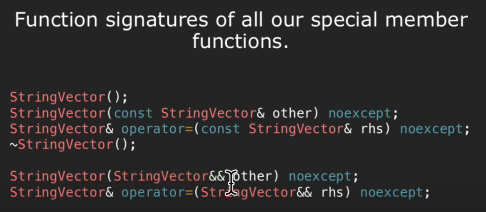

# Lec 13: Move Semantics

## Introduction: `push_back` vs `emplace_back`

```cpp
#include <vector>
#include <iostream>

using namespace std;

class Test {
public:    
    Test() : count(0) {}
    Test(const Test& other) noexcept {
        this->count = other.count + 1;
    }
    ~Test() {
        // default
    }
    void operator() () {
        cout << count << ' ';
    }
    
private:
    int count;
};

int main() {
    vector<Test> t;
    t.push_back(Test()); // output: 3
    t.emplace_back();    // output: 1
    for (auto i : t) {
        i();
    }
    
    return 0;
}
```

### Recap: Destructor

```cpp
#include <bits/stdc++.h>

using namespace std;

class Test {
public:
    Test() = delete;
    Test(string str) : tt(str) {
        cout << tt << " is constructed via `string` \n";
    }
    Test(const Test& other) {
        tt = other.tt;
        cout << tt << " is constructed via `Test&` \n";
    }
    ~Test() {
        cout << tt << " is destructed \n";
    }
    Test& operator=(const Test& other) {
        cout << tt << " is assigned to " << other.tt << '\n';
        tt = other.tt;
        return *this;
    }
private:
    string tt;
};

void mark_times() {
    static int time = 1;
    cout << "Mark: " << time << '\n';
    ++time;
}

Test fun (Test t) {
    mark_times();
    return t;
}

int main() {
    Test test1("Hello");
    mark_times();
    Test test2("World");
    mark_times();
    test1 = fun(test2);
    mark_times();
    cout << "final test\n";
    test2 = fun(static_cast<string>("CS106L"));
    mark_times();
    
    return 0;
}
```

Output (with flag `-Og -fno-elide-constructors`):

```
Hello is constructed via `string` 
Mark: 1
World is constructed via `string` 
Mark: 2
World is constructed via `Test&` 
Mark: 3
World is constructed via `Test&` 
Hello is assigned to World
World is destructed 
World is destructed 
Mark: 4
final test
CS106L is constructed via `string` 
CS106L is constructed via `Test&` 
Mark: 5
CS106L is constructed via `Test&` 
World is assigned to CS106L
CS106L is destructed 
CS106L is destructed 
CS106L is destructed 
Mark: 6
CS106L is destructed 
World is destructed 
```

So:

1. temporary objects will be destructed after the program goes to the next line
2. all non-`new` objects will be destructed after reaching `}`
3. when calling `test(static_cast<string>("CS106L"))`, three temp objects will be created (and destructed)
   - first, `(string)"CS106L"` to `Test temp1`
     - if you discard the `-fno-elide-constructors` flag, the first and second steps can be merged into one step
   - second, `Test temp1` to `Test t`
   - finally, `Test t` to `return`


## l-value vs r-value

> This is a simplification of the reality, but it's enough for today's topic.

l-value is a value with an identity

- can be addressed

r-value has no identity.

- can't be addressed

### r-value reference

```cpp
int main()
{
    int a = 1;
    int &b = a;
    int &c = a + 2; // error: cannot bind non-const lvalue reference to an rvalue
    const int &d = a + 2;
    int &&e = a; // error: cannot bind rvalue reference to lvalue
    int &&f = a + 2;
}
```

### Why r-value is the key to `std::move`

An object that is an I-value is NOT disposable, so you can copy from, but definitely cannot move from.

An object that is an r-value is disposable, so **you can either copy or move from**.

- "move" here just means "steal"

### Move constructor and move assignment



> The move constructor and move assignment are at the bottom two lines.

So, if RHS is an r-value, we use move constructor; if not, we use normal constructor.

- Notice actually **you can bind `const Type&` to an r-value**, but C++11 standard says if you are encountered with a r-value, you must use `Type &&`, if it exists.

---

The actual meaning of r-value reference, is: 

**Provide the (temporary) r-value a name, so I can easily manipulate the data within it later.**

---

And, since **r-value reference itself is l-value**, its elements are **l-value**s. So we must cast them to **r-value**.

In this case, we use **std::move**.

```cpp
class StrVector {
public:
    // ...
    StrVector (StrVector&& other) : elems(std::move(other.elems)), logicalSize(other.logicalSize), allocatedSize(other.allocatedSize)
    {
		other.elems = nullptr;
    }
};
```

### Example: `swap`

```cpp
template <typename T>
void my_swap(T& a, T& b)
{
    T temp = std::move(a); 
    // now a is undefined
    a = std::move(b);
    // now b is undefined, and is given to a (i.e. a is defined)
    b = std::move(temp);
    // now temp is undefined, and is given to b (i.e. b is defined)
	
    // Finally, temp is undefined, and a, b are swapped.
}
```

