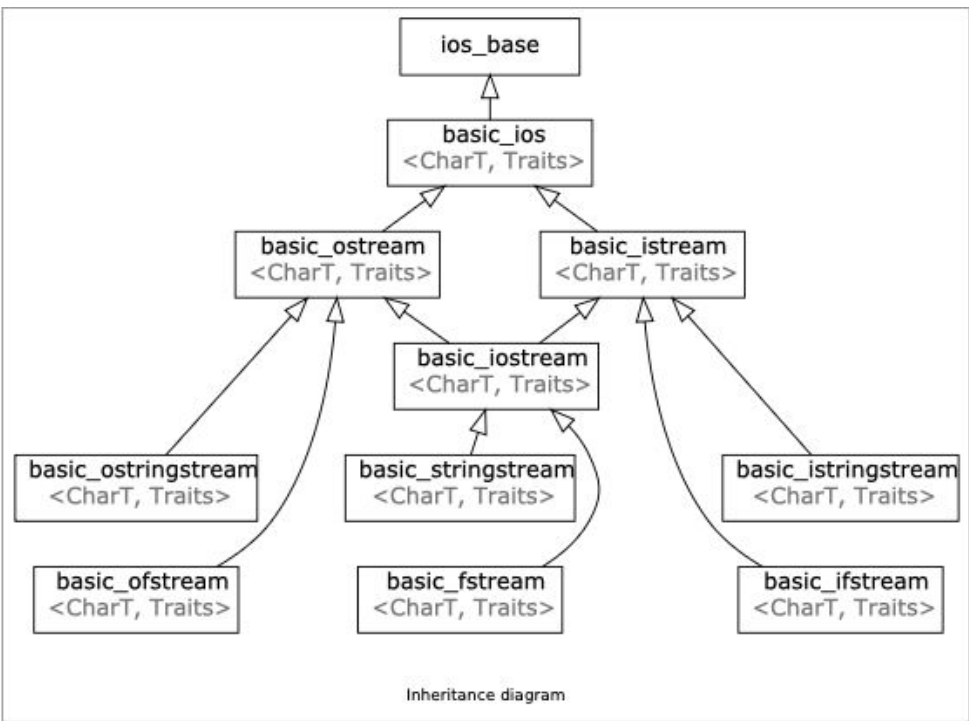
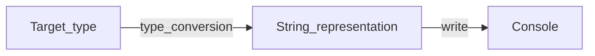

# Lec 4: Streams

> Definition: a general input/output(IO) **abstraction** for C++

## `cout` and `cin`

They are known as the standard iostreams.

And 

```cpp
namespace std {
    ostream cout;
    typedef ostream basic_ostream<char>;
    template<
    	class CharT,
    	class Traits = std::char_traits<CharT>
	> class basic_ostream : virtual public std::basic_ios<CharT, Traits>;
    // ...
}
```




**Note:**

1. `std::cout` is a **output stream**
2. `std::cout` is an instance of `std::ostream` which represents the standard output stream!

Also:

1. `std::cin` is a **input stream**
2. `std::cout` is an instance of `std::ostream` which represents the standard output stream!

## Generalizing the Stream

`std::cin` is


`std::cout` is



`std::ostringstream` is


In general:


**In summary,streams allow for a universal way of dealing with external data**

## What streams actually are?

Input streams (I) 

- a way to read data from a source 

Output streams (O) 

- a way to write data to a destination

### Example: `std::stringstream`

```cpp
#include <stringstream>
#include <iostream>

using namespace std;

int main() {
    string quote = "Donald Trump Make America Great Again!";
    
    /// create a stringstream
    stringstream ss(quote);
    
    /// data destinations
    string first, last, extracted_quote;
    
    ss >> first >> last;
    getline(ss, extracted_quote);
    
    cout << first << ' ' << last << ": " << extracted_quote << endl;
    
    return 0;
}
```

Note:

- `>>` ignores all leading spaces, and read the string from the first non-space char until **the next char** is space, and set the `beg` pointer to **the next char**.
- `istream& getline(istream& is, string& str, char delim)`  read the string from the `beg` pointer until **the next char** is `delim`. In this case, it set the `beg` pointer to **the char next to the next char (i.e. next next char)**.

So, you **SHOULDN'T** use `>>` and `getline` together. Because they parse data differently. 

---

**To summarize**

- `>>`: ignores leading delims, read till next is delim, stop at the next delim. 
  - (\ngood\n) read (good), stop at (\n)
  - ( good\nboy) read (good), stop at (\n)
- `getline` doesn't ignore leading delims, read till next is delim, stop at the char next to next delim.
  - (\ngood\n) read (), stop at (g)
  - ( good\nboy) read ( good), stop at (b)

### Example: `std::cout`

`std::cout` also has a **intermediate buffer** that stores the chars to be printed on the console.

Example:

```cpp
#include <sstream>
#include <iostream>
#include <iomanip>

using namespace std;

int main() {
    for (int i = 1; i <= 257; ++i) {
        cout << setw(4) << i;
    }
    
    cout << 1 / 0;
    
    cout << "Good!";
    
    return 0;
}
```

Output:

```
   1   2   3   4   5   6   7   8   9  10  11  12  13  14  15  16  17  18  19  20  21  22  23  24  25  26  27  28  29  30  31  32  33  34  35  36  37  38  39  40  41  42  43  44  45  46  47  48  49  50  51  52  53  54  55  56  57  58  59  60  61  62  63  64  65  66  67  68  69  70  71  72  73  74  75  76  77  78  79  80  81  82  83  84  85  86  87  88  89  90  91  92  93  94  95  96  97  98  99 100 101 102 103 104 105 106 107 108 109 110 111 112 113 114 115 116 117 118 119 120 121 122 123 124 125 126 127 128 129 130 131 132 133 134 135 136 137 138 139 140 141 142 143 144 145 146 147 148 149 150 151 152 153 154 155 156 157 158 159 160 161 162 163 164 165 166 167 168 169 170 171 172 173 174 175 176 177 178 179 180 181 182 183 184 185 186 187 188 189 190 191 192 193 194 195 196 197 198 199 200 201 202 203 204 205 206 207 208 209 210 211 212 213 214 215 216 217 218 219 220 221 222 223 224 225 226 227 228 229 230 231 232 233 234 235 236 237 238 239 240 241 242 243 244 245 246 247 248 249 250 251 252 253 254 255 256Floating point exception
```

Which means that the buffer of `cout` is 1024 bytes (at least in my machine), and when it is about to add ` 257` into the buffer, the buffer is full, and it has to flush it to the console. And then the exception happens, and the remainders in the buffer is ignored.

### Example: `std::cerr` and `std::clog`

`cerr`: used to output errors (unbuffered) 

`clog`: used for non-critical event logging (buffered)

### Example: `std::fstream`

`std::fstream` also has a **intermediate buffer** that stores the chars to be printed on the console.