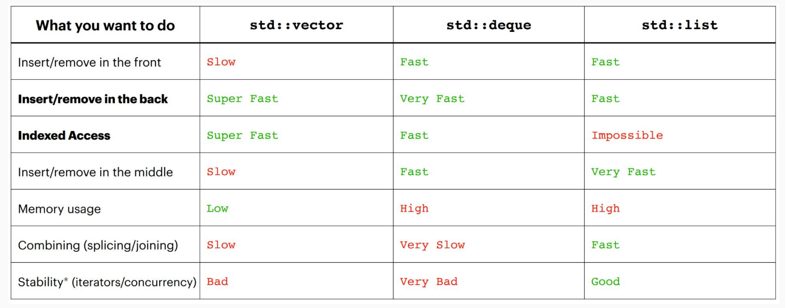

# Containers

> Definition: Container is an object that allows us to collect other objects together and interact with them in some way.

## Why containers?

1. **Organization:** Related data packed together
2. **Standardization:** *Common* features are *expected* and *implemented*.
3. **Abstraction:** Complex idea made easier to utilize by clients

### Example for "standardization"

Containers export some *standard*, *basic* functionality.

- Allow you to **store** multiple objects (of the same type)
- Allow **access** to this collection in some ways
  - Maybe even allow **iterations**!

- Maybe allow **deletion** or **editing**!

## Safety VS Speed

Containers in C++ STL don't check boundaries, whereas those in Python check.

```cpp
int main() {
    vector<int> vec{1,2,3,4};
    vec[114514]; // valid.
}
```

```python
vec = [1,2,3,4]
vec[114514] # invalid!
```

Along with other checks, Python is much slower than C++ (even if both compiled).

### C++ Design Philosophy

- Only provide the checks/safety nets that are necessary
  - i.e. minimal safety
- The programmer knows best!
  - i.e. programmers DIY

So, you should **check it yourself** when needed. That is, **make sure what you are doing is allowed is your job**.

## Two Types of Containers

Sequential containers

- Containers can be accessed sequentially
- **Anything with an inherent** order goes there

Associative containers

- Containers that don’t necessarily have a sequential order
- More easily searched
- **Maps** and **sets** go here!

### Sequential containers

Let's take `std::vector`, `std::deque` and `std::list` as examples.

`std::vector` uses continuous memories, `std::list` uses pointers and random memories, whereas `std::deque` use continuous memories that store the addresses of blocks of continuous memory **(not circular vector!!!)**.



**Tips:**

- Sequence containers are for when you need to **enforce some order on your information**!
- `std::vector` can be used for *almost* anything.
- `std::deque` when you need to insert at both ends.
- `std::list` when joining/working with multiple lists (very rare)

### Associative containers

Let's take `std::map/set` and `std::unordered_map/set` as examples.

To use `std::map/set<Key(, Value)>`, the `Key` class must define the **comparison operator**.

To use `std::unordered_map/set<Key(, Value)>`, the `Key` class must define the **hash function**.


**Tips:**

- Unordered containers are **faster**, but can be difficult to get to work with nested containers/collections.
- If using **complicated data types**/unfamiliar with hash functions, use an ordered container

## Container Adaptors

Container adaptors are “wrappers” to existing containers!

- Wrappers **modify the interface** to sequence containers and change what the client is allowed to do/how they can interact with the container.

### Example: `std::queue`

The definition for `std::queue` is 

```cpp
template <class T, class Container = deque<T> > class queue;
```

So, without specification, `std::queue` use `std::deque` as its underlying container.

Although `std::queue` is implemented by `std::deque`, the client can only `push` and `pop`, and can't `push_front` or `pop_back`. Thus, `std::queue` indeed changes what the client is allowed to do.

---

But, `Container` can't be arbitrary. It must at least support 

- empty
- size
- front
- back
- push_back
- pop_front

So, `std::list` can be a suitable container for `std::queue`, e.g. `queue<int, list<int> > q`

---

And, **the concept of container adapters** is new layer of abstraction again!

- Commonly used data structures made easy for the client to use 
  - e.g. `priority_queue` is based on `vector`. And implement an ordered heap is not a trivial job.
- Can use different backing containers based on use type
  - e.g. `list` can also be used to implement `queue`

