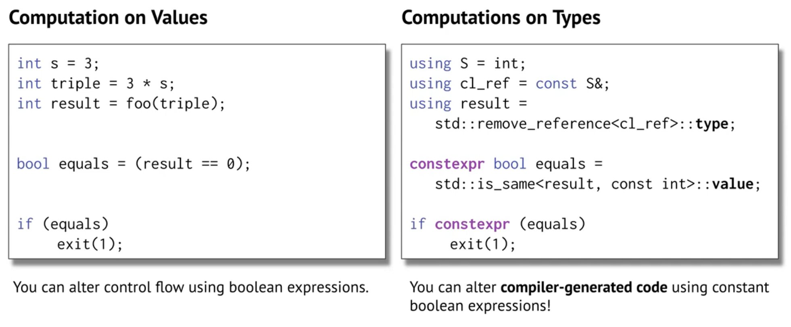
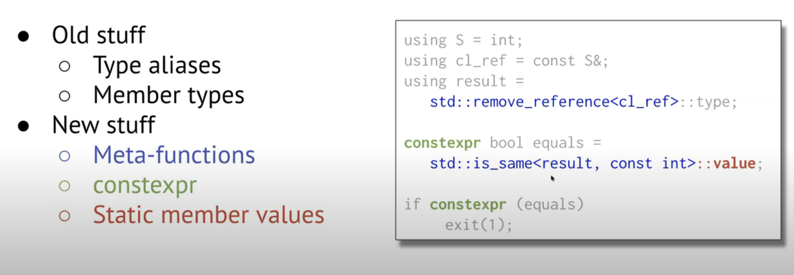
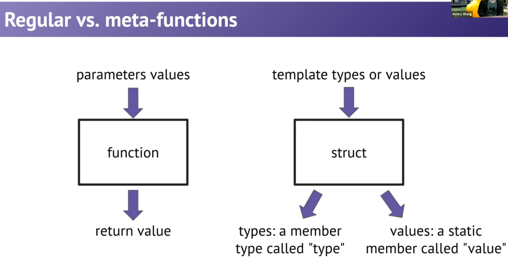

# Guest Lecture: Template Metaprogramming

## Prerequisite: `typename` 的用法

1. 声明模板参数，如：`template <typename T>`。不多解释。

2. 声明嵌套类型，如：

   ```cpp
   template<typename C>
   void print2nd(const C& container){
       if(container.size() >= 2){
           typename C::const_iterator it(container.begin());
           ++it;
           int value = *it;  
           cout<<value;
       }
   }
   ```

   此处，如果没有 `typename`，C++ 会默认将 `C::const_iterator` 当作一个变量/静态成员。


## Introduction: the `my_distance` function

我们希望实现一个泛型的距离函数，可以返回两个迭代器之间的举例：

```cpp
template <typename It>
size_t my_distance (It a, It b) {
    return b - a;
}
```

但是，这个函数只适用于 random access iterator。

```cpp
template <typename It>
size_t my_distance (It a, It b) {
    size_t result = 0;
    while (first != last) {
        ++first, ++result;
    }
    return result;
}
```

但是，这个函数对于 random access iterator 而言，太慢了。

我们希望兼顾两者——对于 RAI，就用上面的方法；对于非 RAI，就用下面的。

## Type Computation



There are old and new stuffs in the image above:



## Regular vs. meta-functions



Example:

```cpp
template <typename T>
struct type_identity {
    using type = T;
};

template <int V>
struct int_identity {
    static const int value = V;
};

using K = type_identity<int>::type;
int val = int_identity<3>::value;
```

**Note:** We use `struct` to *simulate* a function. But `struct` itself, by essence, is NOT a function.

**Summary:**

- Meta-functions are structs that **treats its template types/values as the parameters**, and **places the return values as public members** (i.e. member types and static member values) .
- We never need to create an instance of the struct
  - say, we can add `<constructor> = delete;` to prevent anyone from instantiate it.

##  Template Specialization

> You can have a "generic" template, as well as "specialized" templates for particular types.

Most classical (fully specialized) example:

```cpp
template <typename T>   // generic
class vector {
    // implementation using an array
	// that is resized as necessary
}

template <>             // specialized
class vector<bool> {
    // implementation using bit array
	// so each element takes one bit
}
```

Also a partially specialized example:

```cpp
template <typename K, typename V>
struct HashMap {
  // generic
};

template <typename K, typename V>
struct HashMap<K*, V> {
  // partially specialized
};

template <typename V>
struct HashMap<int, V> {
  // partially specialized
};

template <>
struct HashMap<int, int> {
  // fully specialized
};
```

### Summary: Deduction Rules

The compiler will 

- **rank** all the templates 
- and try each one until it finds one that works.

An error will occur only if 

- none of the templates work 
- or if there is a tie.

### More examples

Generic and specialized templates resemble "a gigantic `if-else` statement".

#### `is_same`

```cpp
template <typename U, typename T>
struct is_same {
    static const bool value = false;
}

template <typename T>
struct is_same <T, T> { // `struct [struct name] <...>` is the special syntax for specialized template
  	static const bool value = true;  
};
```

#### `remove_const`

```cpp
template <typename T>
struct remove_const {
    using type = T;
}

template <typename T>
struct remove_const <const T> {
  	using type = T; 
};
```

## Finally, the generic yet specialized implementation of `my_distance`

```cpp
template <typename It>
size_t my_distance (It a, It b) {
	using category = typename std::iterator_traits<It>::iterator_category; // `category` is a type!
    // `iterator_traits<...>` can be considered as a vector-valued metafunction
    // and `iterator_category` is one of the components of the vector
    
    if constexpr (std::is_same<category, std::random_access_iterator_tag>::value) {
        return b - a;
    } else {
        size_t result = 0;
        while (first != last) {
            ++first, ++result;
        }
        return result;
    }
}
```

**Note:** `if constexpr` is a new syntax in C++17. The `if-else` condition can be evaluated at compile time, enabling the compiler to discard one of the branches enclosed in the brackets.