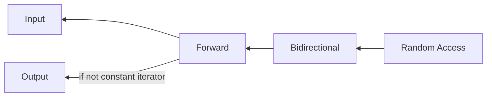
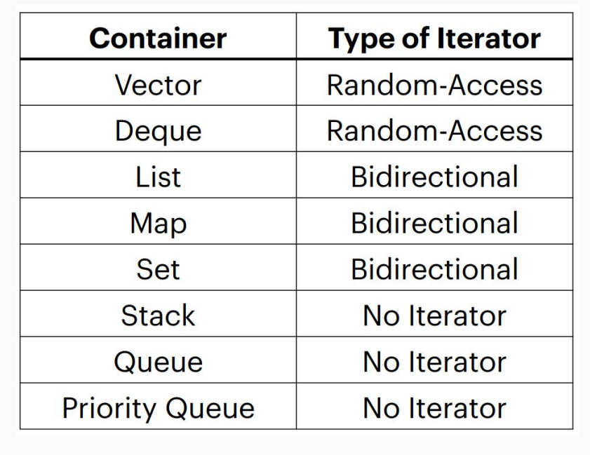

# Lec 6: Iterators and Pointers

## Iterators

An iterator (of a container)

- can let you **access all data** in containers **programmatically**!
- has a certain **order**; it “knows” what element will come next
  - not necessarily the same each time you iterate (esp. for associative containers)

### STL iterators

In STL, all containers implement iterators, but they are not all the same.

Nonetheless, they share a few operations:

- Initializing: `auto iter = s.begin()`
- Incrementing: `++iter`
- Dereferencing: `*iter`
- Comparing: `iter != s.end()`
- Copying: `auto new_iter = iter`

### The hierarchy of iterators

**Input** and **output** **iterators** are the most limited types of iterators: they can perform sequential single-pass input or output operations.
**Forward** **iterators** have all the functionality of **input iterators** and -if they are not ***constant iterators***- also the functionality of output iterators, although they are limited to one direction in which to iterate through a range (forward). All standard containers support at least forward iterator types.
**Bidirectional** **iterators** are like forward iterators but can also be iterated through backwards.
**Random-access** **iterators** implement all the functionality of bidirectional iterators, and also have the ability to access ranges non-sequentially: distant elements can be accessed directly by *applying an offset value* to an iterator without iterating through all the elements in between. *These iterators have a similar functionality to standard pointers* (pointers are iterators of this category).

**Note:**

- In some sense, iterators are kind of restricted pointers. Random-access iterators have almost the same functionalities as pointers.
- **Input** iterators can appear at the RHS of the `= ` operator, i.e. *input* its value to a variable
  - `auto val = *it`
- **Output** iterators can appear at the LHS of the `= ` operator, i.e. *output* the value of a variable to it
  - `*it = val`
- **Forward** iterators are the minimum level of functionality for standard containers.
- **Bidirectional** iterators support `--it`
- **Random-access** iterators support `it + 5`

