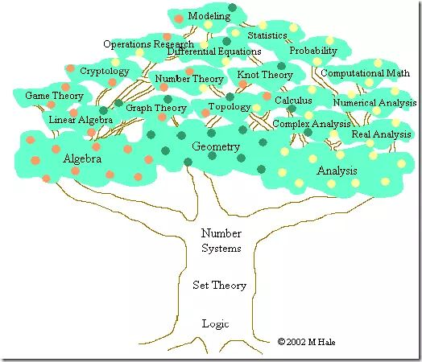

# MIT牛人解说数学体系

> 原文链接：[MIT牛人解说数学体系](https://mp.weixin.qq.com/s?__biz=MzAwNTA5NTYxOA==&mid=400856341&idx=1&sn=f5e417b3f67efd872afa41e321460501&scene=21#wechat_redirect)

## 一、为什么要深入数学的世界

作为计算机的学生，我（原作者）没有任何企图要成为一个数学家。我学习数学的目的，是要想爬上巨人的肩膀，希望站在更高的高度，能把我自己研究的东西看得更深广一些。说起来，我在刚来这个学校的时候，并没有预料到我将会有一个深入数学的旅程。我的导师最初希望我去做的题目，是对appearance和motion建立一个unified的model。这个题目在当今Computer Vision中百花齐放的世界中并没有任何特别的地方。事实上，使用各种Graphical Model把各种东西联合在一起framework，在近年的论文中并不少见。

我不否认现在广泛流行的Graphical Model是对复杂现象建模的有力工具，但是，我认为它不是panacea，并不能取代对于所研究的问题的深入的钻研。如果统计学习包治百病，那么很多“下游”的学科也就没有存在的必要了。事实上，开始的时候，我也是和Vision中很多人一样，想着去做一个Graphical Model——我的导师指出，这样的做法只是重复一些标准的流程，并没有很大的价值。经过很长时间的反复，另外一个路径慢慢被确立下来——我们相信，一个图像是通过大量“原子”的某种空间分布构成的，原子群的运动形成了动态的可视过程。微观意义下的单个原子运动，和宏观意义下的整体分布的变换存在着深刻的联系——这需要我们去发掘。

在深入探索这个题目的过程中，遇到了很多很多的问题，如何描述一个一般的运动过程，如何建立一个稳定并且广泛适用的原子表达，如何刻画微观运动和宏观分布变换的联系，还有很多。在这个过程中，我发现了两个事情：

> **我原有的数学基础已经远远不能适应我对这些问题的深入研究。**
> **在数学中，有很多思想和工具，是非常适合解决这些问题的，只是没有被很多的应用科学的研究者重视。**

于是，我决心开始深入数学这个浩瀚大海，希望在我再次走出来的时候，我已经有了更强大的武器去面对这些问题的挑战。我的游历并没有结束，我的视野相比于这个博大精深的世界的依旧显得非常狭窄。在这里，我只是说说，在我的眼中，数学如何一步步从初级向高级发展，更高级别的数学对于具体应用究竟有何好处。

## 二、**集合论**：现代数学的共同基础

现代数学有数不清的分支，但是，它们都有一个共同的基础——集合论——因为它，数学这个庞大的家族有个共同的语言。集合论中有一些最基本的概念：集合(set)，关系(relation)，函数(function)，等价 (equivalence)，是在其它数学分支的语言中几乎必然存在的。对于这些简单概念的理解，是进一步学些别的数学的基础。我相信，理工科大学生对于这些都不会陌生。

不过，有一个很重要的东西就不见得那么家喻户晓了——那就是“选择公理” (Axiom of Choice)。这个公理的意思是“任意的一群非空集合，一定可以从每个集合中各拿出一个元素。”——似乎是显然得不能再显然的命题。不过，这个貌似平常的公理却能演绎出一些比较奇怪的结论，比如巴拿赫-塔斯基分球定理——“一个球，能分成五个部分，对它们进行一系列刚性变换（平移旋转）后，能组合成两个一样大小的球”。

正因为这些完全有悖常识的结论，导致数学界曾经在相当长时间里对于是否接受它有着激烈争论。现在，主流数学家对于它应该是基本接受的，因为很多数学分支的重要定理都依赖于它。在我们后面要回说到的学科里面，下面的定理依赖于选择公理：

> **拓扑学：Baire Category Theorem**
> **实分析（测度理论）：Lebesgue不可测集的存在性**
> **泛函分析四个主要定理：Hahn-Banach Extension Theorem, Banach-Steinhaus Theorem (Uniform boundedness principle), Open Mapping Theorem, Closed Graph Theorem**

在集合论的基础上，现代数学有两大家族：分析(Analysis)和代数(Algebra)。至于其它的，比如几何和概率论，在古典数学时代，它们是和代数并列的，但是它们的现代版本则基本是建立在分析或者代数的基础上，因此从现代意义说，它们和分析与代数并不是平行的关系。

## 三、**分析**：在极限基础上建立的宏伟大厦

**1 微积分：分析的古典时代--从牛顿到柯西**

先说说分析(Analysis)吧，它是从微积分(Caculus)发展起来的——这也是有些微积分教材名字叫“数学分析”的原因。不过，分析的范畴远不只是这些，我们在大学一年级学习的微积分只能算是对古典分析的入门。分析研究的对象很多，包括导数(derivatives)，积分(integral)，微分方程(differential equation)，还有级数(infinite series)——这些基本的概念，在初等的微积分里面都有介绍。如果说有一个思想贯穿其中，那就是极限——这是整个分析（不仅仅是微积分）的灵魂。

一个很多人都听说过的故事，就是牛顿(Newton)和莱布尼茨 (Leibniz)关于微积分发明权的争论。事实上，在他们的时代，很多微积分的工具开始运用在科学和工程之中，但是，微积分的基础并没有真正建立。

那个长时间一直解释不清楚的“无穷小量”的幽灵，困扰了数学界一百多年的时间——这就是“第二次数学危机”。直到柯西用极限的观点重新建立了微积分的基本概念，这门学科才开始有了一个比较坚实的基础。直到今天，整个分析的大厦还是建立在极限的基石之上。

柯西(Cauchy)为分析的发展提供了一种严密的语言，但是他并没有解决微积分的全部问题。在19世纪的时候，分析的世界仍然有着一些挥之不去的乌云。而其中最重要的一个没有解决的是“函数是否可积的问题”。

我们在现在的微积分课本中学到的那种通过“无限分割区间，取矩阵面积和的极限”的积分，是大约在1850年由黎曼(Riemann)提出的，叫做黎曼积分。但是，什么函数存在黎曼积分呢（黎曼可积）？数学家们很早就证明了，定义在闭区间内的连续函数是黎曼可积的。可是，这样的结果并不令人满意，工程师们需要对分段连续函数的函数积分。

**2 实分析：在实数理论和测度理论上建立起现代分析**

在19世纪中后期，不连续函数的可积性问题一直是分析的重要课题。对于定义在闭区间上的黎曼积分的研究发现，可积性的关键在于“不连续的点足够少”。只有有限处不连续的函数是可积的，可是很多有数学家们构造出很多在无限处不连续的可积函数。显然，在衡量点集大小的时候，有限和无限并不是一种合适的标准。

在探讨“点集大小”这个问题的过程中，数学家发现实数轴——这个他们曾经以为已经充分理解的东西——有着许多他们没有想到的特性。在极限思想的支持下，实数理论在这个时候被建立起来，它的标志是对实数完备性进行刻画的几条等价的定理（确界定理，区间套定理，柯西收敛定理，Bolzano-Weierstrass Theorem和Heine-Borel Theorem等等）——这些定理明确表达出实数和有理数的根本区别：完备性（很不严格的说，就是对极限运算封闭）。

随着对实数认识的深入，如何测量“点集大小”的问题也取得了突破，勒贝格创造性地把关于集合的代数，和Outer content（就是“外测度”的一个雏形）的概念结合起来，建立了测度理(Measure Theory)，并且进一步建立了以测度为基础的积分——勒贝(Lebesgue Integral)。在这个新的积分概念的支持下，可积性问题变得一目了然。

上面说到的实数理论，测度理论和勒贝格积分，构成了我们现在称为实分析 (Real Analysis)的数学分支，有些书也叫实变函数论。对于应用科学来说，实分析似乎没有古典微积分那么“实用”——很难直接基于它得到什么算法。而且， 它要解决的某些“难题”——比如处处不连续的函数，或者处处连续而处处不可微的函数——在工程师的眼中，并不现实。

但是，我认为，它并不是一种纯数学概念游戏，它的现实意义在于为许多现代的应用数学分支提供坚实的基础。下面，我仅仅列举几条它的用处：

1）黎曼可积的函数空间不是完备的，但是勒贝格可积的函数空间是完备的。简单的说，一个黎曼可积的函数列收敛到的那个函数不一定是黎曼可积的，但是勒贝格可积的函数列必定收敛到一个勒贝格可积的函数。在泛函分析，还有逼近理论中，经常需要讨论“函数的极限”，或者“函数的级数”，如果用黎曼积分的概念，这种讨论几乎不可想像。我们有时看一些paper中提到L^p函数空间，就是基于勒贝格积分。

2）勒贝格积分是傅立叶变换（这东西在工程中到处都是）的基础。很多关于信号处理的初等教材，可能绕过了勒贝格积分，直接讲点面对实用的东西而不谈它的数学基础，但是，对于深层次的研究问题——特别是希望在理论中能做一些工作——这并不是总能绕过去。

3）在下面，我们还会看到，测度理论是现代概率论的基础。

**3 拓扑学：分析从实数轴推广到一般空间--现代分析的抽象基础**

随着实数理论的建立，大家开始把极限和连续推广到更一般的地方的分析。事实上，很多基于实数的概念和定理并不是实数特有的。很多特性可以抽象出来，推广到更一般的空间里面。对于实数轴的推广，促成了点集拓扑学(Point- set Topology)的建立。很多原来只存在于实数中的概念，被提取出来，进行一般性的讨论。在拓扑学里面，有4个C构成了它的核心：

**1）Closed set 闭集**

在现代的拓扑学的公理化体系中，开集和闭集是最基本的概念。一切从此引申。这两个概念是开区间和闭区间的推广，它们的根本地位，并不是一开始就被认识到的。经过相当长的时间，人们才认识到：开集的概念是连续性的基础，而闭集对极限运算封闭——而极限正是分析的根基。

**2）Continuous function连续函数**

连续函数在微积分里面有个用epsilon-delta语言给出的定义，在拓扑学中它的定义是“开集的原像是开集的函数”。第二个定义和第一个是等价的，只是用更抽象的语言进行了改写。我个人认为，它的第三个（等价）定义才从根本上揭示连续函数的本质——“连续函数是保持极限运算的函数” ——比如y是数列x1, x2, x3, … 的极限， 那么如果 f 是连续函数，那么 f(y) 就是 f(x1), f(x2), f(x3), …的极限。连续函数的重要性，可以从别的分支学科中进行类比。比如群论中，基础的运算是“乘法”，对于群，最重要的映射叫“同态映射”——保持“乘法”的映射。在分析中，基础运算是“极限”，因此连续函数在分析中的地位，和同态映射在代数中的地位是相当的。

**3）Connected set 连通集**

比它略为窄一点的概念叫(Path connected)，就是集合中任意两点都存在连续路径相连——可能是一般人理解的概念。一般意义下的连通概念稍微抽象一些。在我看来，连通性有两个重要的用场：一个是用于证明一般的中值定理(Intermediate Value Theorem)，还有就是代数拓扑，拓扑群论和李群论中讨论根本群(Fundamental Group)的阶。

**4）Compact set 紧集**

Compactness似乎在初等微积分里面没有专门出现，不过有几条实数上的定理和它其实是有关系的。比如，“有界数列必然存在收敛子列”——用compactness的语言来说就是——“实数空间中有界闭集是紧的”。它在拓扑学中的一般定义是一个听上去比较抽象的东西——“紧集的任意开覆盖存在有限子覆盖”。这个定义在讨论拓扑学的定理时很方便，它在很多时候能帮助实现从无限到有限的转换。对于分析来说，用得更多的是它的另一种形式 ——“紧集中的数列必存在收敛子列”——它体现了分析中最重要的“极限”。Compactness在现代分析中运用极广，无法尽述。微积分中的两个重要定 理：极值定理(Extreme Value Theory)，和一致收敛定理(Uniform Convergence Theorem)就可以借助它推广到一般的形式。

从某种意义上说，点集拓扑学可以看成是关于“极限”的一般理论，它抽象于实数理论，它的概念成为几乎所有现代分析学科的通用语言，也是整个现代分析的根基所在。

**4 微分几何：流形上的分析——在拓扑空间上引入微分结构**

拓扑学把极限的概念推广到一般的拓扑空间，但这不是故事的结束，而仅仅是开始。在微积分里面，极限之后我们有微分，求导，积分。这些东西也可以推广到拓扑空间，在拓扑学的基础上建立起来——这就是微分几何。从教学上说，微分几何的教材，有两种不同的类型，一种是建立在古典微机分的基础上的“古典微分几何”，主要是关于二维和三维空间中的一些几何量的计算，比如曲率。还有一种是建立在现代拓扑学的基础上，这里姑且称为“现代微分几何”——它的核心概念就是“流形”(manifold)——就是在拓扑空间的基础上加了一套可以进行微分运算的结构。现代微分几何是一门非常丰富的学科。比如一般流形上的微分的定义就比传统的微分丰富，我自己就见过三种从不同角度给出的等价定义——这一方面让事情变得复杂一些，但是另外一个方面它给了同一个概念的不同理解，往往在解决问题时会引出不同的思路。除了推广微积分的概念以外，还引入了很多新概念：tangent space, cotangent space, push forward, pull back, fibre bundle, flow, immersion, submersion 等等。

近些年，流形在machine learning似乎相当时髦。但是，坦率地说，要弄懂一些基本的流形算法， 甚至“创造”一些流形算法，并不需要多少微分几何的基础。对我的研究来说，微分几何最重要的应用就是建立在它之上的另外一个分支：李群和李代数——这是数学中两大家族分析和代数的一个漂亮的联姻。分析和代数的另外一处重要的结合则是泛函分析，以及在其基础上的调和分析。

## **四、代数：一个抽象的世界**

**1 关于抽象代数**

回过头来，再说说另一个大家族——代数。

如果说古典微积分是分析的入门，那么现代代数的入门点则是两个部分：线性代数(linear algebra)和基础的抽象代数(abstract algebra)——据说国内一些教材称之为近世代数。代数——名称上研究的似乎是数，在我看来，主要研究的是运算规则。一门代数，其实都是从某种具体的运算体系中抽象出一些基本规则，建立一个公理体系，然后在这基础上进行研究。一个集合再加上一套运算规则，就构成一个代数结构。在主要的代数结构中，最简单的是群(Group)——它只有一种符合结合率的可逆运算，通常叫“乘法”。如果，这种运算也符合交换率，那么就叫阿贝尔群 (Abelian Group)。如果有两种运算，一种叫加法，满足交换率和结合率，一种叫乘法，满足结合率，它们之间满足分配率，这种丰富一点的结构叫做环(Ring)，如果环上的乘法满足交换率，就叫可交换环(Commutative Ring)。如果，一个环的加法和乘法具有了所有的良好性质，那么就成为一个域(Field)。基于域，我们可以建立一种新的结构，能进行加法和数乘，就构成了线性代数(Linear algebra)。

代数的好处在于，它只关心运算规则的演绎，而不管参与运算的对象。只要定义恰当，完全可以让一只猫乘一只狗得到一头猪:-)。基于抽象运算规则得到的所有定理完全可以运用于上面说的猫狗乘法。当然，在实际运用中，我们还是希望用它干点有意义的事情。学过抽象代数的都知道，基于几条最简单的规则，比如结合律，就能导出非常多的重要结论——这些结论可以应用到一切满足这些简单规则的地 方——这是代数的威力所在，我们不再需要为每一个具体领域重新建立这么多的定理。

抽象代数有在一些基础定理的基础上，进一步的研究往往分为两个流派：研究有限的离散代数结构（比如有限群和有限域），这部分内容通常用于数论，编码，和整数方程这些地方；另外一个流派是研究连续的代数结构，通常和拓扑与分析联系在 一起（比如拓扑群，李群）。我在学习中的focus主要是后者。

**2 线性代数：“线性”的基础地位**

对于做Learning, vision, optimization或者statistics的人来说，接触最多的莫过于线性代数——这也是我们在大学低年级就开始学习的。线性代数，包括建立在它基础上的各种学科，最核心的两个概念是向量空间和线性变换。线性变换在线性代数中的地位，和连续函数在分析中的地位，或者同态映射在群论中的地位是一样的 ——它是保持基础运算（加法和数乘）的映射。

在learning中有这样的一种倾向——鄙视线性算法，标榜非线性。也许在很多场合下面，我们需要非线性来描述复杂的现实世界，但是无论什么时候，线性都是具有根本地位的。没有线性的基础，就不可能存在所谓的非线性推广。我们常用的非线性化的方法包括流形和kernelization，这两者都需要在某个阶段回归线性。流形需要在每个局部建立和线性空间的映射，通过把许多局部线性空间连接起来形成非线性；而kernerlization则是通过置换内积结构把原线性空间“非线性”地映射到另外一个线性空间，再进行线性空间中所能进行的操作。而在分析领域，线性的运算更是无处不在，微分，积分，傅立叶变换，拉普拉斯变换，还有统计中的均值，通通都是线性的。

**3 泛函分析：从有限维向无限维迈进**

在大学中学习的线性代数，它的简单主要因为它是在有限维空间进行的，因为有限，我们无须借助于太多的分析手段。但是，有限维空间并不能有效地表达我们的世界——最重要的，函数构成了线性空间，可是它是无限维的。对函数进行的最重要的运算都在无限维空间进行，比如傅立叶变换和小波分析。这表明了，为了研究函数（或者说连续信号），我们需要打破有限维空间的束缚，走入无限维的函数空间——这里面的第一步，就是泛函分析。

泛函分析(Functional Analysis)是研究的是一般的线性空间，包括有限维和无限维，但是很多东西在有限维下显得很trivial，真正的困难往往在无限维的时候出现。在泛函分析中，空间中的元素还是叫向量，但是线性变换通常会叫作“算子”(operator)。除了加法和数乘，这里进一步加入了一些运算，比如加入范数去表达“向量的长度”或者“元素的距离”，这样的空间叫做“赋范线性空间”(normed space)，再进一步的，可以加入内积运算，这样的空间叫“内积空间”(Inner product space)。

大家发现，当进入无限维的时间时，很多老的观念不再适用了，一切都需要重新审视。

1、所有的有限维空间都是完备的（柯西序列收敛），很多无限维空间却是不完备的（比如闭区间上的连续函数）。在这里，完备的空间有特殊的名称：完备的赋范空间叫巴拿赫空间(Banach space)，完备的内积空间叫希尔伯特空间(Hilbert space)。

2、在有限维空间中空间和它的对偶空间的是完全同构的，而在无限维空间中，它们存在微妙的差别。

3、在有限维空间中，所有线性变换（矩阵）都是有界变换，而在无限维，很多算子是无界的(unbounded)，最重要的一个例子是给函数求导。

4、在有限维空间中，一切有界闭集都是紧的，比如单位球。而在所有的无限维空间中，单位球都不是紧的——也就是说，可以在单位球内撒入无限个点，而不出现一个极限点。

5、在有限维空间中，线性变换（矩阵）的谱相当于全部的特征值，在无限维空间中，算子的谱的结构比这个复杂得多，除了特征值组成的点谱(point spectrum)，还有approximate point spectrum和residual spectrum。虽然复杂，但是，也更为有趣。由此形成了一个相当丰富的分支——算子谱论(Spectrum theory)。

6、在有限维空间中，任何一点对任何一个子空间总存在投影，而在无限维空间中， 这就不一定了，具有这种良好特性的子空间有个专门的名称切比雪夫空间(Chebyshev space)。这个概念是现代逼近理论的基础(approximation theory)。函数空间的逼近理论在Learning中应该有着非常重要的作用，但是现在看到的运用现代逼近理论的文章并不多。

**4 继续往前：巴拿赫代数，调和分析，李代数**

基本的泛函分析继续往前走，有两个重要的方向。第一个是巴拿赫代数 (Banach Algebra)，它就是在巴拿赫空间（完备的内积空间）的基础上引入乘法（这不同于数乘）。比如矩阵——它除了加法和数乘，还能做乘法——这就构成了一 个巴拿赫代数。除此以外，值域完备的有界算子，平方可积函数，都能构成巴拿赫代数。巴拿赫代数是泛函分析的抽象，很多对于有界算子导出的结论，还有算子谱 论中的许多定理，它们不仅仅对算子适用，它们其实可以从一般的巴拿赫代数中得到，并且应用在算子以外的地方。巴拿赫代数让你站在更高的高度看待泛函分析中 的结论，但是，我对它在实际问题中能比泛函分析能多带来什么东西还有待思考。

最能把泛函分析和实际问题在一起的另一个重要方向是调和分析 (Harmonic Analysis)。我在这里列举它的两个个子领域，傅立叶分析和小波分析，我想这已经能说明它的实际价值。它研究的最核心的问题就是怎么用基函数去逼近和构造一个函数。它研究的是函数空间的问题，不可避免的必须以泛函分析为基础。除了傅立叶和小波，调和分析还研究一些很有用的函数空间，比如Hardy space，Sobolev space，这些空间有很多很好的性质，在工程中和物理学中都有很重要的应用。对于vision来说，调和分析在信号的表达，图像的构造，都是非常有用的工具。

当分析和线性代数走在一起，产生了泛函分析和调和分析；当分析和群论走在一起，我们就有了李群(Lie Group)和李代数(Lie Algebra)。它们给连续群上的元素赋予了代数结构。我一直认为这是一门非常漂亮的数学：在一个体系中，拓扑，微分和代数走到了一起。在一定条件下，通过李群和李代数的联系，它让几何变换的结合变成了线性运算，让子群化为线性子空间，这样就为Learning中许多重要的模型和算法的引入到对几何运动的建模创造了必要的条件。因此，我们相信李群和李代数对于vision有着重要意义，只不过学习它的道路可能会很艰辛，在它之前需要学习很多别的数学。

## **五、现在概率论：在现代分析基础上再生**

最后，再简单说说很多Learning的研究者特别关心的数学分支：概率论。自从Kolmogorov在上世纪30年代把测度引入概率论以来，测度理论就成为现代概率论的基础。在这里，概率定义为测度，随机变量定义为可测函数，条件随机变量定义为可测函数在某个函数空间的投影，均值则是可测函数对于概率测度的积分。值得注意的是，很多的现代观点，开始以泛函分析的思路看待概率论的基础概念，随机变量构成了一个向量空间，而带符号概率测度则构成了它的对偶空间，其中一方施加于对方就形成均值。角度虽然不一样，不过这两种方式殊途同归，形成的基础是等价的。

在现代概率论的基础上，许多传统的分支得到了极大丰富，最有代表性的包括鞅论 (Martingale)——由研究赌博引发的理论，现在主要用于金融（这里可以看出赌博和金融的理论联系，:-P），布朗运动(Brownian Motion)——连续随机过程的基础，以及在此基础上建立的随机分析(Stochastic Calculus)，包括随机积分（对随机过程的路径进行积分，其中比较有代表性的叫伊藤积分(Ito Integral)），和随机微分方程。对于连续几何运用建立概率模型以及对分布的变换的研究离不开这些方面的知识。