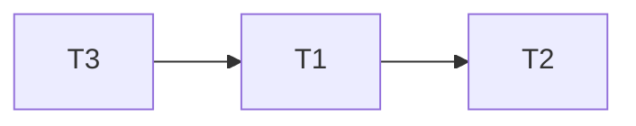

# Basics

事务需要保证 ACID 原则的实现：

- Atomic: 一个事务，要么完成了，要么没完成
- Consistent: 不管事务完成了还是没完成，数据库的状态都是合法的（i.e. 满足 trigger 等等的约束）
- Isolated: 一个事务的操作和数据在**未提交之前**，对其他事务是不可见的。
- Durability: 如果一个事务完成了，那么对数据库的改变是永久性的，即使发生了系统崩溃、断电等故障。

---

为了简化事务，我们只有 **read** 和 **write** 两种操作。

## ACID by Example: Money Transfer

如图：如果要把 50 元从 A 的账户转到 B 的账户，那么就需要经历 6 步操作，其中涉及四次读/写操作。

Consistency 有两种约束：

1. 显式：就是内蕴于数据库的，一般而言是比较基础的约束，比如 primary key, foreign key, unique 等等。
2. 隐式：就是只能用过**与数据库交互的程序**来实现的，统称为 integrity constraints。

只有在 transaction execution 的过程中，数据库才可以短暂地 inconsistent。其余时候，必须 consistent。

Isolation 有一个很简单的办法，就是串行 (serial)。当然这个策略是低效的。

## TX State

如图，对于一个交易而言，其状态就是一个有限状态机。

其中，

- active: 正在执行
- partially committed: 所有行执行完毕，待提交
- failed: 正在执行或者已执行完毕待提交的时候，发现无法继续执行/提交
- aborted: 回滚成功。
- committed: 所有行执行完毕，且已提交

# Concurrent Executions

并发执行有几点好处：

1. (if multicore) reduce overall execution time
    - 如果有多核 CPU，那么就可以在任务层面真·并行
2. increased processor and disk utilization
    - 即使只有单核，如果能够分时伪·并行，那么还是可以更加充分地利用资源（参考 CPU 流水线，比如 1 任务使用 CPU 的时候，2 任务正在写入/读取磁盘）
3. reduced average response time
    - 即使只有单核，如果将任务按照（预期）任务执行时间由小到大排一下，可以保证较短的任务不用等待前面的长任务

## Anomalies (异常情况)

主要有以下 4 个异常情况：

1. Lost Update
2. Dirty Read
3. Unrepeatable Read
4. Phantom Read

### Lost Update

如果一个事务在正常完成了写操作之后，却在 commit 之前，写入的值被篡改了，就称为 lost update。

| T1            | T2                                           |
| ------------- | -------------------------------------------- |
| Read A (100)  |                                              |
|               | Read A (100)                                 |
| A := A-1 (99) |                                              |
|               | A := A-1 (99)                                |
| Write A (99)  |                                              |
|               | <del>Write A (99)</del> (**This is wrong!**) |

### Dirty Read

一个事务读了另一个事务未提交的数据，就是 dirty read。

| T1            | T2                                           |
| ------------- | -------------------------------------------- |
| Read A (100)  |                                              |
| A := A-1 (99) |                                              |
| Write A (99)  |                                              |
|               | Read A (99)                                  |
|               | A := A-1 (98)                                |
| Rollback      |                                              |
|               | <del>Write A (98)</del> (**This is wrong!**) |
|               | Commit                                       |

### Unrepeatable Read

如果一个事务在不同时间读取同一个数据，读到的 value 可能不同，那么就称为 unrepeatable read。

| T1           | T2            |
| ------------ | ------------- |
| Read A (100) |               |
|              | Read A (100)  |
|              | A := A-1 (99) |
|              | Write A (98)  |
| Read A (99)  |               |

### Phantom Read (幻读)

如果一个事务在不同时间进行同样的查询，查询的行数不一样。

| T1                                                           | T2                                                           |
| ------------------------------------------------------------ | ------------------------------------------------------------ |
| SELECT * FROM student WHERE id = 3220104982 (No Answer)      |                                                              |
|                                                              | INSERT INTO student (id, gender, age) VALUES (3220104982, M, 18) |
| <del>INSERT INTO student (id, gender, age) VALUES (3220104982, M, 20)</del> (**failed!**) |                                                              |

- 幻读，并不是说两次读取获取的结果集不同，幻读侧重的方面是**某一次的 select 操作得到的结果所表征的数据状态无法支撑后续的业务操作**。 更为具体一些：select 某记录是否存在，不存在，准备插入此记录，但执行 insert 时发现此记录已存在，无法插入，此时就发生了幻读。

## Scheduling (调度)

采用合适的调度，可以避免上面的部分或者所有的 anomalies。

### 串行调度

串行的方法，必然可以保证上面的异常情况都不存在。

### 交替调度

如果处理得当（i.e. 实际执行过程中是写后读），那么也可以交替执行也是可以的。

由于处理不当，使得本来应该的写后读顺序变成了读后写，从而结果不对。

## Serializability (可串行化)

> 注：两个 instructions 之间冲突，意思就是两个 instructions 之间
>
> 1. 至少有一个是 WRITE
> 2. 作用于同一个对象

如果每一个 tx 都能 preserve db consistency，那么串行执行这些 txs 之后，consistency 也可以保持。

而我们的目标，就是找到这样的 schedule，使得它和 serial schedule 是 equivalent 的。

### Conflict Serializability

如果一个 schedule 可以通过 a series of swaps of non-conflicting instructions，那么就称 S and S' are conflict serializable.

- 至于 swaps of non-conflicting instructions，根本意思就是：**这个 swap，不能改变任何 conflict pairs 执行的先后顺序**

我们可以用一个 precedence graph 来判断几个关系之间是否是冲突的：

如图：

1. 由于 T1 read(Y) < T2 write(Y)，因此 T1 &rarr; T2
2. 由于 T1 read(Z) < T3 write(Z)，因此 T1 &rarr; T3
3. 由于 T1 read(Y/Z) < T4 write(Y/Z)，因此 T1 &rarr; T4
4. 由于 T2 read/write(Y) < T4 read/write(Y)，因此 T2 &rarr; T4
5. 由于 T3 write(Z) < T4 write(Z)，因此 T3 &rarr; T4

不难发现，这张图就是一个 acylic directed graph。通过拓扑排序，我们可以得到这样的一个顺序（比如 T1, T2, T5, T3, T4），使得在不交换 conflict insts 的前提下（其它可以随意交换），使得该图变成 T1 T2 T5 T3 T4 串行执行的图。

### View Serializability

1. View 只需要：Read 的值是一样的；Write 的值也是一样的
    - 注意上文是非常粗略、不严格的大意。具体要求需要见下面的图片。
    - 
        - 如果 Ti 在 S 中，某语句读到了 Q 的初始值，那么 S' 的对应语句也必须**读到 Q 的初始值**
        - 如果 Ti 在 S 中，某语句读到了某 Tj 的某 Write，那么那么 S' 的对应语句也必须读到**对应 Tj 的对应 Write**
        - 如果 Ti 的 Write(Q) 是所有 Write(Q) 中最后一个，那么 S' 也必须**是所有 Write(Q) 中最后一个**
2. Conflict 的条件比 view 更加严格。

如图，上图和 T27-T28-T29 串行执行是等价的，因为：

1. 全局唯一一个 Read（i.e. T27 的 Read(Q)）读到的值，就是初始值，这和 T27-T28-T29 中 T27 的 Read 读到的一样
2. 全局最后写的值，就是 T29 的值，这和 T27-T28-T29 中最后写的一样

因此，是等价的。

> 注意：如果没有 T29，那么就**不** view serializability。本质上还是因为 T29 **覆写**了 Q 的值。

### Other Notions of Serializability

如图，T1, T5 并不 conflict serializable，因为不论是 T1-T5 还是 T5-T1，都无法将交错在一起的 T5 和 T1 之间的块分开。

同样，也不 view serializable，因为 T1 read(B) 读到的是 T2 write(B)，T2 read(A) 读到的是 T1 write(A)。但是，串行化后，T1 read(B) 和 T2 read(A) 至少有一个必须读到 original value。因此也不行。

但是，实际上，当前的 schedule，执行结果就和串行后的执行结果一样（无论是 T1-T2 or T2-T1）。

**因此，上述的两个 serializability check，实际上是一个 must analysis。也就是，如果分析下来是 serializable 的，那么 must be serializable，但是分析下来不是的，不一定不是（比如说上图）。**

## Recoverable Schedule

> 在已有的 READ, WRITE 两个操作的基础上，再加一个 COMMIT

如上图：如果 A 读取了 B 产生的数据，那么就必须保证 B 在 A 之前 commit。否则，如果 B 回滚，而 A 已经 commit 了，就可能造成数据不一致。

## Cascading rollback

> 在 recoverable schedule 的基础上（i.e. 如果 A 读取了 B 产生的数据，那么就必须保证 B 在 A 之前 commit），每一次 "rollback" 某个 TX 的时候，都可能需要同时 rollback 其它受到影响的 TXs。我们希望尽量减少其它受到影响的 TXs。

如图，如果 T10 rollback 了，那么 T11, T12 都需要 rollback。如果有更多的 TXs 需要级联回滚的话，这样会导致开销非常的大。

### Solution: Cascadeless Schedule

等待 T10 commit 之后，T11 再进行 read(A) 操作；等待 T11 回滚之后，T12 在进行 read(A) 操作。

- 当然，这样做也自然会导致并发度降低，since everything is tradeoff

### Which One to Choose?

部分情况下，默认一个操作回滚概率低，从而采用冒险激进的策略，实在要回滚了，反正也只有很少的次数，占用资源不多。

- 当然，有时候，回滚不一样是“推倒重来”，还可以用“补偿操作”。比如订票系统中，我们可以一次处理多张订票，之后一起 commit。如果有之前的订票取消了，我们无需将该次订票之后的订票回滚，而只需要

另外的情况下，默认一个操作有不小的可能会回滚，从而采用“解决方法”中的策略，虽然造成并发度降低，但是起码不会造成更多的回滚。

## Brief Summary

数据库系统希望这样的 schedule

- Serializable
    - either view or conflict serializable
- Recoverable
- (Better be) cascadeless

# Tradeoffs in Reality

实际中，如果我们强制要求 schedule 必须 serializable，那么就会导致性能很差。因此，我们实际上有不同的事务隔离级别。如下图所示：

- Repeatable Read: 我之前 read 过所有的数据，没有发现 xxx，但是在我准备插入 xxx 之前，xxx 已经被其它事务插入，因此插入失败。
    - 只能插入新的，不能修改旧的。
- Read committed: 其它事务可以把当前事务已经读过的条目重新修改，当然，必须保证其它事务必须在当前事务提交前提交。
- Read uncommitted: 就是没有规则，随便来。

# Concurrency Control

前两种是悲观的（i.e. 默认有不小概率回滚），第三种是乐观的（i.e. 默认回滚概率极低）。

## Locks

锁分两个：shared lock and exclusive lock。

- 分别简称 lock-S, lock-X。

其中，shared lock 允许一个 TX 读，exclusive lock 允许表项被一个 TX 读写。

如上图所示：

- 如果一个 shared lock 占据一个表项，那么其它 TXs 就无法获得 exclusive lock，但是可以获得 shared lock
    - 多个 TXs 可以同时读
- 如果一个 exclusive lock 占据一个表现，那么其它 TXs 就无法获得任意 lock
    - 只有一个 TX 可以写

### Two-Phase Protocol

简单来说：**对于每一个 TX 而言，必须先上锁、把所有该做的事情都做完之后，才能一一把上的锁解开。也就是说，不能在使用完了一个资源之后，就解锁，而是要等到使用完了所有该使用的资源之后，才能解锁。**

两阶段协议可以保证**冲突可串行性**，证明如下。

> [!note]- 证明
> 
> **证明：** Two-Phase Locking Protocol 可以保证 **conflict serializability**。
> 
> **（使用反证法）**
> 
> 假如某几个 TXs 之间有 cycle。由于 Ti 指向 Ti+1 必须满足两者的操作其中至少有一是 WRITE，因此两锁之间必有至少一个是 lock-X，因此不能共存，也就是说：**必须等待 $T_i$ 解锁之后，才能让 $T_{i+1}$ 把锁锁上**。
> 
> 因此，T1 解锁 lock-u1 先于 T2 加 lock-l2，**由 two-phase 可知**，T2 加 lock-l2 必然先于 T2 解 lock-u2，而 T2 解 lock-u2 又先于 T3 加 lock-l3，……
> 
> 如此 induct，可以最终得到结论：T1 解 lock-u1 先于 T1 加 lock-l1。而这显然违反了 two-phase。因此，不可能存在 cycle。

#### Extensions of Two-Phase Protocol

上面的 two-phase protocol 只能保证 serializability，但是无法保证**可恢复性**。也就是说：没法保证如果 TX A 读取了 TX B 的数据，TX A 就必须在 TX B 之后 commit。

因此，我们需要引入羡慕两个更加严格的 locking：

如图：
1. Strict two-phase locking: 就相当于，如果 TX B READ 了 **TX A WRITE** 的数据，那么，**由于 TX A WRITE 需要用到 exclusive lock**，因此在 TX B READ 的那一刻，**由该规则可知**，TX A 已经 commit/abort 了。因此是可恢复的。
    - 同时，因为 TX A 已经 commit/abort 了，因此**假如 TX A 是 abort——也就是回滚**，那么由于 TX B 是在 TX A 回滚之后读取的数据，因此 TX B 必然无需回滚。也就是，**级联回滚可以避免**。
2. Rigorous two-phase locking: 相比上面的更加严格，部分情况下会有用。

> [!info]+
> 
> 对于“可串行化”事务隔离级别，**strict two-phase locking** 用的是最广泛的。

#### Is Two-Phase Protocol Necessary?

不妨思考下面这个例子：

> [!example]+
> 
> 
> 

显然，precedence graph 如下：

显然是 conflict-serializable。

但是，如果要实现上表的顺序，就必须按照下面的 lock/unlock 顺序：
1. +C(T1)
2. -C(T1)
3. +C(T2)
4. -C(T2)
5. +A(T3)
6. -A(T3)
7. +A(T1)
8. -A(T1)

也就是下图的情形：

> [!example]-
> 
> 

其中，-C(T1) 在 +C(T1) 和 +A(T1) 之间，违反了 two-phase locking protocol。**也就是说，一个 conflict-serializable 的 schedule 违反了 two-phase locking protocol**。

因此，**two-phase locking protocol is not necessary**。

### Two-Phase Protocol with Fined-Grained Lock Management

直接上图。

> [!info]+
> 
> 所谓 fined-grained，就是在 lock-X 和 lock-S 之外，另外加了一个 lock-U。
> 
> That is，上图的 **upgradable lock-S**，其实还有一个称呼就是 **lock-U(pgradable)**。
> 
> 也就是说，如果我们不知道我们之后只是读某个数据、还是要写某个数据，那么可以申请 U 锁，然后按需升级至 lock-U。
> 
> 同样，如果我们写完了，但是之后可能还需要读，那么可以先将 lock-X 降级至 lock-U，这样的话，就可以将资源更早地释放出去。

### Automatic Lock in Real-World DBMS

在数据库中，我们并不手动管理锁，DBMS 会帮我们管理，i.e. **锁是自动获得的**。下面就是 READ 和 WRITE 的伪代码：

> [!abstract] 
> 
> 简单来说：有锁就用，没锁就申请，申请不了就等待。

#### Locktable

我们使用 lock table 来管理锁。如图，lock table 可以作为 OOP 中的一个对象，有至少两个 methods：
1. `Lock(Txn *tx, Obj *to_be_locked /* maybe row, table, column, etc */, LockType locktype, Lock *lock)`
2. `Unlock(Txn *tx, Lock *lock)`

返回值可以是 `bool`，意思是是否上锁成功。

### Deadlock Problem

也就是说：T1 要了 lock-X on A，T2 要了 lock-X on B，然后两者分别又想要对方的锁，可惜都要不到，因此产生了 deadlock。

> [!note]+ 根本原因
> 
> 其实，根本原因在于，如果 T1 要了 lock-X on A，T2 要了 lock-X on B，那么，由于 T1 之后还要 lock-X on B，而 T2 之后还要 lock-X on A，因此，**无论之后怎样的顺序，precedence graph 中，T1、T2 之间必然会形成一个环，从而必然违反 conflict-precedence。**
> - 从而，使用基于满足 conflict-precedence 的 lock protocol，**必然无法继续下去**。
> - 也可以说：**前面走错了一步（i.e. T1 要了 lock-X on A，紧接着 T2 要了 lock-X on B），后面无论怎么走，都是错的**。

那么，如何改正错误呢？也是两种方法：
1. 不要走错，i.e. 使用 deadlock prevention protocol
    1. **Predeclaration:** 简单粗暴，就是 lock all its data items beforehand。但是很多时候，我们并不一定知道需要 lock 哪一些数据（e.g. 只知道之后会进行 write，但是 write 哪些数据，不知道），因此这个策略不是很实用。
    2. **Graph-Based**: 很精巧，**而且可以不需要 Two-Phase，也能够实现 conflict-serializable 以及 deadlock-free；当然，如果需要 recoverable，还需要额外加限制**（见下面）
2. 把走错的那一步退回去，i.e. 使用 timeout based protocol
    - 实际上，也可以使用 deadlock detection based protocol（见下一段）

#### Deadlock Detection

如图：每一个时刻（或者说是每一个 TX 需要 wait 的时候），都可以作出这么一张图，显示的就是 wait 的依赖关系。如果发现有环，那么就说明死锁发生了。

解决死锁的方式就是 **rollback**。
- rollback 肯定会“牺牲”某一个 deadlock cycle 上的 TX。
- rollback 分为 total rollback 和 as-far-as-necessary-to-break-deadlock rollback。第二种显然是更加 efficient
- 如果某一个 TX **总是**被选为 victim，那么就发生了所谓的 starvation——某个 TX 总是获得不到所需的资源，因此这一条 TX 的执行时间远超预期

#### Graph-Based Protocol

给定一个偏序关系（任意的偏序关系都可以，**不过只有一个有根的偏序关系，才有良好的性质，因此我们下文中讨论的都是有根的偏序关系**），我们加锁必须满足下面的条件：
1. 只能加 lock-X
2. 如果要某 TX 对 A 加锁，那么**必须保证该 TX 目前拥有 A 父节点的锁**
3. 每一个节点，**至多加锁一次**
4. 另外，与 2-phase 不同，可以**随时解锁**。

假如说**偏序关系有根**，那么可以有以下的保证：

> [!example]+
> 
> 对于我们前面举的 X, Y deadlock 的例子，你可以试一试下面两种偏序关系：
> 1. $X \preceq Y$
> 2. $X, Y \preceq Z$
> 
> 我们这里以第二种举例：假如说 TX1 希望获取 X 的锁，那么首先应该锁上 Z，然后再锁上 X。**由于 Z 只能锁一次，因此 TX1 在锁上 X 之后，就必须锁上 Y，然后才能解锁 Z；同时在 TX1 锁上 Y 之前，Z 尚未被 TX1 解锁，因此 TX2 也没法此时就锁上 Z，从而没法此时锁上 Y。因此，no deadlock。**

> [!question]+ 如何实现 recoverability？
> 
> 由于 unlock 的时间没有控制，因此无法保证 dirty-read。我们还需要引入一些 commit dependency 机制（比如说如果检测到了 TX 1 读取了 TX 2 的脏数据，那么就必须强制 TX 1 在TX 2 之后提交。

### Multiple Granularity

> [!question]- 为何需要多粒度管理？
> 
> 想象一下，对于一个拥有多达 1 亿的数据的 table，我们如果希望 `SELECT * FROM table WHERE <cond>`，那么就必须对**全表加锁**（即使符合 `<cond>` 的数据寥寥无几，因为你需要查看整张表的数据来筛选；另外如果你实际上查找时用了红黑树，只看几个索引，也必须锁全表，因为整棵红黑树的索引就是基于全表数据的，改变了表的一个数据，就可能改动整个红黑树的索引）
> 
> 对全表加锁，和对全表的每一个 entries 加锁，在逻辑上是等价的，但是后者是 computational VERY EXPENSIVE。因此，显然需要提供“全表加锁”这种选项，也就是多粒度管理。

如图：数据库管理是分多个层次的。

比如，READ 的时候，我们需要对整个 table 加锁；但是 WRITE 的时候，我们只需要对整个 table 加 lock-S，然后对需要写入的数据加 lock-X 即可。因此，分层管理是很有必要的。

同时，分层管理，又会引入一个问题：如果你对子层次加了锁，那么如果有某个 TX 要对其父层次加锁，怎么办？这里，可以通过 **lock-S/XI(ntention)** 来解决。

#### Intention Lock Modes

简单来说：
- IS: 我要**读**下面的**一些**数据了
- IX: 我要**写**下面的**一些**数据了
- SIX: 我**读整张表**，同时**写**下面的**一些**数据
    - 其实，SIX = IX + S。但是由于 IX 和 S 是 incompatible，因此不能使用 IX+S，而是要单走一个 SIX

其 compatibility 如下图所示：

- 不难发现：$SIX = IX \land S$

#### New Locking Scheme

使用了新的锁，我们还需要新的 scheme。下面就是 Two-Phase Scheme 在多粒度管理下的变种：

> [!warning]+
> 
> Multiple granularity 的 hierarchy 和之前的 graph-based hierarchy 不太一样：
> - graph-based 只需要保证，在 lock 子节点的**瞬间**，父节点必须 lock
> - multiple granularity 需要保证，在 lock 子节点的**所有时间**，父节点必须被相应地 lock
>     - 也就是说，在某种子节点**全部**解锁之前，对应的父节点不可以解锁

> [!note]+ Lock granularity escalation
> 
> 注意 lock granularity escalation：如果某个 TX 在某一层的锁太多了，会造成管理臃肿的情况。此时，直接移到上一层。

### More Operations: `INSERT` and `DELETE`

我们可以假设一个 table is infinitely large with `undefined` entries。然后，`INSERT` 就是将 undefined 改成一个有意义的值，而 `DELETE` 正好相反。

我们现在先不考虑 multiple granularity。那么，假设我们有两个事务，第一个首先检查表中是否含有 primary key 为 114514 的 entry，如果没有，就插入 `(114514, Koji Tadokoro)`；第二个事务就是直接插入 `(114514, yaju senpai)`。

执行的流程可能如下：
1. 首先，TX 1 先给表中所有 entries 上 lock-S，然后判断是否存在 114514。
2. 同时，TX 2 往表中插入数据，同时上 一个 lock-X。此时可以
3. 最后，TX 1 插入数据，但是却导致了 primary key 重复。可是 TX 1 当时在读的时候，并没有读到 `(114514, <some name>)`。于是好似一个”114514 幽灵“产生了，此所谓幻读（phantom read）。

当然，在这个例子中，也会存在 unrepeatable read 的问题。因为 TX 2 可以在插入之后立刻释放锁，TX 1 就可以再读一次，就会发现两次读的事情不一样。

#### Lock the Table

这是最暴力的方法：通过 multiple granularity，直接锁住整个 table——等价于将所有的 `undefined` entries 一并也锁上了。

**缺点**：假如你要插入的是 `(1919810, <some name>)`，本来这个东西和 114514 毫无关系，却也插不进去了，造成了并行性下降。

#### Lock the Value

我们可以直接给 `<primary key name>: 114514` 这个 value with column 上一个锁。然后插入的时候，一个一个锁进行比较。

**缺点**：在锁很多的时候，会造成大量的对比，并不划算。

#### Lock the Leaf (Page)

假如已经建立了索引，那么我们可以直接在 B+ 树的叶子上上锁，i.e. 将 lock-S 也锁在查询用到的叶子中。如下图：

**缺点**：锁的太多了，不够精细。

#### Next-Key Lock

我们希望更加精细地进行管理。因此，自然的想法就是：锁上对应访问过的值。但是，光是锁上值还不够，因为**值的范围**比**查询范围**要小。
- 比如上图中，即使锁上了 14，如果插入的是 15（**在查询范围中，但是不在值的范围中**），那么也可以插入，从而照成 phantom/unrepeatable read。

因此，必须要**把 next-key 也锁上**。
- 如上图，锁上了 next-key 之后，x=15 和 x=7 这两个会造成 phantom/unrepeatable read 的插入，就插不进去了。
- 但是，这样做，仍然也不是完美的——**如果决定插入 6，那么 lock-X 应该为 (6, 8)。因此 8 重复了，也插不进去。但是实际上 $6 \notin [7, 16]$。**

#### Multiversion Lock

多版本的方法，是目前工业界中最常用的。因为对并发性的支持最好（缺点就是多了一些 spatial overhead 罢了）。

如图，有几个特点：
1. 分成两种事务：读写、只读
    - 这是因为只读事务在**实际中**占据了绝大多数的事务，因此我们可以进行优化
2. 使用一个全局的时间戳，来标记不同的版本
3. 使用 **rigorous two-phase protocol**

对于**读写事务**：
- 读的时候，加上 lock-S，且读取的是 **latest version**
- 写的时候，加上 lock-X，且写到**无穷大时间戳**
    - 因为还没有 commit，需要避免 dirty read
- 在 commit 之后，把所有的 lock-X 的时间戳更改到**当前时间戳+1**。最后再将当前时间戳 +1。

对于**只读事务**：
- 建立的时候，记录下当前的时间戳
- 读的时候，什么措施也不用，就读取**之前记录的时间戳的版本**即可

另外，这样做显然会使得历史版本越来越多，从而占据无尽的空间。我们需要做的，就是时刻进行 garbage collection，将之后不可能再用到的 versions 的空间释放出来。

> [!bug]+
> 
> 这种方法的正确性的证明，我还<del>没有写</del>不知道

