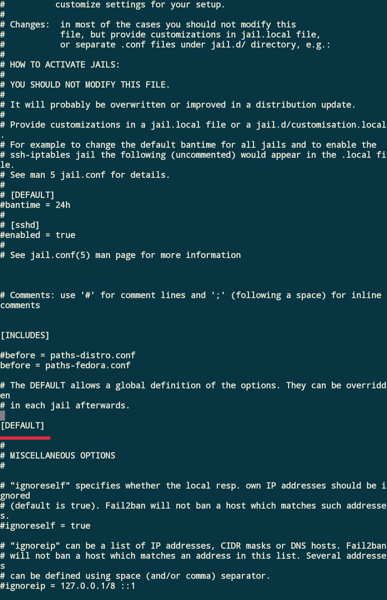
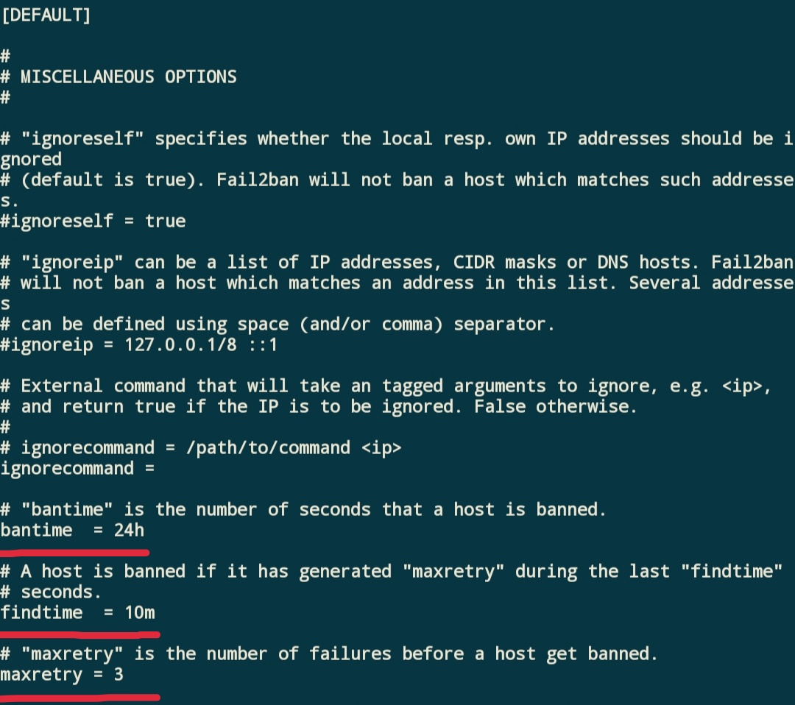
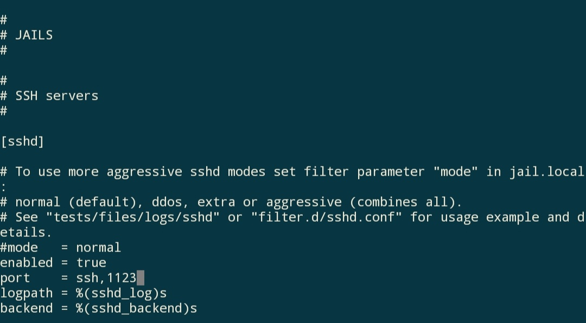

> 转载自：[tree.moe](https://tree.moe/way-to-use-fail2ban-for-freshman/)

# 小白: 从零开始使用fail2ban

## 0.内容导入

(´• ᗜ •`) ◞因为作为一个linux入门级别的小白, 很多人都会把一些web面板(比如宝塔面板?)作为自己管理vps的首选, 而当我一段时间登录宝塔面板之后, 有时就会看到提示发现自己的SSH登录竟然失败了上万次! 可这都不是我干的呀(我不是我没有!) 如果自己的SSH密码真的被暴力破解了怎么办呢? 那么…试试fail2ban?


## 1.fail2ban的安装

对于CentOS, 以及Fedora

```
sudo yum install fail2ban
```

对于ubuntu, Debian或Linux Mint

```
sudo apt-get install fail2ban
```

## 2.fail2ban的配置

通过运行上面的命令, 我们已经完成了fail2ban的安装, 接下来就是fail2ban的配置

首先使用vi或者vim打开fail2ban的规则配置文件

```
vi /etc/fail2ban/jail.conf
```

你将会看到这样的配置文件(从红色划线记号[Default]开始向下翻阅需要更改的配置)


在[Default]中, 你主要修改bantime, findtime, 以及maxretry这三个选项

图片中三个选项的意思就是在10分钟内失败超过3次的用户将会被封禁24小时

接下来可以按需开启需要的规则, 前文我们说到的ssh暴力破解，可以通过设置fail2ban中的[sshd]规则来防止。
从[Default]继续向下翻阅很长的一段之后，我们就来到单个规则的配置啦, 以单个开启[sshd]规则为例

我们需要设置enabled=true来激活它; 如果你有更改过ssh的端口的话(比如改成1123), 就在port需要添加1123这个端口(如图)

## 3.激活fail2ban

在配置完成后, 当然是选择激活它啦

对于CentOS7/8,Fedora

```
sudo systemctl restart fail2ban
```

对于Debian, Ubuntu或CentOS6:

```
sudo service fail2ban restart
```

如果是第一次启动的话建议把命令中的restart换成start

CentOS7设置fail2ban自启

```
systemctl enable fail2ban.service
```

## 4.检验fail2ban

如果要检验fail2ban有没有正确启动, 可以使用这个命令

```
sudo fail2ban-client ping
```

如果正确启动的话fail2ban会以pong作为回应(Server replied: pong), 其他情况就需要看看配置文件的格式正确以及是不是用start命令启动fail2ban什么的…

如果要查看fail2ban目前启用的规则的话

```
fail2ban-client status
```

查看某个规则下被封禁的次数以及ip(以[sshd]规则为例)

```
fail2ban-client status sshd
```

## 5.结束语

emmm…大概目前我所用到的就是这些吧, 对于目前使用账号密码登录ssh的小白来说确实是已经够用啦, 之后的话或许可能还有证书登录什么的来提高ssh登录安全性, 之后想到再继续补充吧。

fail2ban的功能大概是不仅仅只有防止ssh被暴力破解这一种的, 不过其他规则的应该也可以通过以上的例子来配置。