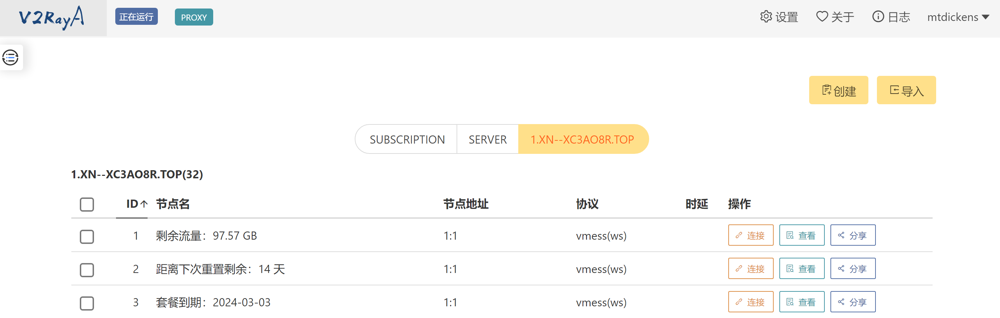

# Linux 上 V2rayA 代理工具使用指南

V2rayA 是 Linux 上可以方便使用的 V2ray/Xray GUI 客户端。

优势：由于 V2rayA 的操作面板由 Web 页面提供，因此你无需配置桌面环境。你可以在任何由浏览器的设备上上配置节点，只要能访问到服务器的 2017 端口即可。

## 1. 安装

详见[下载页面](https://v2raya.org/docs/prologue/installation/)。

### Ubuntu/Debian

1. 在 [release](https://github.com/v2rayA/v2rayA/releases) 页面中，搜索 `debian_x64`（如果你的机器是 x86_64 架构的）。
2. `wget https://mirror.ghproxy.com/https://github.com/v2rayA/v2rayA/releases/download/v2.2.4.3/installer_debian_x64_xxxx.deb`
    - **注意要使用 ghproxy，否则下载太慢**
3. `sudo apt install /path/download/installer_debian_x64_xxxx.deb`
4. xray 也是一样的，只是要在 `https://github.com/v2rayA/v2raya-apt/tree/master/pool/main/` 中找到对应的 deb 包。
    - 也可以[一键安装](https://github.com/XTLS/Xray-install)：`bash -c "$(curl -L https://github.com/XTLS/Xray-install/raw/main/install-release.sh)" @ install`
        - **注意：**由于一键安装脚本内使用的地址不是 ghproxy 的代理地址，因此如果不自行魔改脚本（把所有 github 下载链接前面加上 https://mirror.ghproxy.com/），下载速度可能较慢

## 2. 配置

1. 启动 V2rayA 服务：`sudo systemctl start v2raya xray`
    - 如果服务器有防火墙，需要开放 2017 端口（tcp 协议）
2. 设置开机自启：`sudo systemctl enable v2raya xray`

## 3. 使用

### 3.1. 配置节点

1. 在浏览器中打开 `http://<your server ip>:2017`，第一次打开会要求你设定用户名和密码
2. 在页面内，点击“导入”，并导入你预先准备好的订阅链接或者节点信息。如下图：
    
3. 单击该节点，再单击“连接”，再单击左上角的“就绪”。

只要看到左上角由橙色变成灰色，文字由“就绪”变成“正在运行”，就说明你配置成功。

### 3.2. 代理设置

V2rayA 有两种代理模式：透明代理和系统代理。

#### 透明代理

在“设置”里面，将“透明代理/系统代理”选项调制“启用：大陆白名单模式”即可。

#### 系统代理

点击“设置-地址与端口”，设置好你的地址和端口。你可以将“http 代理”设置为 1081 端口。

然后，在系统中，配置系统代理：

```bash
export http_proxy=http://localhost:1081; export https_proxy=$http_proxy
```

如果要取消系统代理，执行：

```bash
unset http_proxy; unset https_proxy
```