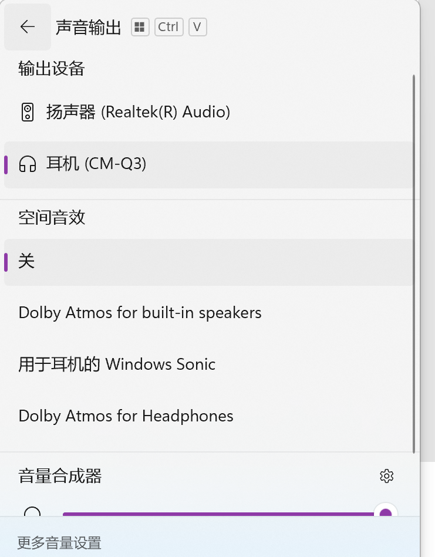
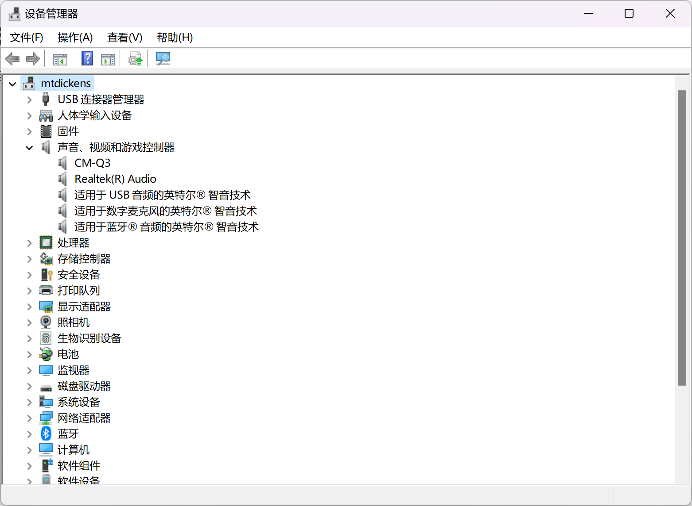
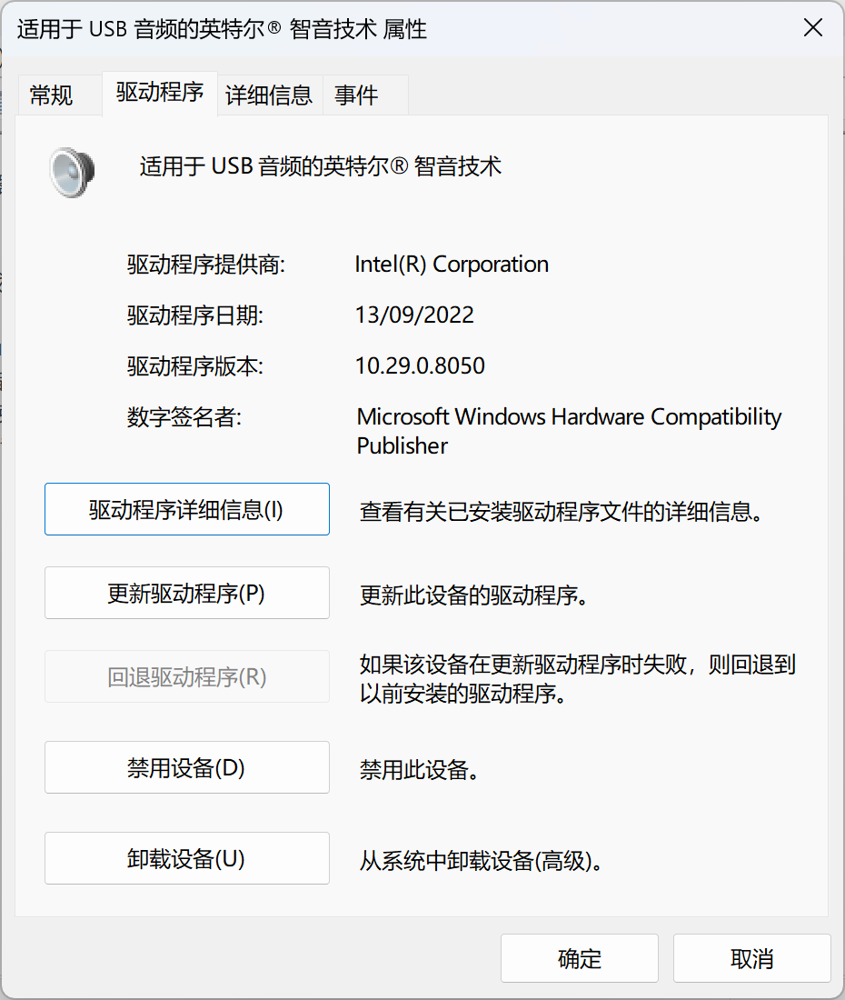

# FAQ for Windows

## Q1
我的耳机接在电脑上，而且**声音输出也确实是耳机**。但是，我还是听不到声音。如何解决？
    - 注意：我的方法仅在 type-c 耳机上试过（毕竟 type-c 也是 usb 的一种）
    比如：
    

## A1
首先，看看你的耳机驱动。
- 步骤：打开设备管理器——声音、视频和游戏控制器（如下图所示）
  
  如图，CM-Q3 就是我的耳机。可以更新一下它的驱动，看看是否有效（如下图）。

- 可能解决一：在 CM-Q3 处右键，选择“更新驱动程序”，选择自动搜索驱动程序。
  但是，由于我的华为耳机已经停产，驱动也不再更新，因此往往该方法无效。因此，要用第二种方法。

- 可能解决二：
    1. 右键“适用于USB音频的英特尔®智音技术”，选择“属性”。
    2. 在属性选择卡里，选择“驱动程序”。
    3. 在“驱动程序”页面，选择“回退驱动程序”
        - 注意：我已经回退完成，因此我的“回退驱动程序”按钮是灰色的。你的应该不是灰色的。
  

回退之后，我的耳机就能连接了。这是在是一个疑难杂症，我是通过 [Microsoft Community](https://answers.microsoft.com/zh-hans/windows/forum/all/type/082a6478-e168-47ba-ada1-224ac32f923d) 的这个帖子的回复解决的。

## Q2

我的电脑 Ctrl 键锁住了。比如我按下 `A`，电脑就会认为我按下了 `Ctrl + A` 键。

## A2

方法 1：同时按下 `ctrl + alt + fn`，有奇效
方法 2：可以重启一下电脑。