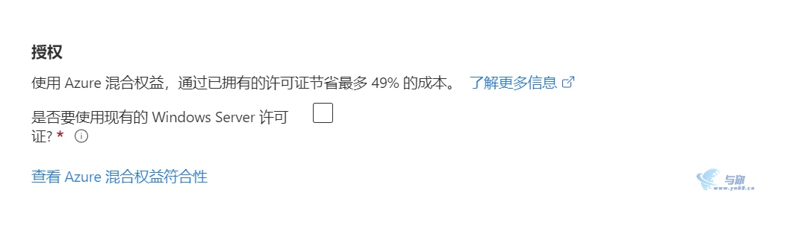

# Azure 使用（避坑）指南

!!! abstract
    Azure提供了长达12个月的免费试用服务和永久免费的服务，但实际上免费机制存在着很多扣费暗坑，如果稍不注意，一个配置写错，就会引起较高的扣费。
    这篇文章统计了几乎所有的暗坑，提请大家注意。

## 一：12个月免费服务的注意事项

1. 两台免费VPS，必须都是B1s，其他机型收费

    !!! warning
        **不要**用 RAM 为 0.5 GB 的那款最便宜的机器。

2. 两台B1s，必须是一台Win一台Linux

    !!! warning
        这里有一个坑，就是创建Win的时候，**不可以**选择下面的选项。
        
        否则这一台Win会作为Linux来算。

3. 两块免费硬盘必须都是64G+P6

可以在创建虚拟机时，就在硬盘一栏选择 64G+P6

!!! warning
    “64GB硬盘免费” 只是一个习惯性的说法，因为有一个推荐选项是“64GB+P6”。
    如果你是手动输入的“64GB”而不是从列表中选择推荐选项，还需要再手动改性能为“P6”，否则还是会扣费。
    总之，不仅要选 64G，还要选 **P6**。

4. 系统是Win还是Linux，是按实时监测的结果算的

   !!! warning
       **不可以** DD 系统，DD以后会按照DD之后的系统算。

- 对于 Windows，建议选 Win2012R2 系统，内存还能撑。

- 建议开启虚拟内存。

- 硬盘改64G后，Win系统下不会自动扩充分区大小

5. 首年免费流量每月 15G

    不是 100G，不是 100G，不是 100G！官方文档上说的不对！

    ~~当然，用超了也没事就是了。反正还有 100 美金~~

6. 只有动态IP免费
    在选择“网络”时，请务必选择“动态” ip。因为动态 ip 是免费的。

---

暂时只写这么多了，以后有时间再继续写 : )