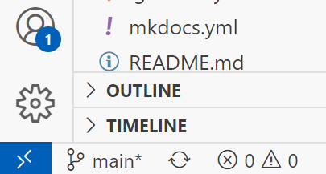

# 在 VSCode 中通过代理连接 ssh

!!! warning
    本文仅适用于 Windows 平台下的 VS Code

## 下载插件

首先当然是下载插件。VSCode 并不默认支持 ssh（不通过命令行），所以需要下载插件。不过插件还是很好用的。

- [Remote Development](https://marketplace.visualstudio.com/items?itemName=ms-vscode-remote.vscode-remote-extensionpack)

## 配置 ssh_config

法一：

使用 `ctrl+shift+p` 这一个快捷键，打开 VSCode 命令行。输入 `ssh`，选择 `config ssh Hosts`。

如果你之前没有配置过 `ssh_config`，那么，你就选择 `Add new ssh host`，选择一个 config 文件。

法二：

单击左下角的这个图标



之后步骤与法一相同。

---

之后，在文本文件中按一下进行配置

```ssh-config
Host [随便起一个名字]
  HostName [主机名，也就是目标 ip 或域名]
  User [需要登录的用户名，一般可以为 root]
```

## 添加代理

在 Windows 平台，建议使用以下配置

之后，在文本文件中按一下进行配置

```ssh-config
Host [随便起一个名字]
  HostName [主机名，也就是目标 ip 或域名]
  ProxyCommand "C:\Program Files\Git\mingw64\bin\connect.exe" -S 127.0.0.1:10808 %h %p
  User [需要登录的用户名，一般可以为 root]
```

如图，`-S` 的意思是使用 socks5 代理，`127.0.0.1:10808` 为代理 ip 和端口（我用的是 v2rayN，因此是 `socks5://127.0.0.1:10808`）。

你还可以使用其他参数，详见[这个博客](https://blog.imyan.ren/posts/4d70a82d/)。