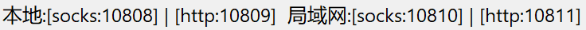

# Tips for Shell

## 如何修改默认编辑器？

在使用 Git 等软件时，这些软件常常会打开默认编辑器，让你进行文本操作。如果你的默认编辑器不是你常用编辑器的话，你使用 Shell 时的体验感、流畅感会大大降低。

以下是修改建议（顺序依据为建议的推荐程度，由高到低排序）：

1. 输入命令 `sudo update-alternatives --config editor`，选择适合的编辑器。

2. 或者，输入命令 `export VISUAL=<your default editor name>;export EDITOR="$VISUAL"` （如：`sudo export VISUAL=vim`），可以**临时**设置
   1. 如果希望**永久**设置，则建议在 **.bashrc/.zshrc** （**rc** 前面的东西取决于你的 Shell 的种类）中加上这两句命令：
   
      ```shell
      export VISUAL=<your default editor name>;
      export EDITOR="$VISUAL";
      ```

## 如何设置系统代理？

**一、临时设置**

如果要设置 http 与 https 代理，则输入 `export http_proxy="<protocol>://<ip>:<port>";export https_proxy="<protocol>://<ip>:<port>";`

对于 WSL2 而言，如果要使用宿主机（即：Windows 系统）上的 v2ray 等代理工具的话，需要：

1. 获取宿主机内网地址：`cat /etc/resolv.conf | grep "nameserver" | awk '{print $2}'`
2. 用获取的内网地址作为 ip，用 v2ray 等代理工具的协议及其对应的**局域网**代理端口作为 protocol 和 port。
   1. :warning:注意：如图，这是我的 V2rayN 本地代理协议以及对应端口。注意事项如下：
      1. **一定要用**“局域网”的（这里即 **10810** 和 **10811**），~~不能用“本地”的~~！
      2. 一定不要匹配错协议和端口。如图所示，我这里的配置，支持  `"socks5://$hostip:10810" `和 `"http://$hostip:10811"`。不能搞错了。

**二、永久设置**

1. 打开对应 Shell 的 rc (run commands)。比如，Linux 各发行版一般自带 bash (bourne again shell)，因此文件名是 **.bashrc**；而 MacOS 自带 zsh，因此是 **.zshrc**。

   文件都在 home 目录下，因此，文件地址是 **~/.bashrc 或 ~/.zshrc**。我们这里以 **~/.bashrc** 为例。

2. 添加以下命令：

```bash
export hostip=$(cat "/etc/resolv.conf" | grep "nameserver" | awk '{print $2}')
alias proxyon='export ALL_PROXY="socks5://${hostip}:10810";export https_proxy=$ALL_PROXY;export http_proxy=$ALL_PROXY'
alias proxyoff='unset ALL_PROXY;unset http_proxy;unset https_proxy'
```

3. 使 **.xxrc** 生效，输入：`source ~/.bashrc`。

