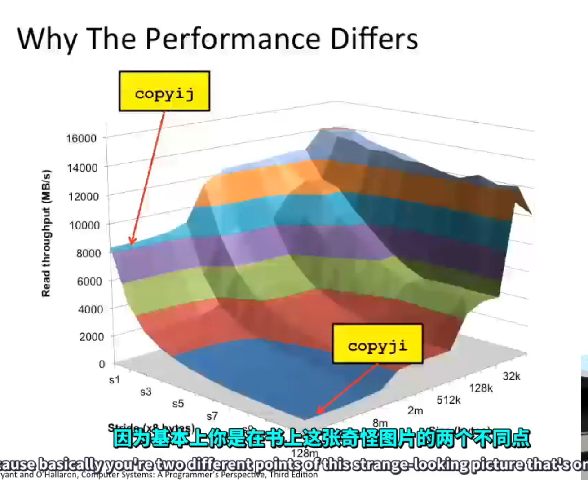

## Lec 1: Course Overview

### `int` != integer, `float` != real numbers

Example:

```
(gdb) print 50000 * 50000
$13 = -1794967296
(gdb) print 50000 * 50000
$14 = -1794967296
(gdb) print 40000 * 40000
$15 = 1600000000
(gdb) print 1e20 + -1e20 + 3.14
$16 = 3.1400000000000001
(gdb) print 1e20 + (-1e20 + 3.14)
$17 = 0
```

### Memory Matters

Example (Memory Reference Bug demo code):

```c
##include <stdio.h>

typedef struct {
        int a[2];
        double d;
} struct_t;

double fun (int i) {
        volatile struct_t s;
        s.d = 3.14;
        s.a[i] = 1073741824;
        for (int x = 0; x != 10; ++x) {
                printf("a[%d]: oct: %d, hex: %x\n", x, s.a[x], s.a[x]);
        }

        return s.d;
}

int main () {
        int i;
        scanf("%d", &i);
        printf("%f\n", fun(i));

        return 0;
}
```

**Result:**

```
Result of ./mem 0

a[0]: oct: 1073741824, hex: 40000000
a[1]: oct: 32767, hex: 7fff
a[2]: oct: 1374389535, hex: 51eb851f
a[3]: oct: 1074339512, hex: 40091eb8
a[4]: oct: 0, hex: 0
a[5]: oct: 0, hex: 0
a[6]: oct: 1435866880, hex: 55959700
a[7]: oct: -1067797316, hex: c05ab4bc
a[8]: oct: -1552650064, hex: a37470b0
a[9]: oct: 32767, hex: 7fff
3.1400000000


Result of ./mem 1

a[0]: oct: -702485904, hex: d620ea70
a[1]: oct: 1073741824, hex: 40000000
a[2]: oct: 1374389535, hex: 51eb851f
a[3]: oct: 1074339512, hex: 40091eb8
a[4]: oct: 0, hex: 0
a[5]: oct: 0, hex: 0
a[6]: oct: -291311616, hex: eea2f000
a[7]: oct: -334096339, hex: ec16182d
a[8]: oct: -702486128, hex: d620e990
a[9]: oct: 32765, hex: 7ffd
3.1400000000


Result of ./mem 2

a[0]: oct: -1152151280, hex: bb539110
a[1]: oct: 32766, hex: 7ffe
a[2]: oct: 1073741824, hex: 40000000
a[3]: oct: 1074339512, hex: 40091eb8
a[4]: oct: 0, hex: 0
a[5]: oct: 0, hex: 0
a[6]: oct: 615639552, hex: 24b1ea00
a[7]: oct: -1435529406, hex: aa6f8f42
a[8]: oct: -1152151504, hex: bb539030
a[9]: oct: 32766, hex: 7ffe
3.1399998665


Result of ./mem 3

a[0]: oct: 1238965360, hex: 49d91c70
a[1]: oct: 32764, hex: 7ffc
a[2]: oct: 1374389535, hex: 51eb851f
a[3]: oct: 1073741824, hex: 40000000
a[4]: oct: 0, hex: 0
a[5]: oct: 0, hex: 0
a[6]: oct: 1029267712, hex: 3d596100
a[7]: oct: 551299897, hex: 20dc2b39
a[8]: oct: 1238965136, hex: 49d91b90
a[9]: oct: 32764, hex: 7ffc
2.0000006104


Result of ./mem 4

a[0]: oct: 548098752, hex: 20ab52c0
a[1]: oct: 32765, hex: 7ffd
a[2]: oct: 1374389535, hex: 51eb851f
a[3]: oct: 1074339512, hex: 40091eb8
a[4]: oct: 1073741824, hex: 40000000
a[5]: oct: 0, hex: 0
a[6]: oct: 282847232, hex: 10dbe800
a[7]: oct: 1859791097, hex: 6eda28f9
a[8]: oct: 548098528, hex: 20ab51e0
a[9]: oct: 32765, hex: 7ffd
3.1400000000


Result of ./mem 5

a[0]: oct: 747974832, hex: 2c9530b0
a[1]: oct: 32764, hex: 7ffc
a[2]: oct: 1374389535, hex: 51eb851f
a[3]: oct: 1074339512, hex: 40091eb8
a[4]: oct: 0, hex: 0
a[5]: oct: 1073741824, hex: 40000000
a[6]: oct: -393668864, hex: e8891700
a[7]: oct: 1570180040, hex: 5d970bc8
a[8]: oct: 747974608, hex: 2c952fd0
a[9]: oct: 32764, hex: 7ffc
3.1400000000


Result of ./mem 6

a[0]: oct: -402921696, hex: e7fbe720
a[1]: oct: 32767, hex: 7fff
a[2]: oct: 1374389535, hex: 51eb851f
a[3]: oct: 1074339512, hex: 40091eb8
a[4]: oct: 0, hex: 0
a[5]: oct: 0, hex: 0
a[6]: oct: 1073741824, hex: 40000000
a[7]: oct: -663403681, hex: d875435f
a[8]: oct: -402921920, hex: e7fbe640
a[9]: oct: 32767, hex: 7fff
*** stack smashing detected ***: <unknown> terminated
Aborted (core dumped)

```

#### Hazards

Since C/C++ doesn't provide any memory protection, there might be:

- Out of bounds array references
  - like this example
- Invalid pointer values
- Abuses of `malloc`/`free`

#### How to deal with this?

- Program in Java, Ruby, Python, ML, ...
  - use another language
- Understand what possible interactions may occur
  - use your brain
- Use-or develop tools to detect referencing errors (e.g. **Valgrind**)
  - use advanced tools

### More Than Asymptotic Complexity

- Constant factor matters too!
- And even exact op count does not predict performance
- Must understand system to optimize performance

Example:

```c
// 4.3 ms
void copyij(int src[2048][2048], int dst[2048][2048])
{
    int i,j;
    for (i=0;i<2048;i++)
        for (j=0;j<2048;j++)
            dst[i][j] = src[i][j];
}

// 81.8 ms
void copyji(int src[2048][2048], int dst[2048][2048])
{
    int i,j;
    for (j=0;j<2048;j++)
        for (i=0;i<2048;i++)
            dst[i][j] = src[i][j];
}
```



The difference has something to do with memory hierarchies.

### More than executing programs

I/O is crucial for machines to communicate with each other.

One interesting application based on I/O is networking. We'll make our own web proxy.

### Assignment Outline

1. Data Lab: Manipulate bits
   - get used to the world of binary operations
2. Bomb Lab: Defusing a binary bomb
   - get used to gdb 
   - learn to read machine code
3. Attack Lab: The basics of code injection attacks
   - learn to hack into memory
4. Cache Lab: Building a cache simulator and optimizing for locality.
   - memory hierarchy
5. Tsh Lab: Writing your own Unix shell
   - **Exception Control Flow: a bridge between hardware and software**
   - also introduction to concurrency
6. Malloc Lab: Writing your own `malloc` package
   - get real feeling for system-level programming
7. Proxy Lab: Write your own web proxy
   - learn network programming and more about concurrency and synchronization.
   - learn I/O

