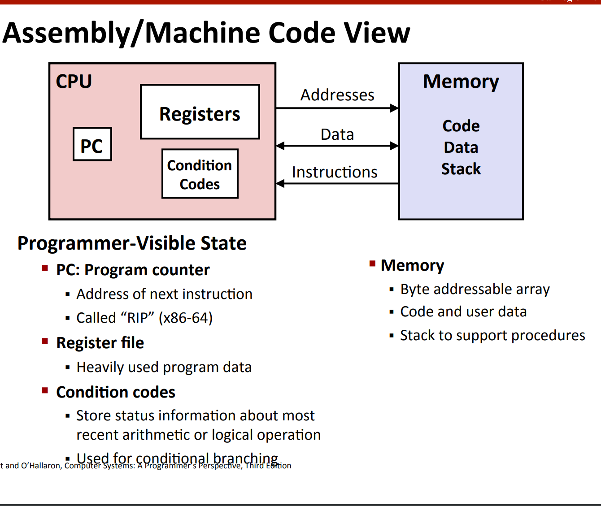
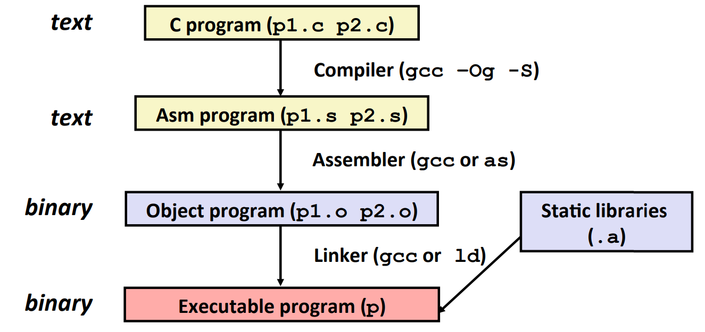
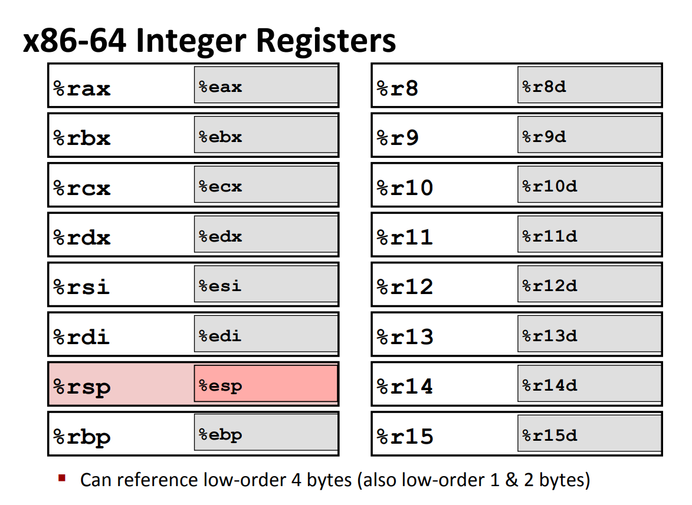
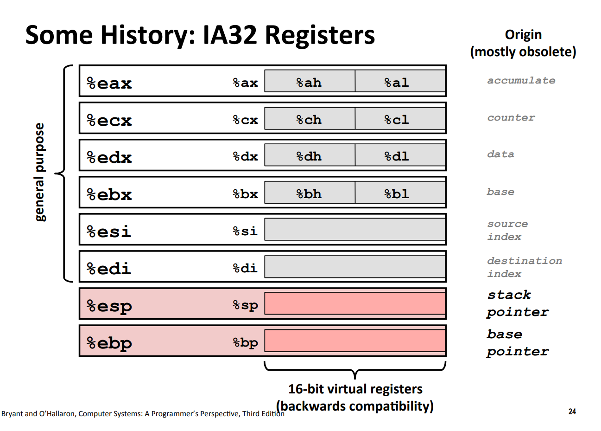
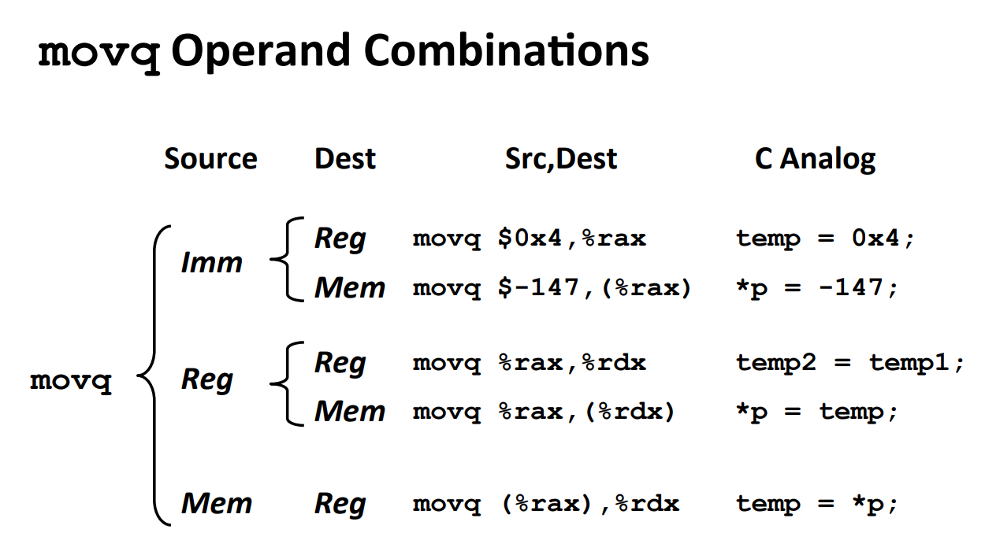
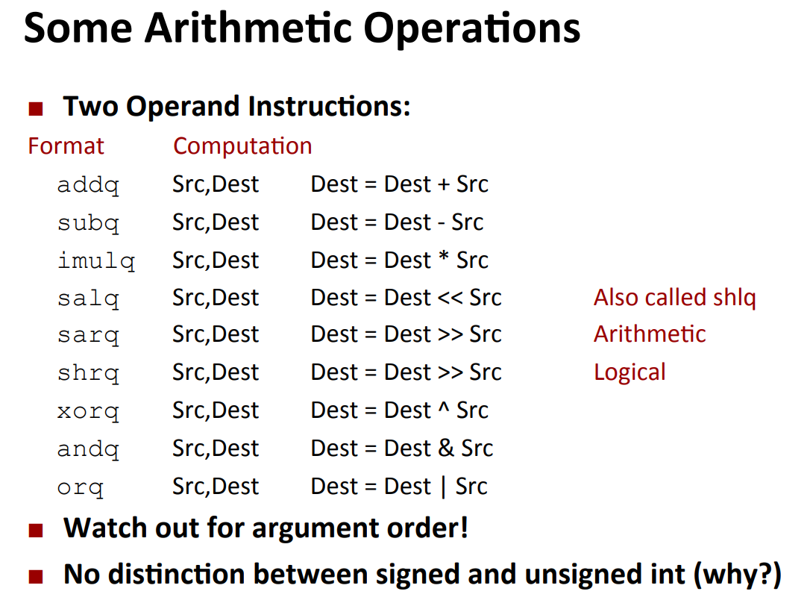
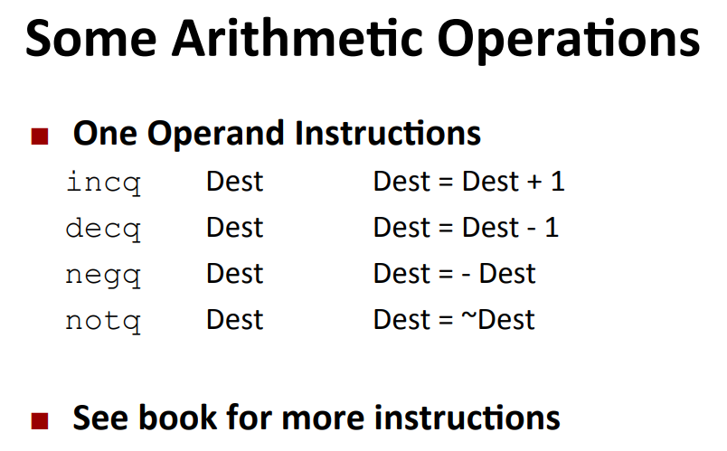

# Lec 5: Machine Level Programming - Basics

> This course uses Intel 64-bit version of the instruction set.

The history of Intel x86(-64) ISA, ARM and micro processors can be found [here (pdf)](https://www.cs.cmu.edu/afs/cs/academic/class/15213-f15/www/lectures/05-machine-basics.pdf).

## ASM Code View



## Turn C into Object Code



**Note:** Even when it is turned into the executable program, it still needs to include some static libraries when first running.

## A Non-trivial Example

> **Note:** Please use `gcc -S -Og -masm=att filename.c -o filename.s`, where `-Og` stands for "don't optimize too much, since I want read it", and `-masm-att` stands for "plz always output AT&T style code which we often see on Unix machines but not Windows".

```c
void sumstore (long x, long y, long *dest)
{
        long t = plus (x,y);
        *dest = t;
}
```

It's assembly code is (in AT&T format):

```assembly
sumstore(long, long, long*):
        pushq   %rbx
        movq    %rdx, %rbx
        call    plus(long, long)
        movq    %rax, (%rbx)
        popq    %rbx
        ret
```

## Quick Note: Disassemble

If you get a binary executable file, you can use `objdump -d xxx` to disassemble it (and it will give you assembly code). Also, you can use `gdb` to disassemble as well.

## Basics of The x86-64 Assembly Code

### Registers of x86-64

> Prenote: The weird names of registers of x86-64 are due to the legacy thing.



Also, for each register starting with `e` (which indicate it's a 32-bit register), there are even smaller registers that you can use, which are shown in the graph down below:



- `%rax`: 64-bit, `%eax`: 32-bit, `%ax`: 16-bit, `%ah, %al`: 8-bit.

- Also note that the name of these registers have origins (shown at the right side). Most are obsolete (i.e. have become legacy), but still some have a specific purpose:
  - `%esp`: pointing to the top of a stack
  - `%ebp`: base pointer, although not commonly used today

### Operations

> Why these operations are ended with "q"? Because there are 64-bit operations - act on **q**uadwords.

#### `movq`

`movq Source, Dest`: move data

- There are three supported operand types
  - immediate
  - register
  - memory



#### `leaq`

`leaq Address, Dest`: load the ADDRESS into the destination

- Computing address without memory reference: `p = &x[i]`

- Computing arithmetic expressions of the form $x+k*y$

  - k = 1, 2, 4, or 8

  - Example: `x * 12`
    ```assembly
    m12(long):
            leaq    (%rdi,%rdi,2), %rax # %rax = %rdi + 2 * %rdi = 3 * %rdi
            salq    $2, %rax            # %rax <<= 2, i.e %rax = 2^2 * 3 * %rdi = 12 * %rdi
            ret
    ```

#### More Operations!



### Addressing Modes

1. Normal: `Mem[Reg[R]]`
   - e.g. `movq (%rcx), %rax`
2. Displacement: `Mem[Reg[R] + D]`
   - e.g. `movq 8(%rcx), %rax`
3. General Addressing `D(Rb,Ri,S)`: `Mem[Reg[Rb] + S * Reg[Ri] + D]`
   - more precisely: `D=0(Rb=0,Ri=0,S=1)`
     - So you can just use part of it
     - e.g.1 `(Rb,Ri)` is equivalent to `0x0(Rb,Ri,1)`
     - e.g.2 `D(,Ri, S)` is equivalent to `D(0x0, Ri, S)`
   - e.g. `movq 16(%rdi, %rax, 8)` = `long t0 = xp[*yp + 2]`
   - somewhat resembles `*(arr + sizeof(typeof_arr) * index + D)`