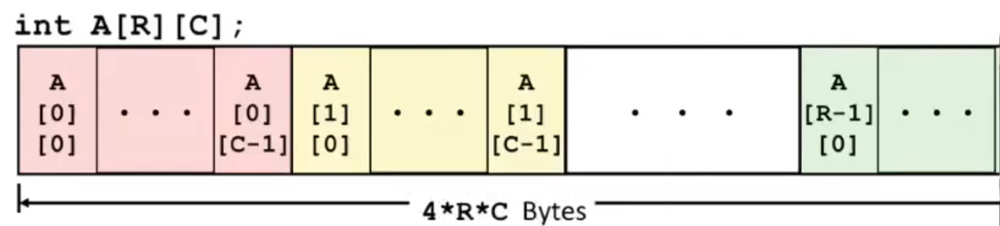
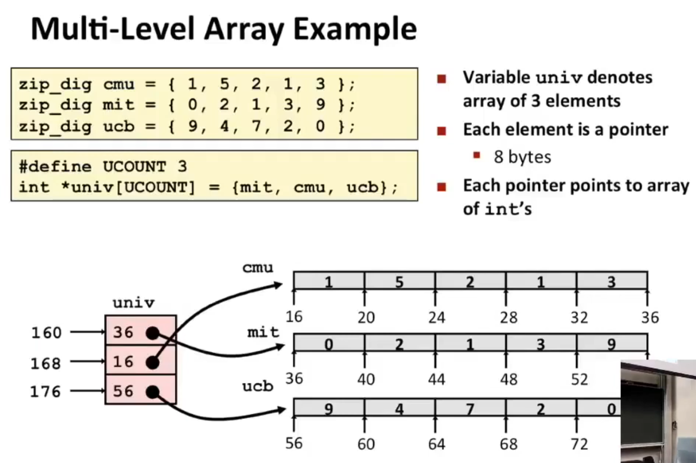
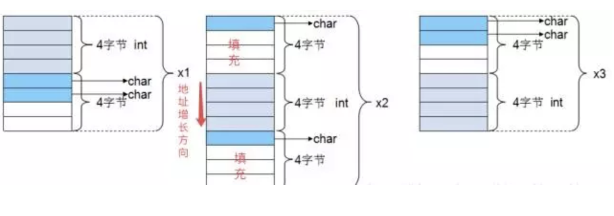

# Lec 8: Machine Level Programming: Data

## Array

### Multidimensional (Nested) Array

$$
\begin{bmatrix}
A[0][0] & \cdots & A[0][C-1] \\
\vdots  &        & \vdots    \\
A[R-1][0] & \cdots & A[R-1][C-1] \\
\end{bmatrix}
$$

- Declaration

  `T A[R][C]`

  - 2D array of data type T
  - $R$ rows, $C$ columns
  - Type T elements requires $K$ bytes

- Array Size

  - R * C *K

- Arrangement

  - Row-Major Ordering
    

- Array Elements
  - $A[i][j]$ is at address $A + (C * i * K) + j * K = A + (C * i + j) * K$

```c
int get_pgh_digit
    (size_t index, size_t digit)
{
    return pgh[index][digit]; // = *(pgh + index * C * 4 + digit * 4) = *(pgh + (index * C + digit) * 4)
}
```


```assembly
leaq     (,%rdi,10) %rdi      # (index * 10)
addq     %rdi %rsi            # (index * 10) + digit
movl     pgh(,%rsi,4), %eax      # ret_val = *(pgh + ((index * 10) + digit) * 4)
ret
```


### Multi-Level Array



For Multi-Level Array:

```c
int get_univ_digit
    (size_t index, size_t digit)
{
    return univ[index][digit]; // = *(*(univ + index * 8) + digit * 4)
}
```


```assembly
salq     $2, %rsi            # digit * 4
addq     univ(,%rdi,8) %rsi  # *(univ + index * 8) + digit * 4
movl     (%rsi), %eax        # ret_val = *(*(univ + index * 8) + digit * 4)
ret
```

---

**Note:** The code for these two representations are the same, but the assembly codes are different.

## Structures & Alignment

规则：

1. 结构体第一个成员的**偏移量（offset）**为0，以后每个成员相对于结构体首地址的 offset 都是**该成员大小与有效对齐值中较小那个**的整数倍，如有需要编译器会在成员之间加上填充字节。
   - 在Linux环境下，linux下默认#pragma pack(4)，且结构体中最长的数据类型为4个字节，所以有效对齐单位为4字节
2. **结构体的总大小**为 有效对齐值 的**整数倍**，如有需要编译器会在最末一个成员之后加上填充字节。

e.g.

- ```c
  struct {
      int x;
      char y;
      char z;
  };
  ```

  x: 0\*sizeof(int) = 0, y: 5\*sizeof(char)=5, z: 6\*sizeof(char)=6; tot = 2*4=8

- ```c
  struct {
      char x;
      int y;
      char z;
  }
  ```

  x: 0\*sizeof(char) = 0, y: 1\*sizeof(int)=4, z: 9\*sizeof(char)=9; tot = 3*4=12


