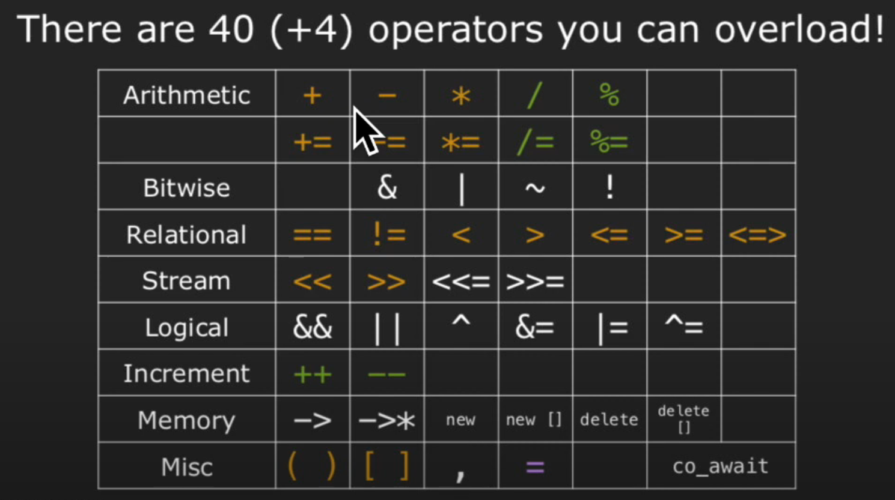
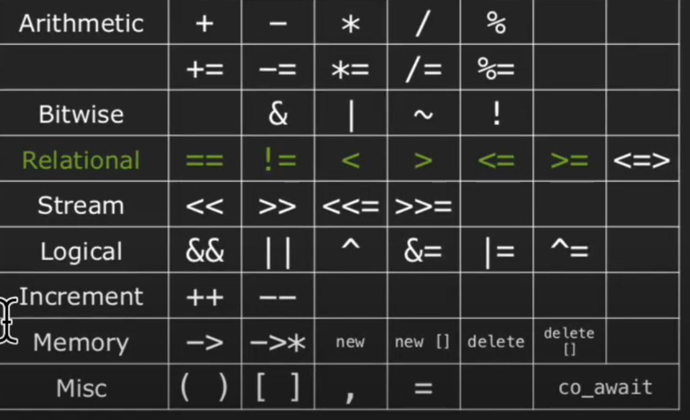

## Lec 11: Operators



When you are using overloaded operators, you are actually calling member functions:

```cpp
##include <iostream>
##include <vector>
##include <string>
using namespace std;

void human_readable_form() {
    vector<string> v{"Hello", "World"};
    cout << v[0];
    v[1] += "!";
}

void member_function_form() {
    vector<string> v{"Hello", "World"};
    cout.operator<<(v.operator[](0));
    v.operator[](1).operator+=("!");
}

void non_member_function_form() {
    // Note: there are some operators that can't be written in non-member-function form.
    vector<string> v{"Hello", "World"};
    operator<<(cout, operator[](v, 0));
    operator+=(operator[](v, 1), "!");
}
```

### A Simple Implementation

```cpp
// ...

class StringVector {
private:
    vector<string> data;
public:
    StringVector () = default;
    
    StringVector& operator+= (const string& str);
    StringVector& operator+= (const StringVector& vec);
    
    // Note: don't use `string& operator[] const (const int& index);`
    // Since `const` modifier doesn't allow you to return a
    // non-const reference to a member variable
    string& operator[] (const int& index);
    
    int size();
    
};

int StringVector::size()
{
    return data.size();
}

// Member function style
StringVector& StringVector::operator+= (const string& str)
{
    data.push_back(str);
    return *this;
}

StringVector& StringVector::operator+= (const StringVector& vec)
{
    data.insert(data.end(), vec.data.cbegin(), vec.data.cend());
    return *this;
}

// Non-member function style


string& StringVector::operator[] (const int& index)
{
    return data[index];
}
```

**Note:** We use `const <type>&` here, since:

1. **`const`** value can't be implicitly converted to non-`const` one, so we'd better use `const`
   - e.g. `strvec += "Hello"`, `"Hello"` here is `const` (and also `constexpr`)
2. Use **reference** to avoid unnecessary copy.

### General Rule of Thumb

1. Some operators must be implemented as **members**, e.g., `[]() -> =`, **due to C++ semantics**.
2. Some operators must be implemented as **non-members**, e.g., `<`, if you are **writing a class for the right-hand side (rhs), not the left-hand side (lhs).**
3. If it's a **unary operator**, e.g., `++`, **implement it as a member**.
4. If binary operator **treats both operands equally** (e.g., both unchanged), implement as **non-member** (maybe friend). Examples: `+`, `<`
5. If binary operator **does not treat both operands equally** (changes `lhs`), implement as a **member** (allows easy access to `lhs` private members). Examples: `+=`

### `friend` modifier

Imagine you have a `Fraction` class:

```cpp
class Fraction {
private:
    int denom;
    int nom;
};
```

And you want to use `cout` to output it. By "General Rule of Thumb", you are writing a class for the rhs (i.e. `Fraction` instead of `ostream`), you have to use non-member.

```cpp
ostream& operator<< (ostream& os, const Fraction& f)
{
    // Error! `nom` and `denom` are private!
    os << f.nom << "/" << f.denom;
    return os;
}
```

However, `nom` and `denom` are **private** members in `Fraction`, so it seems that you can't use them in non-members *without extra modifier(s)*.

**That's why we have to introduce `friend` modifier** for adding non-member functions to the friends list of the target class.

```cpp
class Fraction {
private:
    int denom;
    int nom;
    friend ostream& operator<< (ostream& os, const Fraction& f);
};
```

### Const-ness and others

Take `operator<<` as example:

1. `ostream&` return type, because

   - we have to chain `<<`'s, so `ostream` and `&` (instead of `void`)

   - it will change, so non-`const`
   - we aren't creating new objects, so `&`

2. `ostream& os`, because

   - it will change, so non-`const`

3. `const Fraction& f`, because

   - it will merely be copied and not change, so `const`

### Principle of Least Astonishment (POLA)

> "If a necessary feature has a high astonishment factor, it may be necessary to redesign the feature".

1. Design operators primarily to mimic conventional usage.
   - example 1: `+=` returns a reference to the lhs object
   - counterexample 1: overloading `,`
   - counterexample 2: overloading `+` for `Time` with `sec, min, hour, ...`, since we don't know whether `+1` is adding a sec or a day, etc
2. Use nonmember functions for symmetric operators.
   - to avoid non-symmetric cases like
     -  `"char" + str`: invalid
     - `str + "char"`: valid
3. Always provide all out of a set of related operators.
   - 
   - e.g. Implement all `==, !=, <, >, <=, >=, <=>` (if the class supports) and not just some of them