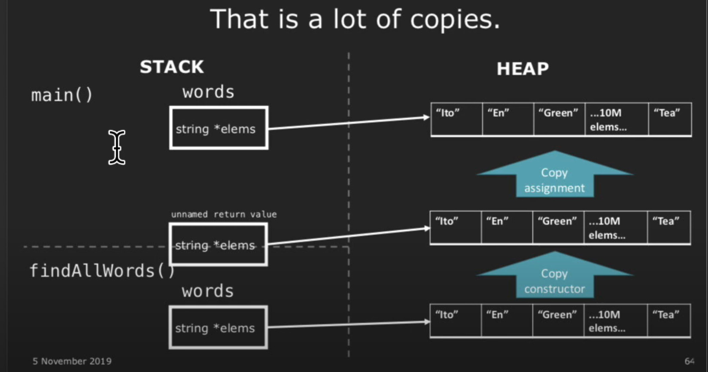
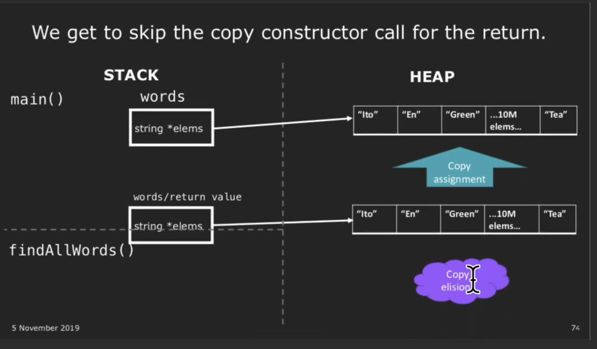
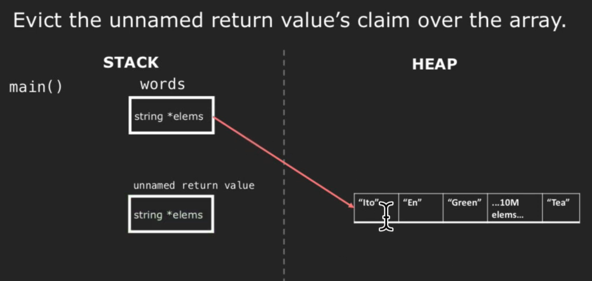

# Lec 12: Special Member Functions

## more of `const`-ness

Example:

```cpp
#include <iostream>

using namespace std;

class Date {
public:
    int year, month, day;
    
    Date (int y, int m, int d) : year(y), month(m), day(d) {}
    
    int& get_year();
    const int& get_year() const;
};

int& Date::get_year() {
    return this->year;
}

const int& Date::get_year() const {
    return this->year;
}

int main()
{
    const Date date{2024, 1, 11};
    cout << date.get_year() << endl;
    return 0;
}
```

该例中，`date` 是 `const Date` object。如果没有 `const int& Date::get_year() const {...}` 的话，那么 `get_year` 就不可以被调用，因为本来 `get_year` 的返回值不是（底层） `const`。

- 注意：`const` objects 只能在 constructor 和 destructor 处更改自己的

## Special Member Functions

1. Default construction
   - object **created** with **no parameters**
2. Copy construction
   - object is **created** as **a copy of an existing object**
3. Copy assignment
   - existing object **replaced** as **a copy of another existing object**
4. Destruction
   - object **destroyed** when **it is out of scope**

**Example:**

```cpp
StringVector function(StringVector vec0 /* (2) */) {
    StringVector vec1;                        // (1)
    StringVector vec2{"Ito", "En", "Green"};  // Normal construction
    StringVector vec3();                      // This is actually a function declaration, 
                                              // which is C++'s most vexing parse.
    
    StringVector vec4(vec2);                  // (2)
    StringVector vec5{};                      // (1), `{}` can be used to "replace" `()`
    StringVector vec6{vec3 + vec4};           // (2) 
    Stringvector vec7 = vec4;                 // (2)
    vec7 = vec2;                              // (3)
    
    return vec7;                              // (2), since vec7 is in the scope of `function`
                                              // and return value should be out of the scope.
                                              // So we construct a out-of-scope copy of vec7
    // (4).`vec1~7` are destructed here.
}
```

### Copy Constructor

Take `StringVector` as example:

```cpp
class StringVector {
private:
    size_t logicalSize;
    size_t allocatedSize;
    std::string* elems;
};

// `noexpect` mean the program will abort 
// when exception occurs in this procedure (constructor)
StringVector::StringVector (const StringVector& other) noexcept :
logicalSize(other.logicalSize), allocatedSize(other.allocatedSize) {
	elems = new std::string[allocatedSize];
    std::copy(other.cbegin(), other.cend(), begin());
}
```

Note: 

The copy constructor is automatically invoked in two scenarios:

1. When a function is called and **a *non-reference* argument is passed.**
2. When a function **returns a non-reference argument.**

In these cases, the copy constructor is responsible for creating a copy of the object being passed or returned.

```cpp
#include <iostream>
using namespace std;

class Test {
public:    
    Test() : count(0) {}
    Test(const Test& other) noexcept {
        this->count = other.count + 10000;
    }
    ~Test() {
        // default
    }
    Test& operator=(const Test& other) {
        this->count = other.count + 1;
        return *this;
    }
    Test& operator() () {
        cout << count << ' ';
        return *this;
    }
    
private:
    int count;
};

Test test_non_reference(Test test) { // copy constructor
    test(); // 10000
    return test; // copy constructor
}

Test& test_reference(Test &test) { // reference, no copy
    test(); // 20001
    return test; // reference, no copy
}

int main()
{
    Test test;
    test(); // 0
    test = test_non_reference(test)() ; // 20000
    test(); // 20001
    test = test_reference(test)(); // 20001
    test(); // 20002
    return 0;
}
```

### Copy Assignment

```cpp
StringVector& StringVector::operator= (const StringVector& other) {
    // check if `*this` and `other` are the SAME object
    // i.e. &(*this) == &other ?
    if (this != &other) {
        delete[] elems;
        logicalSize = other.logicalSize;
        allocatedSize = other.allocatedSize;
        elems = new std::string[allocatedSize];
        std::copy(other.cbegin(), other.cend(), begin());
    }
    return *this;
}
```

### `delete`: Explicitly Preventing Copy

In `ifstream`, objects are NOT allowed to be copied. Thus:

```cpp
template <...>
class ifstream<...> {
public:
    ifstream& operator= (const ifstream& other) = delete;
};
```

## Rules

### Rule of Zero

If the default operations work,then don't define your own custom ones.

- makes the code clean
- you won't make a mistake

### Rule of Three

If you decide to define (or delete) at least one of

- copy constructor
- copy assignment
- destructor

**you should define ALL three of them.**

## Optimization

Without optimization, if you initialize an array in `main` and call `findAllWords`:



The array will be repetitively created three times, which is a waste of time.

### Return Value Optimization (RVO)

If the compiler know that you are going to return the vector anyway, when you create the vector in local scope, the compiler actually create it in the stack frame.



### Even Better?

Using `std::move`, you can actually *steal* the resource from the `findAllWords`


