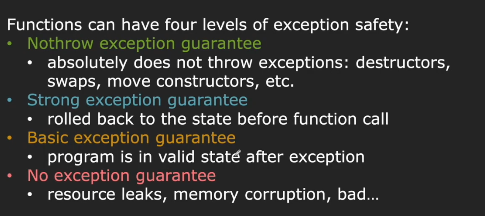
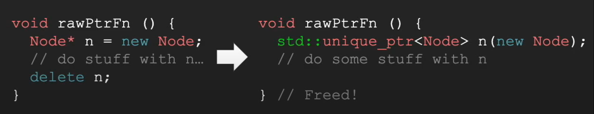

# Lec 15: RAII, Smart Pointers and Building CPP Projects

## Code Paths

```cpp
string EvaluateSalaryAndReturnName(Employee e) {
    if (e.Title() == "CEO" && e.Salary() > 100000) {
        cout << e.First() << " " << e.Last() << " is overpaid" << endl;
    }
    return e.First() + " " + e.Last();
}
```

**Hidden code paths:** There are (at least) 23 places where this function can throw exceptions (and thus return early):

- 1 Copy constructor of Employee parameter, may throw.
- 5 Constructor of temp `string`/`int`s, may throw.
- 6 Call to Title, Salary, First (2), Last (2), may throw.
- 10 Operators may be user-overloaded, may throw.
- 1 Copy constructor of string for return value, may throw.

And there are 3 exception-free code paths (i.e. **normal code paths**).

So, in total, at least 26.

### Memory Leak Issue

```cpp
string EvaluateSalaryAndReturnName(int idNumber) {
    Employee* e = new Employee(idNumber);
    if (e->Title() == "CEO" && e->Salary() > 100000) {
        cout << e->First() << " " << e->Last() << " is overpaid" << endl;
    }
    auto result = e->First() + " " + e->Last();
    delete e;
    return result;
}
```

If any exception is thrown in these segment of code,

```cpp
if (e->Title() == "CEO" && e->Salary() > 100000) {
    cout << e->First() << " " << e->Last() << " is overpaid" << endl;
}
auto result = e->First() + " " + e->Last();
```

it will cause **memory leak**.

## More general concern: resources that need to be returned

|             | Acquire  | Return |
| ----------- | -------- | ------ |
| Heap Memory | new      | delete |
| Files       | open     | close  |
| Locks       | try_lock | unlock |
| Sockets     | socket   | close  |
| ...         | ...      | ...    |

## Exception Safety

There are four levels of exception safety.

- In Google C++ style guide, they follow the first level.
- But in our course, we shall follow the third level - **"basic exception guarantee"**



## RAII

**Note: A Better Name For RAII is CADRE - Constructor Acquires,Destructor Releases.**

Comparison between Google's guide and RAII:

- Google's guide guarantees that **all hidden data paths are forbidden**. 
  So we can plainly free all pointers immediately before `return`.
- RAII guarantees that 
  - All resources should be acquired in the constructor.
    All resources should be released in the destructor.
  - And no more (so as to prevent double delete)

### The Rationale Behind RAII

- There should never be a "half-valid"state of the object. Object useable after its creation.
- The destructor is always called (even with exceptions), so the resource is always freed.

### Example: `ifstream`

The old code (which doesn't comply with RAII):

```cpp
void printFile() {
    ifstream input;
    input.open("hamlet.txt");
    
    string line;
    while (getline(input, line)) {
        cout << line << endl;
    }
    
    input.close();
}
```

The new code that complies with RAII. i.e.

- `open` on constructing
- `close` on destructing

```cpp
void printFile() {
    ifstream input("hamlet.txt");
    
    string line;
    while (getline(input, line)) { // might throw exception here!
        cout << line << endl;
    }
   
    // no close call needed!  
}   // stream destructor,releases access to file
```

### Example: `lock_guard`

The old code (which doesn't comply with RAII), i.e.

- lock on `constructing` (`lock_guard`)
- unlock on `destructing` (`lock_guard`)

```cpp
void cleanDatabase(mutex& databaseLock, map<int, int>& database) {
    databaseLock.lock();
    // other threads will not modify the database
    // modify the database
    // if an exception is thrown, the mutex is never unlocked!
    databaseLock.unlock();
}
```

The new code:

```cpp
void cleanDatabase(mutex& databaseLock, map<int, int>& database) {
    lock_guard<mutex> lock(databaseLock);
    // other threads will not modify the database
    // modify the database
    // if an exception is thrown, that's fine!
    // no release call needed
    // lock always unlocked when function exits
}
```

Also, the implementation of `lock_guard` is:

```cpp
template <typename T>
class lock_guard {
public:
    lock_guard(T& lock) : acquired_lock(lock) {
        acquired_lock.lock();
    }
    
    ~lock_guard() {
        acquired_lock.lock();
    }
private:
    T& acquired_lock;
};
```

### Example: Smart Pointer

#### `std::unique_ptr`

- Uniquely owns its resource and deletes it when the object is destroyed.
- Cannot be copied!
  - If you have two `unique_ptr` instances pointing to the same memory, when one of them is destructed and the memory get released, the pointer of the other instance will become invalid.



#### `std::shared_ptr`

- Resource can be stored by any number of `shared_ptr`s.
- Deleted when none of them point to it.