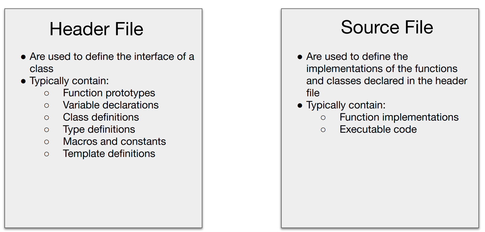

## Classes

### Comparison between `struct` and `class`

Class contains

- a sequence of **objects** of various types
- a set of **functions** for manipulating these objects
- a set of **restrictions** on the access of these objects and function

C++ `struct` is `class` without class restrictions.

C `struct` is `class` without class restrictions and member functions.

### `.h` vs `.cpp`



In short, apart from *function implementations* and *executable code*, other stuff are usually stored in ".h" file.

Also, header file is **interface**,whereas source file is **logic**.

### Class Design

1. A **constructor** and a **destructor**
2. Private member functions/variables
3. Public member functions (interface for user)

Demo:

`lec7.h`

```cpp
##pragma once
##include <string>

class Student
{
private:
    std::string name;
    std::string state;
    int age;

public:
    /// constructor for our student
    Student(std::string name, std::string state, int age);
    Student();

    /// method to get name, state, and age, respectively
    std::string getName();
    std::string getState();
    int getAge();
};
```

`lec7.cpp`

```cpp
##include "lec7.h"
##include <string>

/// Constructors
/// C++11 support "list initialization constructor" (similar to uniform initializaiton, but not the quite)
Student::Student() : name{"John Smith"}, state{"Oklahoma"}, age{17} {}

Student::Student(std::string name, std::string state, int age) : name{name}, state{state}, age{age} {}

/// Destructor
/// We don't have to define destructors explicitly
/// Just implement it in the source file
Student::~Student() {}

/// Member functions
int Student::getAge()
{
    return this->age;
}

std::string Student::getName()
{
    return this->name;
}

std::string Student::getState()
{
    return this->state;
}
```

#### Type aliasing

In C++, we prefer `using` to `typedef` in that:

> They (`using` and `typedef`) are largely the same, except that `using` is compatible with templates, whereas the C style `typedef` is not.

Therefore, we can make slight adjustments to the code mentioned above in order to make it more concise.

```cpp
##pragma once
##include <string>

class Student
{
private:
    using String = std::string;
    String name;
    String state;
    int age;

public:
    /// constructor for our student
    Student(String name, String state, int age);
    Student();

    /// method to get name, state, and age, respectively
    String getName();
    String getState();
    int getAge();
};
```

### Class Hierarchy

#### Base Class and Subclass

Inclusion polymorphism can be implemented by base-class-sub-class hierarchical structure.

**Example:**

```cpp
class Shape {
public:
    virtual double area() const = 0;
};

class Circle : public Shape {
public:
    Circle(double radius): _radius(radius) {}
    double area() const override {
        return 3.14 * _radius * _radius;
    }
private:
    double _radius;
};

class Rectangle : public Shape {
public:
    Rectangle(double height, double width): _height(height), _width(width) {}
    double area() const override {
        return _height * _width;
    }
private:
    double _height, _width;
};
```

#### Class Inheritance vs Container Adapter

**Class inheritance** is about subclass inheriting (virtual) methods from base class.

**Container adapter** provides interface for several classes and act like a *template parameter*.

### Footnote: Polymorphism

There are three polymorphisms that are popular and broadly recognized in C++, namely:

- Ad-hoc Polymorphism

  - Achieved through **method overloading**
  - **Allows for flexibility in return type, argument type, and implementation**
    - This makes it highly adaptable

- Parametric Polymorphism

  - Implemented using **templates**
  - **Return type, argument type, and implementation are strictly defined and determined by the templates**

- subclass/inclusion polymorphism

  - by **class hierarchy**

    - When we refer to "class hierarchy", we're specifically focusing on functions that are marked with the `override` keyword.

      ```cpp
      class Base {
      public:
      	virtual int func (double i) = 0;    
      };
      
      class Derived : public Base {
      public:
          /// we consider this.
      	int func (double i) override {
              return int(i);
          }    
          
          /// not this!!!
          double func (int i) {
              return double(i);
          }    
      };
      ```

  - **Consistent return type, argument type. Flexible implementation.** 

  

